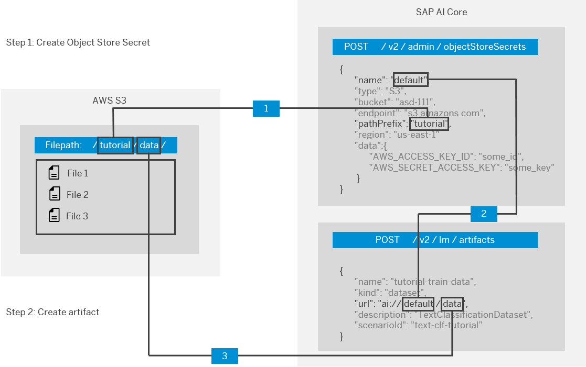

<!-- loio386ba71cbf8c451288b899ec0d8f9fb1 -->

# Manage Artifacts

An artifact is a reference to data or a file that is produced or consumed by an execution or deployment. They are managed through SAP AI Core and your connected object store.

The object store secret contains the credentials to access your cloud storage that contains your data. You can locate and copy this to your machine, using artifacts. In the following examples, you will need to replace *<ai://default\>* with the values that you used when registering the object storage. Please follow the naming convention outlined in the diagram below to formulate your path.

-   **[Create Artifacts](create-artifacts-66413f1.md "Create an artifact to connect a dataset or model, to make it available for use in SAP AI Core.")**  
Create an artifact to connect a dataset or model, to make it available for use in SAP AI Core.
-   **[List Artifacts](list-artifacts-1d613e0.md "Retrieve a list of existing artifacts.")**  
Retrieve a list of existing artifacts.

**Parent topic:** [Connect Your Data](connect-your-data-9508bdb.md "Use cloud storage with SAP AI Core to store AI assets such as datasets and model files. You use Artifacts in SAP AI Core to reference to your AI Assets.")

