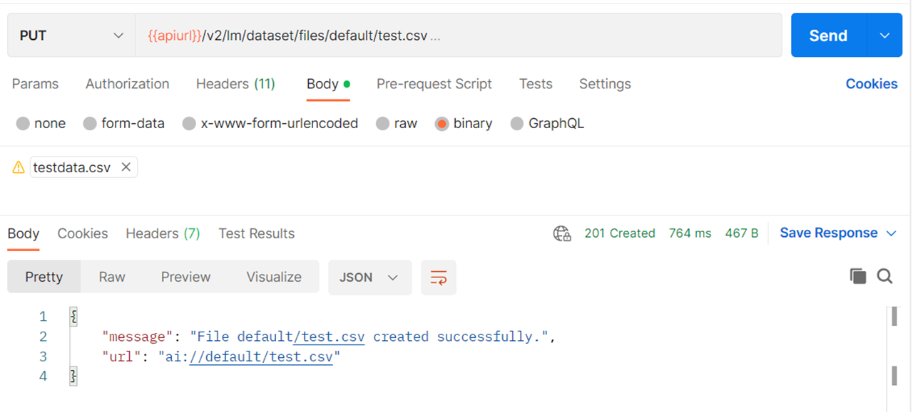

<!-- loioba8ac5c1b8644a9a978bd1a3cf870660 -->

# Manage Files Using the Dataset API

Where direct access to files in the object store is not possible or desirable \(for example, in Content as a Service Scenarios, where the Service Consumers might not be the owners of the object store\) you can upload, download, and delete files from the pre-registered object store using the SAP AI Core Dataset API.

For full details on the Dataset API specification, see [SAP AI Core API documentation](https://api.sap.com/api/AI_CORE_API/overview).


<a name="loioba8ac5c1b8644a9a978bd1a3cf870660__section_yzv_d5s_2xb"/>

## Prerequisites

-   You must have an object store secret defined in the target resource group.

> ### Restriction:  
> Only S3 object stores can be used with the Dataset API.

> ### Restriction:  
> Only `csv` type files can be uploaded with the Dataset API.

**Parent topic:** [Connect Your Data](connect-your-data-9508bdb.md "Use cloud storage with SAP AI Core to store AI assets such as datasets and model files. You use Artifacts in SAP AI Core to reference to your AI Assets.")

**Related Information**  


[Manage Files](manage-files-386ba71.md "An artifact refers to data or a file that is produced or consumed by executions or deployments. They are managed through SAP AI Core and your connected object store.")

 <a name="loio04664599dc4545b19581f64dd6242186"/>

<!-- loio04664599dc4545b19581f64dd6242186 -->

## Create Files


<a name="loio04664599dc4545b19581f64dd6242186__section_bqr_gds_2xb"/>

## Using Postman

1.  Send a PUT request to the endpoint `{{apiurl}}/v2/lm/dataset/files/{secret name}/{full file path}`
2.  In the header set the `Content-Type` as *<text/csv\>*.
3.  If you use a service provider token, specify the resource group.

    If you use a service consumer token, the resource group information is contained in the token, and need not be specified.

4.  In the request body, submit the file as binary data.


### Results

Your file will be uploaded to the S3 storage bucket with the prefix specified in the object store secret, and the full file path specified in the upload request.

  


<a name="loio04664599dc4545b19581f64dd6242186__section_arf_dds_2xb"/>

## Using curl

```
curl --location --request PUT “$AI_API_URL/v2/lm/dataset/files/$SECRET_NAME/$FILE_PATH” \\
	--header “Authorization: Bearer $TOKEN” \
	--header “Content-Type: text/csv” \
	--header “ai-resource-group: $RESOURCE_GROUP” \
	--data @$FILE_LOCATION
```

-   If you use a service provider token, specify the resource group.

    If you use a service consumer token, the resource group information is contained in the token, and need not be specified.

-   In the request body, submit the file as binary data.


### Results

Your file will be uploaded to the S3 storage bucket with the prefix specified in the object store secret, and the full file path specified in the upload request.

 <a name="loio0a641f3e5e35421ba9ebdbf43b68decc"/>

<!-- loio0a641f3e5e35421ba9ebdbf43b68decc -->

## Download Files


<a name="loio0a641f3e5e35421ba9ebdbf43b68decc__section_uk3_jds_2xb"/>

## Using Postman

Send a GET request to the endpoint `{{apiurl}}/v2/lm/dataset/files/{secret name}/{full file path}`


<a name="loio0a641f3e5e35421ba9ebdbf43b68decc__section_dw3_kds_2xb"/>

## Using Curl

```
curl --location --request GET “$AI_API_URL/v2/lm/dataset/files/$SECRET_NAME/$FILE_PATH” \\
	--header “Authorization: Bearer $TOKEN” \
	--header “ai-resource-group: $RESOURCE_GROUP” \
	--data @$FILE_LOCATION
```

 <a name="loioedf9b1b0d47c4db69a5bfb56f290c711"/>

<!-- loioedf9b1b0d47c4db69a5bfb56f290c711 -->

## Delete Files


<a name="loioedf9b1b0d47c4db69a5bfb56f290c711__section_uk3_jds_2xb"/>

## Using Postman

Send a DELETE request to the endpoint `{{apiurl}}/v2/lm/dataset/files/{secret name}/{full file path}`


<a name="loioedf9b1b0d47c4db69a5bfb56f290c711__section_dw3_kds_2xb"/>

## Using Curl

```
curl --location --request DELETE “$AI_API_URL/v2/lm/dataset/files/$SECRET_NAME/$FILE_PATH” \\
	--header “Authorization: Bearer $TOKEN” \
	--header “ai-resource-group: $RESOURCE_GROUP
```

