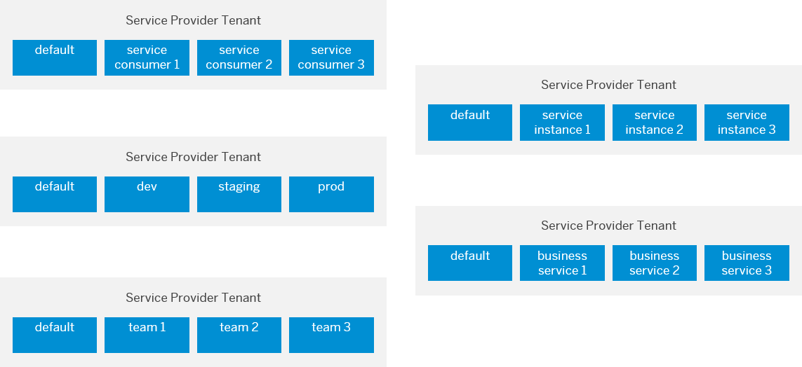

<!-- loio8aae6cbe2c0e4290954b8f61b4b355b7 -->

# Manage Resource Groups

A resource group is a unique dedicated namespace or workspace environment, where users can create or add configurations, executions, deployments, and artifacts. They are used for running training jobs or model servers.

-   **[Create a Resource Group](create-a-resource-group-01753f4.md "")**  

**Parent topic:**[Administration](administration-7937fc1.md "Creating secrets for external programs and tools, that are used with SAP AI Core means that you can connect them without compromising your credentials.")

<a name="concept_kvy_wbh_wwb"/>

<!-- concept\_kvy\_wbh\_wwb -->

## Resource Group Level Resources

-   Executables at the tenant level are shared across all of the resource groups.

-   Object Store is registered at the resource group level \(by setting the resource group header\). SAP AI Core tenants need to consider security aspects while designing the AI function. We recommend not to use the same object store bucket with same IAM user for multiple resource groups.

-   Runtime entities such as Executions, Deployments, Configurations and Artifacts belong to resource groups and cannot be shared across resource groups.

-   Generic secrets that are created within a resource group can only be used for workloads within the resource group.

Example resource group mappings are outlined in the figure below:

