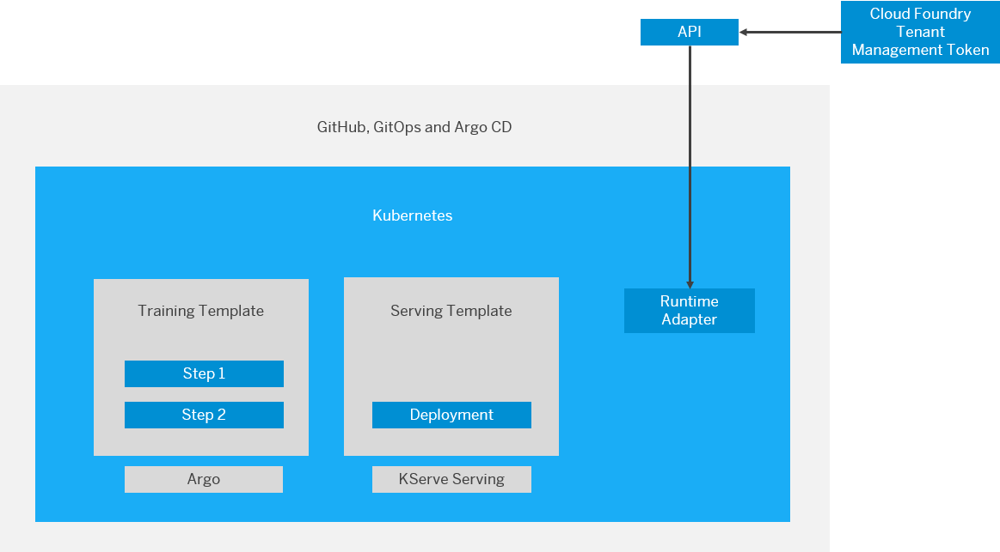
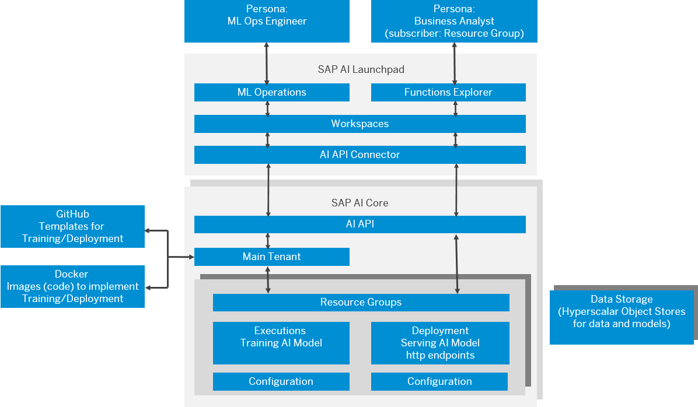

<!-- loioc243d2aa9dee43a5b15ed9c96f55f152 -->

# Overview of SAP AI Core Systems

Your SAP AI Core system connects internal and external tools.

Users interact with the various repositories, systems, and objects when working with SAP AI Core; some of these objects are provided by SAP. In other cases, customers provide these components to enable enhanced control \(authorizations\) and continuous integration/continuous deployment \(CI/CD\).

<a name="loioc243d2aa9dee43a5b15ed9c96f55f152__section_vk1_mhl_kqb"/>

## Key Repositories, Systems, and Objects

**Summary of Elements and Their Use**

<table>
<tr>
<th valign="top">

What

</th>
<th valign="top">

Why

</th>
</tr>
<tr>
<td valign="top">

Git repo

</td>
<td valign="top">

For storing training and serving workflows and templates

</td>
</tr>
<tr>
<td valign="top">

Hyperscaler storage

</td>
<td valign="top">

For storage of input and output artifacts, such as training data and models \(for example, SAP BTP Object Store Service\)

</td>
</tr>
<tr>
<td valign="top">

Docker repo

</td>
<td valign="top">

For custom Docker images referenced in the templates

</td>
</tr>
<tr>
<td valign="top">

Kubernetes \(K8s\)

</td>
<td valign="top">

The K8s cluster orchestrates and scales the pods, which are used in AI pipelines. Resource group isolation is based on a K8s namespace.

</td>
</tr>
<tr>
<td valign="top">

KServing \(K\)

</td>
<td valign="top">

For optimized deployments of machine learning models. Deployment templates use KServe notation.

</td>
</tr>
<tr>
<td valign="top">

AI API

</td>
<td valign="top">

For managing your artifacts and workflows \(such as training scripts, data, models, and model servers\) across multiple runtimes

> ### Note:  
> The AI API can also be used to integrate other machine learning platforms, engines or runtimes into the AI ecosystem.

</td>
</tr>
<tr>
<td valign="top">

Argo Workflows

</td>
<td valign="top">

A container native, workflow engine for Kubernetes.

</td>
</tr>
<tr>
<td valign="top">

SAP AI Launchpad

</td>
<td valign="top">

SAP AI Launchpad is a multitenant software as a service \(SaaS\) application in SAP Business Technology Platform. Customers and partners can use SAP AI Launchpad to manage AI use cases \(scenarios\) across multiple instances of AI runtimes \(such as SAP AI Core\).

</td>
</tr>
</table>

<a name="loioc243d2aa9dee43a5b15ed9c96f55f152__section_g5q_dhl_kqb"/>

## Synchronization

-   Your GitOps implementation is integrated with SAP AI Core to enable CI/CD.

-   Templates are synchronized from your Git repository to a Kubernetes cluster.

-   Your training and serving templates are regularly synchronized \(every few minutes\).

-   SAP AI Core checks the template syntax, and if synchronization fails, then error messages are displayed.

<a name="loioc243d2aa9dee43a5b15ed9c96f55f152__section_igm_qgl_kqb"/>

## Process Summary

-   An SAP BTP token is used in `AI API` for authentication of the API calls.

-   Users run templates via the AI API.

-   Training templates are executed using the Argo workflow. The training pipeline consumes data input artifacts and outputs a model artifact.

-   An execution is created using the training template and AI API configuration. The result is a training job.

-   Serving templates are deployed using KServing.

-   A deployment is created using the serving template and AI API configuration. The result is an inference server.
-   Artifacts \(such as datasets, models\) are copied to and from the hyperscaler storage.

-   Required images are pulled from the registered Docker repository.

-   Details about scenarios and executables are retrieved from the Kubernetes cluster by the `AI API`.

**Parent topic:** [Concepts](concepts-4c6b2da.md "In this section, we'll explore some of the concepts surrounding SAP AI Core.")

**Related Information**  

[SAP AI Core Overview](sap-ai-core-overview-88e0078.md "SAP AI Core is the key to integrating artificial intelligence capabilities in your SAP solutions.")

[Terminology](terminology-05f41ee.md "")

[Resource Groups](resource-groups-26c6c6b.md#loio26c6c6b50e3f412f8bc0cd6a8ebdb850 "SAP AI Core tenants use resource groups to isolate related ML resources and workloads. Scenarios, executables, and Docker registry secrets are shared across all resource groups.")

