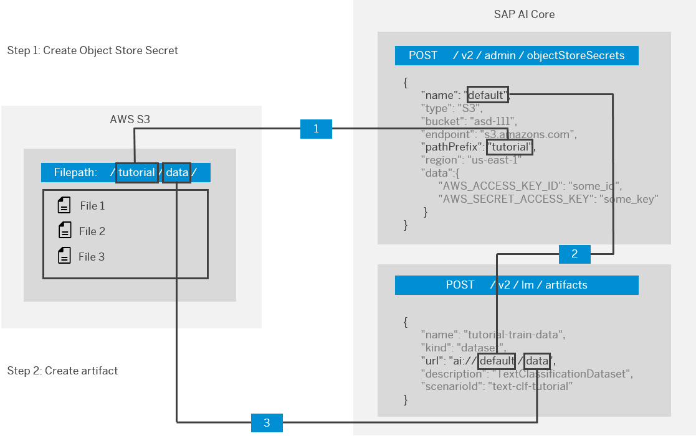

<!-- loio66413f1d9fbf4758a0d739eaf1c95dc7 -->

# Create Files

> ### Note:  
> The `objectStore name`, `data path` and `scenarioId` refer to pre-existing values. For the `objectStore name` and `data path` values, you must use the values that you used when registering the object storage, following the naming convention outlined in the diagram below. In example output code blocks, these values are represented by `ai://default/data`.



<a name="task_xp1_532_scc"/>

<!-- task\_xp1\_532\_scc -->

## Using a Third-Party API Platform


<a name="task_xp1_532_scc__steps_sv1_x32_scc"/>

## Procedure

Submit a `POST` request to the endpoint `{{apiurl}}/v2/lm/artifacts`, including the following JSON:

```json
{
  "name": "name of artifact",
  "kind": "dataset",
  "url": "ai://<objectStore name>/<data path>",
  "description": "<description of artifact>",
  "scenarioId": "<scenarioID>"
}
```


<a name="task_xp1_532_scc__result_ccq_3xc_5xb"/>

## Results

The response body contains the ID of your new artifact.

```json
{
    "id": "3x4mpl3-651c-4f3e-8e1d-81a408041bc1",
    "message": "Artifact acknowledged",
    "url": "ai://default/data"
}
```

<a name="task_cks_cj2_scc"/>

<!-- task\_cks\_cj2\_scc -->

## Using curl


<a name="task_cks_cj2_scc__steps_bgp_2j2_scc"/>

## Procedure

Run the following code:

```
curl --location --request POST "$API_URL/v2/lm/artifacts" \
--header "Authorization: Bearer $TOKEN" \
--header "Content-Type: application/json" \
--header "AI-Resource-Group: <Resource group>" \
--data-raw '{
   "name": "name of artifact",
   "kind": "dataset",
   "url": "ai://<objectStore name>/<data path>",
   "description": "<description of artifact>",
   "scenarioId": "<scenarioID>"
}
```


<a name="task_cks_cj2_scc__result_t1z_zxc_5xb"/>

## Results

The response body contains the ID of your new artifact.

```json
{
    "id": "3x4mpl3-651c-4f3e-8e1d-81a408041bc1",
    "message": "Artifact acknowledged",
    "url": "ai://default/data"
}
```

