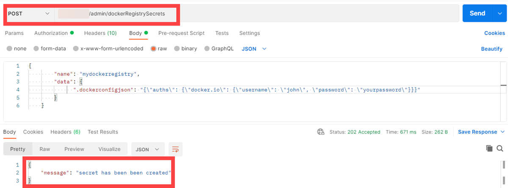

<!-- loioa7cf5e1496eb4ea8beca79671f49ff66 -->

# Register Your Docker Registry Secret

Docker packages and runs applications in remote containers. Connect SAP AI Core to a Docker repository and manage access using a Docker registry secret.


<a name="loioa7cf5e1496eb4ea8beca79671f49ff66__section_t3r_qmc_gyb"/>

## Prerequisites

You have completed the Initial Setup. For more information, see [Initial Setup](initial-setup-38c4599.md).


<a name="loioa7cf5e1496eb4ea8beca79671f49ff66__section_jnm_xnf_mvb"/>

## Context

Your Docker credentials are managed using secrets. Secrets allow and control connections across directories and tools without compromising your credentials.

Your Docker registry secret lets you authorize SAP AI Core to pull your **private** Docker images from your Docker repository. You specify the name of the secret in your workflows to authenticate the Docker image pull. For more information, see [Workflow Templates](workflow-templates-83523ab.md) and [Serving Templates](serving-templates-20a8667.md).


<a name="loioa7cf5e1496eb4ea8beca79671f49ff66__section_lfb_34f_mvb"/>

## Using Postman

1.  Send a POST request to the endpoint `{{apiurl}}/v2/admin/dockerRegistrySecrets`
2.  As the request body, select the *raw* radio button and enter the following:

    ```
    {
    "name": "mydockerregistry",
    "data": {
    ".dockerconfigjson": "{\"auths\":{\"your.private.registry\":{\"username\":\"john\",\"password\":\"docker-accesstoken-or-password\"}}}"
    }
    }
    ```

    -   `name`: Set the name of your Docker registry secret. This is your choice of identifier for your secret. In the example, the name is `"mydockerregistry"`.
    -   `data`: Enter a JSON string that represents your Docker registry secret.

3.  Send the request:

    

4.  After your Docker registry secret has been created, reference it in your template as an image pull secret.

    > ### Source Code:  
    > ```
    > spec:
    >     imagePullSecrets:
    >     - name: <Name of your Docker registry secret>
    > ```


> ### Restriction:  
> The maximum number of Docker registry secrets is limited at tenant level to 50. If you reach this limit, you will receive an error message. To free up space, delete some Docker registry secrets. Alternatively, raise a ticket to increase your quota.
> 
> For more information, see [Delete a Docker Registry Secret](delete-a-docker-registry-secret-5ff30f0.md).


<a name="loioa7cf5e1496eb4ea8beca79671f49ff66__section_nqm_hqf_mvb"/>

## Using curl

Submit a POST request to the endpoint `{{apiurl}}/v2/admin/dockerRegistrySecrets`, Include the following parameters in your request body:

-   `name`: Set the name of your Docker registry secret.
-   `data`: Enter a JSON string that represents your Docker registry secret.

> ### Sample Code:  
> ```json
> {
> "name": "mydockerregistry",
> "data": {
> ".dockerconfigjson": "{\"auths\":{\"your.private.registry\":{\"username\":\"john\",\"password\":\"docker-accesstoken-or-password\"}}}"
> }
> }
> ```

> ### Note:  
> If you are using a public Docker registry from [http://hub.docker.com](http://hub.docker.com), you must provide your Docker URL in the format `https://index.docker.io`, in the *<\\"auths\\"\>* variable input.

1.  Submit a POST request to the endpoint `{{apiurl}}/v2/admin/dockerRegistrySecrets` and include the name of your Docker registry secret along with the credentials for your repository. For example

    > ### Sample Code:  
    > ```
    > $ curl --location --request POST "$AI_API_URL/v2/admin/dockerRegistrySecrets" --header "Authorization: Bearer $TOKEN" --header 'Content-Type: application/json' --data-raw '{
    > 	"name": "mydockerregistry",
    > 	"data": {
    > 		".dockerconfigjson": "{\"auths\": {\"my.docker.repositories.io\": {\"username\":\"$USERNAME\", \"password\": \"$PWD\"}}}"
    > 	}
    > }
    > {
    > 	"message": "secret has been created"
    > }
    > ```

2.  After your Docker registry secret has been created, reference it in your template as an image pull secret. For example

    > ### Source Code:  
    > ```
    > spec:
    >     imagePullSecrets:
    >     - name: <Name of your Docker registry secret>
    > ```


> ### Restriction:  
> The maximum number of Docker registry secrets is limited at tenant level to 50. If you reach this limit, you will receive an error message. To free up space, delete some Docker registry secrets. Alternatively, raise a ticket to increase your quota.
> 
> For more information, see [Delete a Docker Registry Secret](delete-a-docker-registry-secret-5ff30f0.md).

