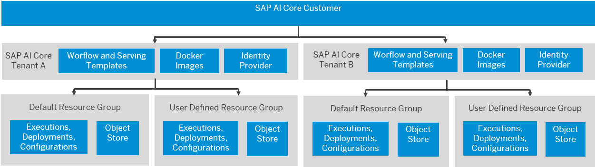
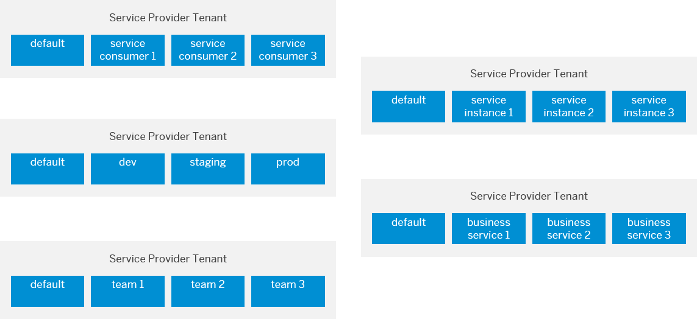

<!-- loio26c6c6b50e3f412f8bc0cd6a8ebdb850 -->

# Resource Groups

SAP AI Core tenants use resource groups to isolate related ML resources and workloads. Scenarios, executables, and Docker registry secrets are shared across all resource groups.

Resource groups represent a virtual collection of related resources within the scope of one SAP AI Core tenant. When your tenant is onboarded, a default resource group is created immediately. Further resource groups can be created, or deleted by your tenant administrator with the AI API. Tenants can map the resource groups based on the corresponding usage scenarios.

If your SAP AI Core tenant uses resource groups to isolate the scenario consumer tenant and the resource groups are subsequently deleted, the scenario consumers will be deprovisioned. SAP AI Core is not aware of the scenario consumer of the tenant. The standard XUSAA multitenancy model is followed.

**Parent topic:**[Concepts](concepts-4c6b2da.md "In this section, we'll explore some of the concepts surrounding SAP AI Core.")

**Related Information**  

[SAP AI Core Overview](sap-ai-core-overview-88e0078.md "SAP AI Core is the key to integrating artificial intelligence capabilities in your SAP solutions.")

[Overview of SAP AI Core Systems](overview-of-sap-ai-core-systems-c243d2a.md "Your SAP AI Core system connects internal and external tools.")

[Terminology](terminology-05f41ee.md "")

<a name="loioc9518c0d0ec44e2e9f767089028ff48c"/>

<!-- loioc9518c0d0ec44e2e9f767089028ff48c -->

## Scope of Resources

Resources that are available for tenants and resource groups differ based on the available scope.

<a name="loioc9518c0d0ec44e2e9f767089028ff48c__section_nl5_cg4_brb"/>

## Tenant-Level Resources

Tenant-level resources include:

-   Workflow templates

-   Serving templates

-   Docker registry \(containing the Docker images\)

-   User authentication and authorization \(UAA\)

User authentication and authorization is based on the SAP AI Core tenant. The tenant is the holder of the access token obtained using the SAP AI Core service key. The SAP AI Core tenant can set the resource group in the request header at runtime, or during lifecycle management, using the AI API. If the resource group is not set, the default resource group is used.

<a name="loioc9518c0d0ec44e2e9f767089028ff48c__section_icm_dg4_brb"/>

## Resource Group-Level Resources

Executables at tenant level are shared across all of the resource groups. At resource group level, the object store is registered by setting the resource group header.

SAP AI Core tenants must consider security aspects in the design of AI functions.

> ### Recommendation:  
> Do not use the same object store bucket with the same AWS IAM user for multiple resource groups.

Runtime entities such as executions, deployments, configurations, and artifacts belong to specific resource groups and cannot be shared across resource groups.

<a name="loioc9518c0d0ec44e2e9f767089028ff48c__section_h4h_kk4_brb"/>

## Examples of Resource Group Mapping

