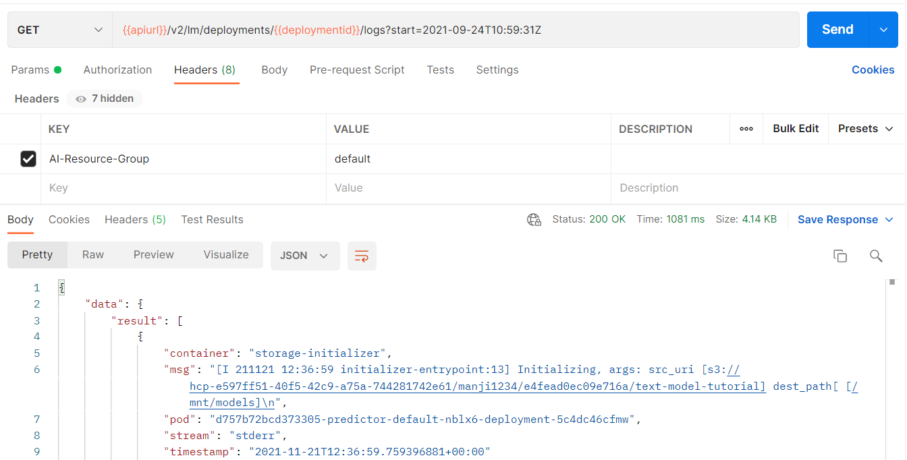

<!-- loio4c86b886f6ec440b99b7284f4b17e735 -->

# Retrieve Deployment Logs

Information about API processing and metrics, are stored and accessed in the deployment and execution logs.


You can retrieve the logs for a specific deployment or execution by submitting a GET request. Use the following endpoints to retrieve the logs:

-   `GET /v2/lm/deployments/{deploymentId}/logs`

-   `GET /v2/lm/executions/{executionsId}/logs`


Query parameters include:

-   `start` : the start time for a query as a string, in RFC 3339-compliant datetime format. Defaults to 1 hour before the current. Example:`2021-05-19T00:00:14.347Z`

-   `end` : the end time for a query as a string, in RFC 3339-compliant datetime format. Defaults to the current time. Example: `2021-05-19T00:00:14.347Z`

-   `$top` : the maximum number of entries returned. The default value is 1000; the maximum is 5000.

-   `$order` : the sort order of logs, either `asc` \(for ascending, earliest in the order will appear at the top of the list\) or `desc` \(for descending, most recent in the order will appear at the top of the list\). Note the default value is `asc`.


For example:

-   `/v2/lm/deployments/{deploymentId}/logs?start=2021-05-19T00:00:14.347Z&end=2021-05-19T01:00:14.347Z&$top=100&$order=asc` - returns the first 100 lines of a deployment log between **2021-05-19T00:00:14.347Z** and **2021-05-19T01:00:14.347Z**

-   `/v2/lm/deployments/{deploymentId}/logs` - returns deployment logs from the preceding hour

-   `/v2/lm/executions/{executionsId}/logs` - returns execution logs from the preceding hour


<a name="loio4c86b886f6ec440b99b7284f4b17e735__section_nhw_gwq_yqb"/>

## Get Deployment Logs Using Postman

1.  Create a new GET request and enter the URL `{{apiurl}}/v2/lm/deployments/{{deploymentid}}/logs`.

    

2.  On the *Authorization* tab, set the type to *Bearer Token*.

3.  Set the token value to ***\{\{token\}\}***.

4.  On the *Header* tab, add the following entry:

    ****


    <table>
    <tr>
    <th valign="top">

    Key


    
    </th>
    <th valign="top">

    Value


    
    </th>
    </tr>
    <tr>
    <td valign="top">

    `ai-resource-group`


    
    </td>
    <td valign="top">

     *<Name of your resourceGroup\>* \(in the example, `default` is used\)


    
    </td>
    </tr>
    </table>
    
5.  Send the request.


<a name="loio4c86b886f6ec440b99b7284f4b17e735__section_hzh_31l_jwb"/>

## Get Deployment Logs Using curl

```
curl --request GET "[/pandoc/div/div/horizontalrule/codeblock/span/code
     {"filepath"}) $AI_API_URL/v2/lm/deployments/$DEPLOYMENT_ID/logs?start=2021-05-19T00:00:14.347Z (code]" --header "Authorization: Bearer $TOKEN" --header "ai-resource-group: $RESOURCE_GROUP"
```


<a name="loio4c86b886f6ec440b99b7284f4b17e735__section_oxd_w1l_jwb"/>

## Sample Output

For example, see the following JSON output from the API.

> ### Output Code:  
> ```json
> {
>     "data": {
>         "result": [
>             {
>                 "container": "storage-initializer",
>                 "msg": "[I 210531 08:20:51 initializer-entrypoint:13] Initializing, args: src_uri [gs://kserve-samples/models/tensorflow/flowers] dest_path[ [/mnt/models]\n",
>                 "pod": "tfs-dep-i543026-predictor-default-v6nf5-deployment-8b58c8ddcfdx",
>                 "stream": "stderr",
>                 "timestamp": "2021-05-31T08:20:51.334+00:00"
>             },
>             {
>                 "container": "storage-initializer",
>                 "msg": "[I 210531 08:20:51 storage:45] Copying contents of gs://kserve-samples/models/tensorflow/flowers to local\n",
>                 "pod": "tfs-dep-i543026-predictor-default-v6nf5-deployment-8b58c8ddcfdx",
>                 "stream": "stderr",
>                 "timestamp": "2021-05-31T08:20:51.335+00:00"
>             },
>             {
>                 "container": "storage-initializer",
>                 "msg": "[W 210531 08:20:51 _metadata:104] Compute Engine Metadata server unavailable onattempt 1 of 3. Reason: [Errno 111] Connection refused\n",
>                 "pod": "tfs-dep-i543026-predictor-default-v6nf5-deployment-8b58c8ddcfdx",
>                 "stream": "stderr",
>                 "timestamp": "2021-05-31T08:20:51.338+00:00"
>             },
>             ...
>         ]
>     }
> } 
> ```

**Parent topic:** [Use Your Model](use-your-model-7f93e8f.md "You deploy your AI learning model to run inferences against it.")

**Related Information**  


[Choose a Resource Plan](choose-a-resource-plan-8deca74.md "You can configure SAP AI Core to use different infrastructure resources for different tasks, based on task demand. SAP AI Core provides several preconfigured infrastructure bundles called “resource plans” for this purpose.")

[Serving Templates](serving-templates-20a8667.md "You use serving templates to manage your serving instances at the level of the main tenant. Serving templates define how a model is to be deployed.")

[List Executables](list-executables-6af8e60.md "An executable is a template that is instantiated for a purpose, such as training a model or creating a deployment. You can list all of the executables in a resource group and get details of specific executables from a resource group. Serving templates are mapped to deployment executables.")

[Deploy Models](deploy-models-dd16e8e.md "Utilize your model and retrieve a URL to use for inferencing.")

[Inference](inference-e348ecf.md "Use the URL from your model deployment to access the results of your model.")

[Update a Deployment](update-a-deployment-9789ddd.md "You can update a deployment with a new configuration while retaining the inference URL.")

[Stop Deployments](stop-deployments-b7d2577.md#loiob7d2577088c84417bbab370173d38cd8 "Stopping a deployment releases the SAP AI Core runtime computing resources that it used.")

[Delete Deployments](delete-deployments-0193d17.md#loio0193d17a7bdb4ae08a9c8301d1d8c1b8 "Deleting a deployment releases the SAP AI Core resources that it used.")

[Efficiency Features](efficiency-features-9fad26a.md "Discover features of SAP AI Core that improve model server efficiency and help manage resource consumption.")

[Retrieve Execution Logs](retrieve-execution-logs-fbc55d3.md "Information about API processing and metrics, are stored and accessed in the deployment and execution logs.")

