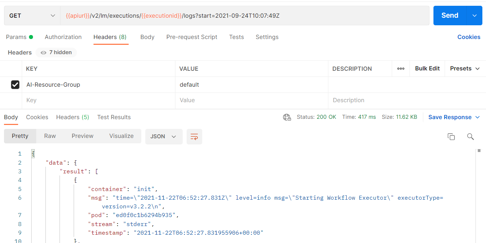

<!-- loiofbc55d35ab7e45aab01d05509361808c -->

# Retrieve Execution Logs

Information about API processing and metrics, are stored and accessed in the deployment and execution logs.


You can retrieve the logs for a specific deployment or execution by submitting a GET request. Use the following endpoints to retrieve the logs:

-   `GET /v2/lm/deployments/{deploymentId}/logs`

-   `GET /v2/lm/executions/{executionId}/logs`


Query parameters include:

-   `start` : the start time for a query as a string, in RFC 3339-compliant datetime format. Defaults to 1 hour before the current. Example:`2021-05-19T00:00:14.347Z`

-   `end` : the end time for a query as a string, in RFC 3339-compliant datetime format. Defaults to the current time. Example: `2021-05-19T00:00:14.347Z`

-   `$top` : the maximum number of entries returned. The default value is 1000; the upper limit is 5000.

-   `$order` : the sort order of logs, either `asc` \(for ascending, earliest in the order will appear at the top of the list\) or `desc` \(for descending, most recent in the order will appear at the top of the list\). Note the default value is `asc`.


For example:

-   `/v2/lm/deployments/{deploymentId}/logs?start=2021-05-19T00:00:14.347Z&end=2021-05-19T01:00:14.347Z&$top=100&$order=asc` - returns the first 100 lines of a deployment log between **2021-05-19T00:00:14.347Z** and **2021-05-19T01:00:14.347Z**

-   `/v2/lm/deployments/{deploymentId}/logs` - returns deployment logs from the preceding hour

-   `/v2/lm/executions/{executionsId}/logs` - returns execution logs from the preceding hour


<a name="loiofbc55d35ab7e45aab01d05509361808c__section_dvw_zwq_yqb"/>

## Using Postman

1.  Send a GET request to the endpoint `{{apiurl}}/v2/lm/executions/{{executionId}}/logs`.

    

2.  On the *Authorization* tab, set the type to *Bearer Token*.

3.  Set the token value to ***\{\{token\}\}***.

4.  On the *Header* tab, add the following entry:

    ****


    <table>
    <tr>
    <th valign="top">

    Key


    
    </th>
    <th valign="top">

    Value


    
    </th>
    </tr>
    <tr>
    <td valign="top">
    
        *ai-resource-group*


    
    </td>
    <td valign="top">
    
        <Name of your resource group\> \(in the example, default is used\)


    
    </td>
    </tr>
    </table>
    
5.  Send the request.


<a name="loiofbc55d35ab7e45aab01d05509361808c__section_adr_bbl_jwb"/>

## Using curl

```
curl --request GET "$AI_API_URL/v2/lm/executions/$EXCUTION_ID/logs?start=2021-05-19T00:00:14.347Z" --header "Authorization: Bearer $TOKEN" --header "ai-resource-group: $RESOURCE_GROUP"
```


<a name="loiofbc55d35ab7e45aab01d05509361808c__section_sq2_x1l_jwb"/>

## Sample Output

For example, see the following JSON output from the API.

> ### Output Code:  
> ```json
> {
>     "data": {
>         "result": [
>             {
>                 "container": "storage-initializer",
>                 "msg": "[I 210531 08:20:51 initializer-entrypoint:13] Initializing, args: src_uri [gs://kserve-samples/models/tensorflow/flowers] dest_path[ [/mnt/models]\n",
>                 "pod": "tfs-dep-i543026-predictor-default-v6nf5-deployment-8b58c8ddcfdx",
>                 "stream": "stderr",
>                 "timestamp": "2021-05-31T08:20:51.334+00:00"
>             },
>             {
>                 "container": "storage-initializer",
>                 "msg": "[I 210531 08:20:51 storage:45] Copying contents of gs://kserve-samples/models/tensorflow/flowers to local\n",
>                 "pod": "tfs-dep-i543026-predictor-default-v6nf5-deployment-8b58c8ddcfdx",
>                 "stream": "stderr",
>                 "timestamp": "2021-05-31T08:20:51.335+00:00"
>             },
>             {
>                 "container": "storage-initializer",
>                 "msg": "[W 210531 08:20:51 _metadata:104] Compute Engine Metadata server unavailable onattempt 1 of 3. Reason: [Errno 111] Connection refused\n",
>                 "pod": "tfs-dep-i543026-predictor-default-v6nf5-deployment-8b58c8ddcfdx",
>                 "stream": "stderr",
>                 "timestamp": "2021-05-31T08:20:51.338+00:00"
>             },
>             ...
>         ]
>     }
> } 
> ```

**Parent topic:** [Train Your Model](train-your-model-a9ceb06.md "You execute a training workflow to train your AI learning model.")

**Related Information**  


[Choose a Resource Plan](choose-a-resource-plan-57f4f19.md "You can configure SAP AI Core to use different infrastructure resources for different tasks, based on demand. SAP AI Core provides several preconfigured infrastructure bundles called “resource plans” for this purpose.")

[Workflow Templates](workflow-templates-83523ab.md "Here, you can find a minimal workflow example template, that can be adapted to meet the requirements of your workflow.")

[List Scenarios](list-scenarios-deedde5.md "")

[List Executables](list-executables-80895a4.md "")

[Create Configurations](create-configurations-884ae34.md "")

[List Configurations](list-configurations-8074b2a.md "")

[Start Training](start-training-54b44e4.md "")

[Stop Training Instances](stop-training-instances-3d85344.md "")

[Delete Training Instances](delete-training-instances-612ce17.md "")

[Efficiency Features](efficiency-features-4cb76f7.md "Discover features of the SAP AI Core runtime that improve efficiency and help manage resource consumption.")

[Training Schedules](training-schedules-2b702f8.md "")

[Retrieve Deployment Logs](retrieve-deployment-logs-4c86b88.md "Information about API processing and metrics, are stored and accessed in the deployment and execution logs.")

