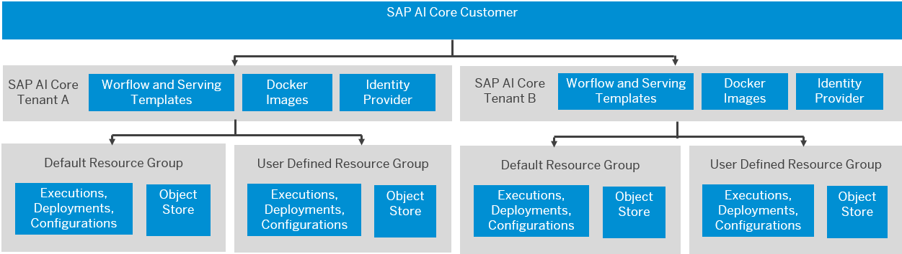

<!-- loioc9518c0d0ec44e2e9f767089028ff48c -->

# Scope of Resources

Resources that are available for tenants and resource groups differ based on the available scope.

<a name="loioc9518c0d0ec44e2e9f767089028ff48c__section_nl5_cg4_brb"/>

## Tenant-Level Resources

Tenant-level resources include:

-   Workflow templates

-   Serving templates

-   Docker registry \(containing the Docker images\)

-   User authentication and authorization \(UAA\)

User authentication and authorization is based on the SAP AI Core tenant. The tenant is the holder of the access token obtained using the SAP AI Core service key. The SAP AI Core tenant can set the resource group in the request header at runtime, or during lifecycle management, using the AI API. If the resource group is not set, the default resource group is used.

<a name="loioc9518c0d0ec44e2e9f767089028ff48c__section_icm_dg4_brb"/>

## Resource Group-Level Resources

Executables at tenant level are shared across all of the resource groups. At resource group level, the object store is registered by setting the resource group header.

SAP AI Core tenants must consider security aspects in the design of AI functions.

> ### Recommendation:  
> Do not use the same object store bucket with the same AWS IAM user for multiple resource groups.

Runtime entities such as executions, deployments, configurations, and artifacts belong to specific resource groups and cannot be shared across resource groups.

<a name="loioc9518c0d0ec44e2e9f767089028ff48c__section_h4h_kk4_brb"/>

## Examples of Resource Group Mapping

