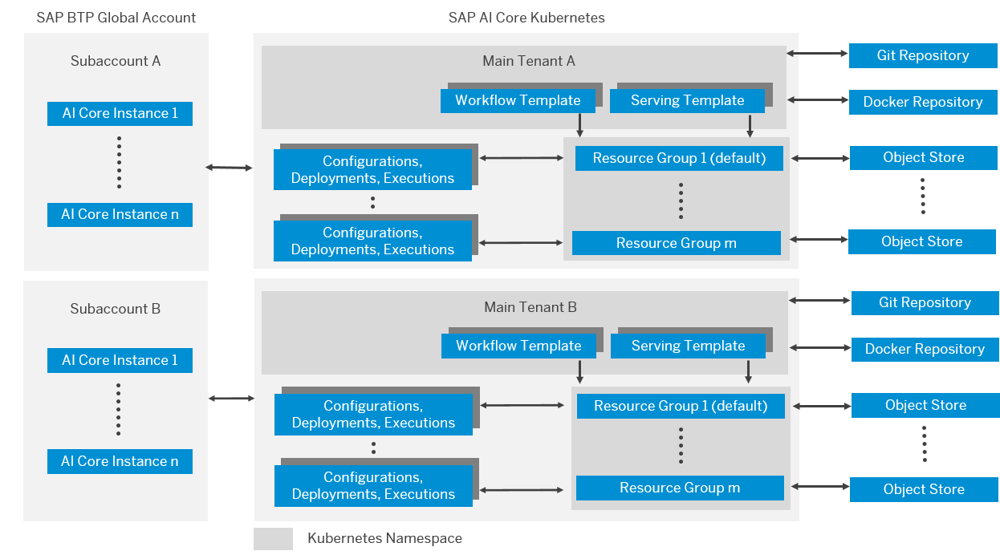
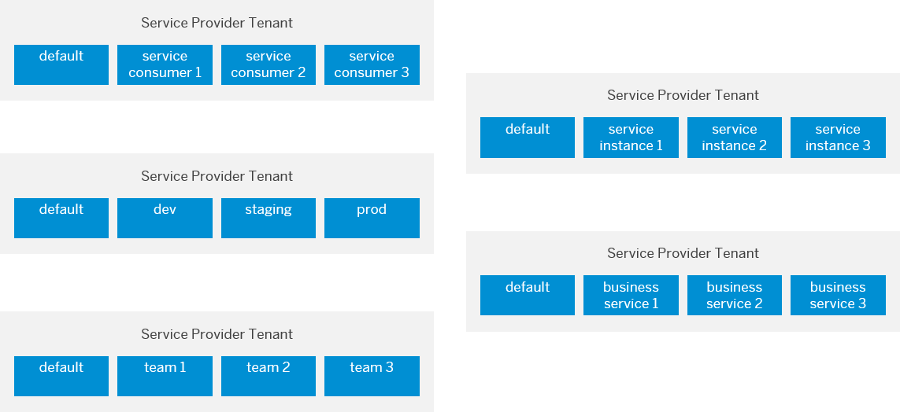

<!-- loioa476d3c15bf04494907dcdb7a9aee131 -->

# Security

Here, we'll explain some of the security aspects of SAP AI Core.

 <a name="loiod25e4c9f12554f2c982ea4f59b04f625"/>

<!-- loiod25e4c9f12554f2c982ea4f59b04f625 -->

## Data Protection and Privacy

For general information about data protection and privacy on SAP Business Technology Platform, see [Data Protection and Privacy](https://help.sap.com/viewer/65de2977205c403bbc107264b8eccf4b/Cloud/en-US/7e513d31704a4a87831191e504ca850a.html).

Data protection is associated with numerous legal requirements and privacy concerns. In addition to compliance with general data protection and privacy acts, it is necessary to consider compliance with industry-specific legislation in different countries/regions. This section describes the specific features and functions that SAP AI Core provides to support compliance with the relevant legal requirements and data privacy.

This guide does not give advice on whether these features and functions are the best method to support company, industry, regional, or country/region-specific requirements. Furthermore, this guide does not give advice or recommendations about additional features that would be required in a particular environment. Decisions related to data protection must be made on a case-by-case basis and under consideration of the given system landscape and the applicable legal requirements.

> ### Note:  
> SAP does not provide legal advice in any form. SAP software supports data protection compliance by providing security features and specific data protection-relevant functions, such as simplified blocking and deletion of personal data. In many cases, compliance with applicable data protection and privacy laws will not be covered by a product feature. Definitions and other terms used in this document are not taken from a particular legal source.

The extent to which data protection is ensured depends on secure system operation. Network security, security note implementation, adequate logging of system changes, and appropriate usage of the system are the basic technical requirements for compliance with data privacy legislation and other legislation.

For a glossary of Data Protection and Privacy terms in SAP BTP, see the SAP BTP [Glossary for Data Protection and Privacy](https://help.sap.com/viewer/65de2977205c403bbc107264b8eccf4b/Cloud/en-US/a57e0ab085404ef483a8c99e50cbf91e.html).

 <a name="loio74fc987a6e704cd0b753e3c12f6a7d1f"/>

<!-- loio74fc987a6e704cd0b753e3c12f6a7d1f -->

### Data Storage and Processing

SAP AI Core provides functionality that allows you to process data, such as configuration files or Machine Learning \(ML\) Training or ML Serving.

SAP AI Core acts as the data processor and is not aware of the type of data or category of data. SAP AI Core customers, as Data Controllers, are responsible for fulfilling data protection and privacy \(DPP\) responsibilities for data storage and processing requirements.

 <a name="loio7cf145520b924a6c8dc7461265025a98"/>

<!-- loio7cf145520b924a6c8dc7461265025a98 -->

### Change Logging and Read-Access Logging

SAP AI Core acts as the data processor and is not aware of the type of data or category of data. SAP AI Core customers, as Data Controllers, are responsible for fulfilling data protection and privacy \(DPP\) responsibilities for data storage and processing requirements.

For any applications or services you develop using SAP AI Core, you must ensure that they include relevant logging functions, and ensure compliance with the data privacy laws by making sure that the data is properly logged.

 <a name="loio9fc8fcbd5a64405490307233877d8779"/>

<!-- loio9fc8fcbd5a64405490307233877d8779 -->

### Consent

SAP AI Core acts as the data processor and is not aware of the type of data or category of data. SAP AI Core customers, as Data Controllers, are responsible for fulfilling asking for consent from data subjects before collecting any personal data.

 <a name="loio44d7acf7ebe3406cbe457388cca97e86"/>

<!-- loio44d7acf7ebe3406cbe457388cca97e86 -->

### Deletion

SAP AI Core supports **Bring your object store**, whereby customers register the object store secret where artifact relevant files \(such as training data or machine learning models or other types\) are stored. Such data is used by the ML workloads during processing, such as ML Training or ML Serving.

The notion of artifacts is limited to capture the metadata of the data. Data is physically stored in the object store and SAP AI Core is not responsible for deletion of files. When artifacts are deleted using AI API, corresponding metadata are deleted from SAP AI Core service and the actual files are not deleted from the object store. For more information about the AI API, see [About the AI API](about-the-ai-api-716d4c3.md).

Upon offboarding, SAP AI Core will clean up the cached data within AI Core used for processing purposes.

SAP AI Core customers, as Data Controllers, are responsible for deletion of data from the registered object store.

 <a name="loioab5939567cf04016854414774fb2291e"/>

<!-- loioab5939567cf04016854414774fb2291e -->

### Security and Customer Data Protection

SAP product standard security and the data protection and privacy \(DPP\) requirements set high standards and obligations when it comes to securing and protecting customer data that is entrusted to SAP.

Customer data protection is handled in three ways:

-   Customer data is imported, output, and processed by the services for no purpose beyond that to which the customer has subscribed.
-   Customer data is protected from malicious access by security technologies that include authentication and authorization.
-   Customer data is protected from accidental exposure to SAP administrators or support persons by security policies, access controls, and monitoring.

 <a name="loio226b593aa7e64a538281bbb7489912ab"/>

<!-- loio226b593aa7e64a538281bbb7489912ab -->

## Security in SAP AI Core

 <a name="loio893936c084114e3591c5c4b36b1d0cc5"/>

<!-- loio893936c084114e3591c5c4b36b1d0cc5 -->

### Security Features of Data, Data Flow and Processes

The figure below shows an overview of the data flow for SAP AI Core.

**Overview of Data and Security Measures**

<table>
<tr>
<th valign="top">

Step

</th>
<th valign="top">

Description

</th>
<th valign="top">

Security Measure

</th>
</tr>
<tr>
<td valign="top">

1

</td>
<td valign="top">

Transmission control/communication security

</td>
<td valign="top">

Encrypted \(HTTPS\) communication. Data-in-transit is encrypted using state-of-the-art TLS settings.

</td>
</tr>
<tr>
<td valign="top">

2

</td>
<td valign="top">

Application Data residing in Persistence layer

</td>
<td valign="top">

Encrypted at rest with state-of-the-art encryption keys generated and maintained by SAP.

</td>
</tr>
<tr>
<td valign="top">

3

</td>
<td valign="top">

Application Data residing in Persistence layer

</td>
<td valign="top">

Backup and restore capabilities are implemented and tested regularly. Backups are stored in remote locations and backups are encrypted at rest with state-of-the-art encryption keys generated and maintained by SAP.

</td>
</tr>
<tr>
<td valign="top">

4

</td>
<td valign="top">

Access control and Separation by purpose

</td>
<td valign="top">

Roles and scopes are available for implementing access control. Customer admin can use standard BTP security administration capabilities to assign roles to users to ensure "Least Privilege" and "Segregation of Duties".

</td>
</tr>
</table>

 <a name="loio42a8f0fd505d4fdca3ed1dc1de14ca07"/>

<!-- loio42a8f0fd505d4fdca3ed1dc1de14ca07 -->

### Encryption in Transit

Customer’s communication with the service, including data upload and download, is protected by encryption using the transport layer security \(TLS\) protocol. SAP services support only the latest protocol versions, TLS v1.2 and later, and strong cipher suites. Customer’s systems must use the supported protocol versions and cipher suites to set up secure communication with the services, and must validate the certificates against the services’ domain names to avoid man-in-the-middle attacks.

 <a name="loiob0d21d53c4f0489cb5760cbe3abc40e8"/>

<!-- loiob0d21d53c4f0489cb5760cbe3abc40e8 -->

### User Authentication and Administration

SAP AI Core uses the user management and authentication mechanisms provided by SAP BTP Authorization and Trust Management Service \(XSUAA\).

For detailed information about SAP Authorization and Trust Management Service \(XSUAA\) in SAP BTP, see the SAP BTP Documentation under SAP Authorization and Trust Management service.

In addition to these guidelines, we include information about user administration and authentication that specifically applies to the SAP AI Core in the following topics:

-   User Authentication: This topic lists the authentication mechanism used by SAP AI Core

-   User Roles: This topic lists the tools to use for user management, the types of users required, and the standard users that are delivered with SAP AI Core

<a name="loiob0d21d53c4f0489cb5760cbe3abc40e8__section_crv_mch_ynb"/>

## User Authentication

SAP AI Core uses JSON Web Token \(JWT\) based authentication.

For technical user communication, obtain a JWT token using the client credentials OAuth 2.0 flow.

For named user communication, obtain a JWT token using password grant OAuth2.0 flow. The user JWT token only contains the scope depending on the role or role collection assignment \(covered in User Roles section\). In such cases, consuming applications need to have an Application Router or REST gateway that accepts username and password and obtains the user token.

<a name="loiob0d21d53c4f0489cb5760cbe3abc40e8__section_ngw_bv2_3rb"/>

## User Roles

In this document, you will learn how to manage and control access to SAP AI Core functionality or ML resources such as ML Scenarios, ML Deployments, ML Executions etc.SAP AI Coreprovides role templates and role collections that are available under the SAP BTP Authorization and Trust Management Service \(XSUAA\).

Key terms:

-   A role template is a collection of scopes, references, and optional attributes references

-   A role collection is a collection of role templates
-   Security administration can assign a role collection to a user or to a user group

> ### Note:  
> You must have Security Administrator permissions to create users and assign roles.

SAP AI Core supports the user roles outlined in [Roles and Authorizations](security-a476d3c.md#loioe7909866a6294b4ab9974dcebc8336f4).

 <a name="loioe7909866a6294b4ab9974dcebc8336f4"/>

<!-- loioe7909866a6294b4ab9974dcebc8336f4 -->

#### Roles and Authorizations

SAP AI Core provides default role collections that you can assign to users. The role collections determine which actions a user is able to carry out in SAP AI Core. You can also create your own role collections and assign the required roles to them.

<a name="loioe7909866a6294b4ab9974dcebc8336f4__section_yds_rgf_3gb"/>

## Default Roles

SAP AI Core provides the following default roles:

**Default Roles**

<table>
<tr>
<th valign="top">

Role

</th>
<th valign="top">

Description

</th>
</tr>
<tr>
<td valign="top">

 `aicore_resourcegroup_viewer` 

</td>
<td valign="top">

View resource groups of SAP AI Core tenant

</td>
</tr>
<tr>
<td valign="top">

 `aicore_resourcegroup_editor view` 

</td>
<td valign="top">

Create and delete resource groups of SAP AI Core tenant

</td>
</tr>
<tr>
<td valign="top">

 `aicore_repository_viewer` 

</td>
<td valign="top">

View GitOps repositories of SAP AI Core tenant

</td>
</tr>
<tr>
<td valign="top">

 `aicore_repository_admin view` 

</td>
<td valign="top">

Create, update and delete git ops repositories of SAP AI Core tenant

</td>
</tr>
<tr>
<td valign="top">

 `aicore_application_viewer` 

</td>
<td valign="top">

View GiOps applications of SAP AI Core tenant

</td>
</tr>
<tr>
<td valign="top">

 `aicore_application_admin view` 

</td>
<td valign="top">

Create, update and delete GiOps applications of SAP AI Core tenant

</td>
</tr>
<tr>
<td valign="top">

 `aicore_log_viewer` 

</td>
<td valign="top">

View application logs of SAP AI Core tenant

</td>
</tr>
<tr>
<td valign="top">

 `aicore_credential_viewer` 

</td>
<td valign="top">

View object store credential and docker registry credential \(metadata only\) of SAP AI Core tenant

</td>
</tr>
<tr>
<td valign="top">

 `aicore_credential_admin` 

</td>
<td valign="top">

View, create, update and delete object store credentials and docker registry credential \(metadata only\) of SAP AI Core tenant

</td>
</tr>
<tr>
<td valign="top">

 `scenario_metadata_viewer` 

</td>
<td valign="top">

View scenarios and scenario versions

</td>
</tr>
<tr>
<td valign="top">

 `scenario_executable_viewer` 

</td>
<td valign="top">

View executables of a scenario

</td>
</tr>
<tr>
<td valign="top">

 `scenario_configuration_viewer` 

</td>
<td valign="top">

View configurations of a scenario

</td>
</tr>
<tr>
<td valign="top">

 `scenario_configuration_editor` 

</td>
<td valign="top">

Edit configurations of a scenario

</td>
</tr>
<tr>
<td valign="top">

 `scenario_deployment_viewer` 

</td>
<td valign="top">

View or list deployments

</td>
</tr>
<tr>
<td valign="top">

 `scenario_deployment_editor view` 

</td>
<td valign="top">

Create, update and delete deployments. also view the application logs of the deployments

</td>
</tr>
<tr>
<td valign="top">

 `scenario_deployment_predictor` 

</td>
<td valign="top">

Invoke deployments of a scenario \(for model inference purpose\)

</td>
</tr>
<tr>
<td valign="top">

 `scenario_execution_viewer` 

</td>
<td valign="top">

View executions of a scenario and view tracking metrics

</td>
</tr>
<tr>
<td valign="top">

 `scenario_execution_editor view` 

</td>
<td valign="top">

Create, update and delete executions and tracking metrics. also view the application logs of the executions

</td>
</tr>
<tr>
<td valign="top">

`scenario_artifact_viewer`

</td>
<td valign="top">

View or list artifacts

</td>
</tr>
<tr>
<td valign="top">

`scenario_artifact_editor`

</td>
<td valign="top">

View, create, update and delete artifacts

</td>
</tr>
<tr>
<td valign="top">

`scenario_metric_viewer`

</td>
<td valign="top">

View tracking metrics of an execution

</td>
</tr>
</table>

<a name="loioe7909866a6294b4ab9974dcebc8336f4__section_hzq_jkf_3rb"/>

## Role Collections

SAP AI Core provides the following default role collections:

**Role Collections and Roles**

<table>
<tr>
<th valign="top">

Role Collection

</th>
<th valign="top">

Roles

</th>
</tr>
<tr>
<td valign="top">

`aicore_viewer`

</td>
<td valign="top">

-   `scenario_metadata_viewer`

-   `scenario_executable_viewer`

-   `scenario_configuration_viewer`

-   `scenario_deployment_viewer`

-   `scenario_artifact_viewer`

-   `scenario_execution_viewer`

-   `scenario_metric_viewer`

-   `aicore_credential_viewer`

-   `aicore_connection_viewer`

-   `aicore_resourcegroup_viewer`

-   `aicore_application_viewer`

</td>
</tr>
<tr>
<td valign="top">

`aicore_admin`

</td>
<td valign="top">

-   `scenario_configuration_editor`

-   `scenario_deployment_editor`

-   `scenario_deployment_predictor`

-   `scenario_execution_editor`

-   `scenario_artifact_editor`

-   `aicore_credential_admin`

-   `aicore_connection_admin`

-   `aicore_resourcegroup_editor`

-   `aicore_log_viewer`

-   `aicore_application_admin`

</td>
</tr>
<tr>
<td valign="top">

`aicore_scenario_viewer`

</td>
<td valign="top">

-   `scenario_metadata_viewer`

-   `scenario_executable_viewer`

-   `scenario_configuration_viewer`

-   `scenario_deployment_viewer`

-   `scenario_artifact_viewer`

-   `scenario_execution_viewer`

-   `scenario_metric_viewer`

</td>
</tr>
<tr>
<td valign="top">

`aicore_scenario_editor`

</td>
<td valign="top">

-   `scenario_configuration_editor`

-   `scenario_deployment_editor`

-   `scenario_deployment_predictor`

-   `scenario_execution_editor`

-   `scenario_artifact_editor`

</td>
</tr>
<tr>
<td valign="top">

`aicore_resourcegroup_viewer`

</td>
<td valign="top">

-   `aicore_resourcegroup_viewer`

</td>
</tr>
<tr>
<td valign="top">

`aicore_resourcegroup_editor`

</td>
<td valign="top">

-   `aicore_connection_admin`

</td>
</tr>
<tr>
<td valign="top">

`aicore_application_admin`

</td>
<td valign="top">

-   `aicore_application_admin`

</td>
</tr>
<tr>
<td valign="top">

`aicore_repository_admin`

</td>
<td valign="top">

-   <code>aicore_repository_admin<a href="security-a476d3c.md#loiob0d21d53c4f0489cb5760cbe3abc40e8">User Authentication and Administration</a></code>

</td>
</tr>
</table>

 <a name="loio8cb3c184e26b450dac32790e4f0f3226"/>

<!-- loio8cb3c184e26b450dac32790e4f0f3226 -->

### Docker Images

SAP AI Core supports tenant-specific Docker registry \(registered via the administration APIs\). Additional tenant workloads, such as for execution and deployments, can be created by referencing the Docker images from this Docker registry.

Docker images are cached on virtual machines. These cached Docker images cannot be accessed by other tenants and will not be accessed by SAP.

Cached Docker images are not deleted immediately upon tenant offboarding but are cleaned up as part of operational events such as cluster scaling-down behavior, maintenance, and upgrade of virtual machines.

With every service consumed by the customer, there is a shared security responsibility between SAP products and customers. Because the

Creation of a Docker image is the responsibility of the tenant, we strongly recommend that you do not “prebake” or embed personal data, sensitive data, or machine learning models inside your Docker images.

 <a name="loiod1cd77fb7da34eacb0fdece7e5262069"/>

<!-- loiod1cd77fb7da34eacb0fdece7e5262069 -->

### AI Content Security

AI content covers workflow templates and serving templates, docker images used in the templates. Docker image contains the ML algorithms or code along with the ML Libraries or Frameworks and other dependent packages. Standard Secure Software Development Practices should be followed covering the AI content.

**Security Practices**

<table>
<tr>
<th valign="top">

Practice

</th>
<th valign="top">

Description

</th>
</tr>
<tr>
<td valign="top">

Threat Modeling

</td>
<td valign="top">

Threat modeling workshop to identify and assess security risks or threats in the AI content

</td>
</tr>
<tr>
<td valign="top">

Static Code Scans

</td>
<td valign="top">

Static Code Scans \(SAST\) tools to be used to scan and analyze the code for vulnerabilities Example tools for scanning – Checkmarx, Fortify

</td>
</tr>
<tr>
<td valign="top">

Open-Source Vulnerability Scan

</td>
<td valign="top">

Any Open Source component used by the product must be scanned for vulnerabilities. Vulnerable OSS components must be patched. Example tools for scanning – WhiteSource, Protecode BDBA

</td>
</tr>
<tr>
<td valign="top">

Open-Source Strategy

</td>
<td valign="top">

Define an update strategy in which time intervals the Open Source Components used in a product or service are updated to the newest secure version

</td>
</tr>
<tr>
<td valign="top">

Code Reviews

</td>
<td valign="top">

It is a good practice to perform a peer code review on each code change. By performing a Code Review the reviewer takes a closer look to the code from a security point of view

</td>
</tr>
<tr>
<td valign="top">

Malware Scanning

</td>
<td valign="top">

Perform malware scanning for data uploaded for AI content

</td>
</tr>
<tr>
<td valign="top">

Secure Code Protection

</td>
<td valign="top">

Support security assurance starting with source code through deployed service. For example, use docker image digest and image sign verifications

</td>
</tr>
<tr>
<td valign="top">

Docker Base Image Security

</td>
<td valign="top">

Use a secure, light base image for building the docker images of the AI content. Ensure you use the latest available base image and remove unused components from the docker image

</td>
</tr>
</table>

 <a name="loio3864a9c5401f4115966a737e4b3a8026"/>

<!-- loio3864a9c5401f4115966a737e4b3a8026 -->

### Kubernetes Security

We recommend that you enable the relevant and applicable Kubernetes security features on your workflow and serving templates. Ensure that you enable the appropriate Kubernetes features for your workloads.

**Related Information**  

[Security Best Practices for Kubernetes Deployment](https://kubernetes.io/blog/2016/08/security-best-practices-kubernetes-deployment/)

 <a name="loio2b4c76d85b614dcc931bbe55902f6d6a"/>

<!-- loio2b4c76d85b614dcc931bbe55902f6d6a -->

### Configuration Data and Secrets

Workloads may implement access to network resources other than object stores. To access such network resources, workloads need to have credentials at runtime. SAP AI Core allows users to inject secrets in form of generic secrets. They can be created and managed by AI Core's REST APIs and consumed in a secure way in a workload. We recommend to only use this mechanism for sensitive information. Technically, it is also possible to inject parameters via configurations or labels. We discourage to use this for sensitive information. Different standards of confidentiality apply for these ways of injecting information into workloads (e.g. they are return in cleartext in GET requests).

### Output Encoding

To avoid breaking the business functionality, SAP AI Core does not sanitize any user input. Consumers or applications that consume the AI API are expected to perform necessary output encoding based on the usage context to prevent XSS attacks.

**Related Information**  

[Cross Site Scripting \(XSS\) – OWASP Site](https://owasp.org/www-community/attacks/xss/)

[Cross Site Scripting Prevention Cheat Sheet – OWASP Site](https://cheatsheetseries.owasp.org/cheatsheets/Cross_Site_Scripting_Prevention_Cheat_Sheet.html)

 <a name="loioee90fe114c26439fb0feff9f8f014458"/>

<!-- loioee90fe114c26439fb0feff9f8f014458 -->

## Multitenancy

SAP AI Core is a tenant-aware BTP reuse service, supporting main tenants and resource groups. Resources are defined per tenants or per resource groups, as outlined in the figure below:

Each main tenant and resource group is mapped to an own namespace. The main tenant namespace only contains templates for workflows and model serving. The instances of these objects are created in the respective resource group namespaces and reference the corresponding templates in the main tenant namespace. Each main tenant has a default resource group, which can be used for workloads from the main tenant.

 <a name="loio9cc1a9d437f54c3c8feb769994a27d25"/>

<!-- loio9cc1a9d437f54c3c8feb769994a27d25 -->

### Tenant Level Resources

-   Executables such as workflow templates, serving templates, Docker registries that contain Docker images, and user authentication and authorization \(UAA\) are at tenant level.

-   User authentication and authorization are based on the SAP AI Core tenant \(access token obtained using the service key for SAP AI Core\). At runtime or when managing the lifecycle via AI API, the SAP AI Core tenant must set the appropriate resource group in the request header.

 <a name="loiofbfa1badbbfa4981a417299238b82e39"/>

<!-- loiofbfa1badbbfa4981a417299238b82e39 -->

### Resource Group Level Resources

-   Executables at the tenant level are shared across all of the resource groups.

-   Object Store is registered at the resource group level \(by setting the resource group header\). SAP AI Core tenants need to consider security aspects while designing the AI function. We recommend not to use the same object store bucket with same IAM user for multiple resource groups.

-   Runtime entities such as Executions, Deployments, Configurations and Artifacts belong to resource groups and cannot be shared across resource groups.

Example resource group mappings are outlined in the figure below:

### Tenant Isolation of Workloads

Workloads are running in a sandbox environment and can not access workflows of other tenants or resource groups. Only TCP is supporte for in- or outbound traffic from a workload. We strongly discourage for workloads to open Sockets on UDP ports, since they would not be usable, yet may pose a theoretical security problem for the workload. 
