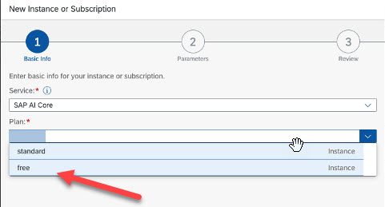

<!-- loio4533adc472074698b355c70f04b2cf49 -->

# Set Up the Free Plan

The free plan lets you try out SAP AI Core for testing and familiarization purposes at no cost.

<a name="loio4533adc472074698b355c70f04b2cf49__prereq_ybv_mjn_lgc"/>

## Prerequisites

You have a global account in the free tier model for SAP BTP \(not available in SAP BTP Trial\).

<a name="loio4533adc472074698b355c70f04b2cf49__context_k3w_y3n_lgc"/>

## Context

Alternatively, you can use a booster to set up the free plan for SAP AI Core. For more information, see the tutorial [Use Boosters for Free Tier Use of SAP AI Core and SAP AI Launchpad](https://developers.sap.com/tutorials/ai-core-launchpad-provisioning.html).

<a name="loio4533adc472074698b355c70f04b2cf49__steps_qtp_xmn_15b"/>

## Procedure

1.  Open your global account in the SAP BTP cockpit.

2.  Go to your subaccount.

3.  In the navigation area, choose *Instances and Subscriptions*.

4.  Choose *New Instance or Subscription*.

5.  In the *Service* field, search for SAP AI Core.

6.  In the *Plan* field, choose *Free*.

    

<a name="loio4533adc472074698b355c70f04b2cf49__result_umt_hkn_lgc"/>

## Results

A Free plan tenant is created in your subaccount.

**Related Information**  

[Service Plans](service-plans-c7244c6.md "The SAP AI Core service plan you choose determines pricing, conditions of use, resources, available services, and hosts.")

[Using Free Service Plans](https://help.sap.com/docs/BTP/65de2977205c403bbc107264b8eccf4b/524e1081d8dc4b0f9d055a6bec383ec3.html)

[Getting a Global Account](https://help.sap.com/docs/BTP/65de2977205c403bbc107264b8eccf4b/d61c2819034b48e68145c45c36acba6e.html)

