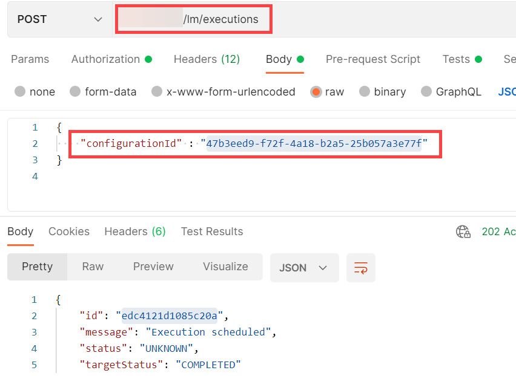
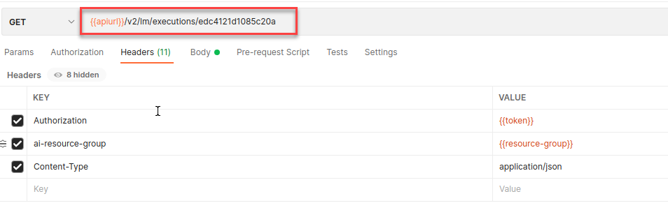

<!-- loio54b44e4099c3436db1c02242489435d8 -->

# Start Training


<a name="loio54b44e4099c3436db1c02242489435d8__section_wwg_g4s_vnb"/>

## Execute Training with Postman

1.  Send a POST request to the endpoint `{{apiurl}}/v2/lm/executions`. Pass the `configurationId` in the request body.

    

2.  Check the status of the execution by submitting a GET request to `{{apiurl}}/v2/lm/executions/{{executionid}}`.

    

    > ### Note:  
    > If the status is dead or pending, there might be errors in the execution. You can check the execution logs for more details, see [Retrieve Execution Logs](retrieve-execution-logs-fbc55d3.md).


<a name="loio54b44e4099c3436db1c02242489435d8__section_wvn_3h4_apb"/>

## Execute Training with curl

1.  Trigger the training workflow via a configuration.

    ```
    curl --location --request POST '$AI_API_URL/v2/lm/executions' \
    ```

    > ### Output Code:  
    > ```json
    > {
    >   "id": "dea6263e6283321b",
    >   "message": "Execution scheduled",
    >   "status": "UNKNOWN",
    >   "targetStatus": "COMPLETED"
    > }
    > ```

2.  Check the status of the execution.

    ```
    curl --request GET $AI_API_URL/v2/lm/executions/$EXECUTION \ \
        --header "Authorization: Bearer $TOKEN" \
        --header "ai-resource-group: $RESOURCE_GROUP"  
    ```

    > ### Note:  
    > If the status is dead or pending, there might be errors in the execution. You can check the execution logs for more details, see [Retrieve Execution Logs](retrieve-execution-logs-fbc55d3.md).


**Parent topic:** [Train Your Model](train-your-model-a9ceb06.md "You execute a training workflow to train your AI learning model.")

**Related Information**  


[Choose a Resource Plan](choose-a-resource-plan-57f4f19.md "You can configure SAP AI Core to use different infrastructure resources for different tasks, based on demand. SAP AI Core provides several preconfigured infrastructure bundles called “resource plans” for this purpose.")

[Workflow Templates](workflow-templates-83523ab.md "Here, you can find a minimal workflow example template, that can be adapted to meet the requirements of your workflow.")

[List Scenarios](list-scenarios-deedde5.md "")

[List Executables](list-executables-80895a4.md "")

[Create Configurations](create-configurations-884ae34.md "")

[List Configurations](list-configurations-8074b2a.md "")

[Stop Training Instances](stop-training-instances-3d85344.md "")

[Delete Training Instances](delete-training-instances-612ce17.md "")

[Efficiency Features](efficiency-features-4cb76f7.md "Discover features of the SAP AI Core runtime that improve efficiency and help manage resource consumption.")

[Retrieve Execution Logs](retrieve-execution-logs-fbc55d3.md "Information about API processing and metrics, are stored and accessed in the deployment and execution logs.")

[Training Schedules](training-schedules-2b702f8.md "")

