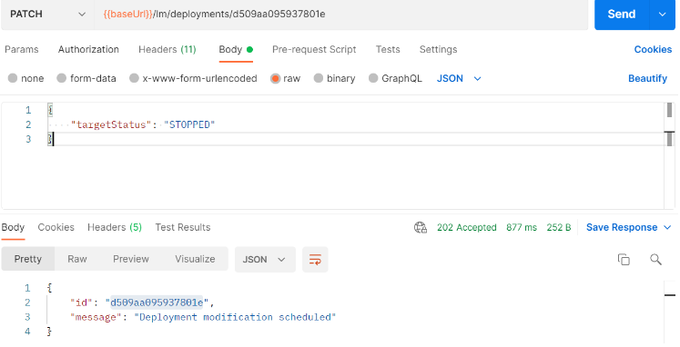

<!-- loio1fa895527bd64c6c878733e293da99dc -->

# Stop a Single Deployment


<a name="loio1fa895527bd64c6c878733e293da99dc__section_f2y_vbd_25b"/>

## Using Postman

Stop the deployment by submitting a PATCH request to `{{apiurl}}/v2/lm/deployments/{{deploymentid}}`. The header for this request is: `AI-Resource-Group: {YOUR-Resource-Group}`. The `Body` for this request is

```
{
"targetStatus": "STOPPED"
}
```



Check the status of the deployment by submitting a GET request to `{{apiurl}}/v2/lm/deployments/{{deploymentid}}`.


<a name="loio1fa895527bd64c6c878733e293da99dc__section_dnd_s3d_25b"/>

## Using curl

1.  Update the deployment by submitting a PATCH request to `{{apiurl}}/v2/lm/deployments/{{deploymentid}}`.

2.  Update the request body to:

    ```
    curl --request PATCH $AI_API_URL/v2/lm/deployments/$DEPLOYMENT_ID \
    --header "authorization: Bearer $TOKEN" \
    --header "ai-resource-group: $RESOURCE_GROUP" \
    --header 'content-Type: application/json' \
    --data-raw '{
    "targetStatus": "STOPPED"
    }'
    
    ```

    > ### Output Code:  
    > ```
    > {
    >     "id": "d748fdae9f88a9b0",
    >     "message": "Deployment modification scheduled"
    > }
    > 
    > ```

3.  Check the status of the deployment by submitting a GET request to `{{apiurl}}/v2/lm/deployments/{{deploymentid}}`.

    ```
    curl --request GET $AI_API_URL/v2/lm/deployments/$DEPLOYMENT_ID \ --header "Authorization: Bearer $TOKEN" \ --header "ai-resource-group: $RESOURCE_GROUP"
    ```


**Parent topic:** [Stop Deployments](stop-deployments-b7d2577.md " ")

**Related Information**  


[Stop Multiple Deployments](stop-multiple-deployments-331cdf5.md "")

