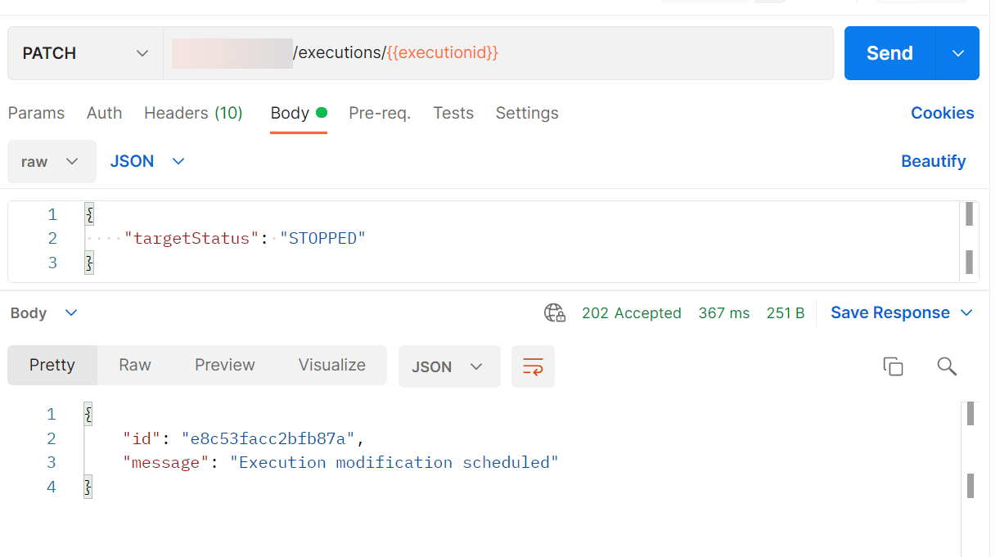

<!-- loio07870dfc89fe4218baeda95e994936da -->

# Stop a Single Training Instance


<a name="loio07870dfc89fe4218baeda95e994936da__section_ypf_lgp_brb"/>

## Using Postman




<a name="loio07870dfc89fe4218baeda95e994936da__section_imm_lgp_brb"/>

## Using curl

```
curl --request PATCH $AI_API_URL/v2/lm/executions/$EXECUTION \ --header "Authorization: Bearer $TOKEN" --header "ai-resource-group: $RESOURCE_GROUP" --header "Content-Type: application/json"
-d '{
    "targetStatus": "STOPPED"
}'

```

> ### Output Code:  
> ```json
> {
>     "id": "ee6769e4dc19c0fd",
>     "message": "Execution modification scheduled"
> }
> 
> ```

**Parent topic:** [Stop Training Instances](stop-training-instances-3d85344.md "")

**Related Information**  


[Stop Multiple Training Instances](stop-multiple-training-instances-09b4810.md "")

