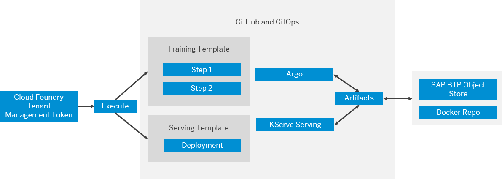

<!-- loioa34bdf4cce48432e8704b4635b4bac50 -->

# Template Synchronization

Your GitOps implementation integrates with SAP AI Core to enable CI/CD. Templates sync from your Git repository to a Kubernetes cluster. Your training and serving templates are regularly synchronized every few minutes. SAP AI Core checks the template syntax, and if synchronization fails, it displays error messages.

