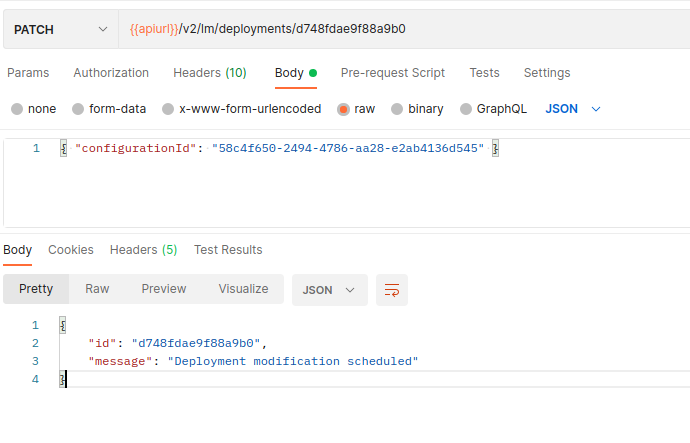
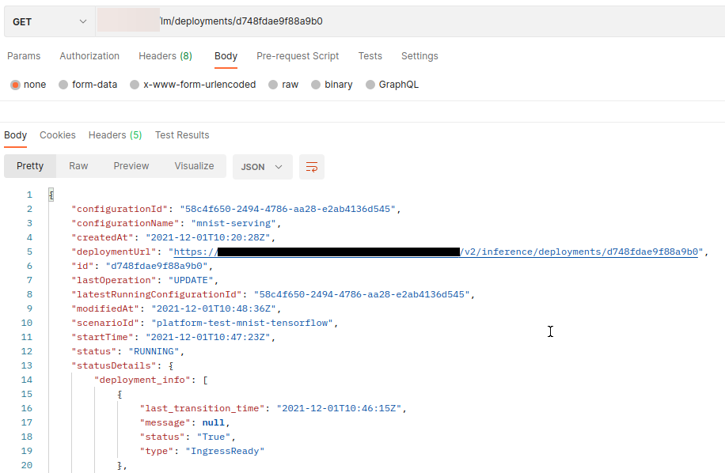

<!-- loio9789ddda860e4056b12efa892e6e4e1b -->

# Update a Deployment

You can update a deployment with a new configuration while retaining the inference URL.

During the transition to the new deployment configuration, the inference requests will continue to work.

When the new configuration is deployed, the deployment may end in a “dead” status, or get stuck in the “pending” status, and never get to a “running” state, due to incorrect configuration. In this case, inference requests will no longer work. The last known running configuration ID is documented in field *latestRunningConfigurationId* and can be used in another PATCH request to return to the last running configuration.

If the updated deployment reaches the “running” state, *latestRunningConfigurationId* will be updated to the new configuration.


<a name="loio9789ddda860e4056b12efa892e6e4e1b__section_tzq_bcv_trb"/>

## Prerequisites

-   The deployment must have the state “pending”, “running” or “dead”.

-   The new configuration contains the same `scenarioId` and `executableId` as the currently active configuration.


> ### Note:  
> Dead deployments can only be patched within 7 days. After 7 days from the time that the deploymemt reached DEAD status, it will be deleted and will no longer be availble.


<a name="loio9789ddda860e4056b12efa892e6e4e1b__section_qsy_bcv_trb"/>

## Using Postman

1.  Update the deployment by submitting a PATCH request to `{{apiurl}}/v2/lm/deployments/{{deploymentid}}`.

2.  Pass the new `configurationId` in the request body.

      

3.  Check the status of the deployment by submitting a GET request to `{{apiurl}}/v2/lm/deployments/{{deploymentid}}`.

      


<a name="loio9789ddda860e4056b12efa892e6e4e1b__section_qbz_bcv_trb"/>

## Using curl

1.  Update the deployment by submitting a PATCH request to `{{apiurl}}/v2/lm/deployments/{{deploymentid}}`.

2.  Pass the new `configurationId` in the request body.

    ```
    curl --request PATCH $AI_API_URL/v2/lm/deployments/$DEPLOYMENT_ID \
    --header “Authorization: Bearer $TOKEN” \
    --header “ai-resource-group: $RESOURCE_GROUP” \
    --header 'Content-Type: application/json' \
    --data-raw '{
        "configurationId": "490a02b0-4b97-48e8-b905-1c6ae5ea5b1c"
    }'
    
    ```

    > ### Output Code:  
    > ```
    > {
    >     "id": "d748fdae9f88a9b0",
    >     "message": "Deployment modification scheduled"
    > }
    > 
    > ```

3.  Check the status of the deployment by submitting a GET request to `{{apiurl}}/v2/lm/deployments/{{deploymentid}}`.

    ```
    curl --request GET $AI_API_URL/v2/lm/deployments/$DEPLOYMENT_ID \ --header "Authorization: Bearer $TOKEN" \ --header "ai-resource-group: $RESOURCE_GROUP"
    ```

    > ### Output Code:  
    > ```
    > {
    >     "configurationId": "490a02b0-4b97-48e8-b905-1c6ae5ea5b1c",
    >     "configurationName": "mnist-serving",
    >     "createdAt": "2021-12-01T10:20:28Z",
    >     "deploymentUrl": " "https://my-deployment-url.com"",
    >     "id": "d748fdae9f88a9b0",
    >     "lastOperation": "UPDATE",
    >     "latestRunningConfigurationId": "490a02b0-4b97-48e8-b905-1c6ae5ea5b1c",
    >     "modifiedAt": "2021-12-01T11:19:21Z",
    >     "scenarioId": "platform-test-mnist-tensorflow",
    >     "startTime": "2021-12-01T10:47:23Z",
    >     "status": "PENDING",
    >     "statusDetails": {},
    >     "submissionTime": "2021-12-01T11:03:55Z",
    >     "targetStatus": "RUNNING"
    > }
    > 
    > ```


**Parent topic:** [Use Your Model](use-your-model-7f93e8f.md "You deploy your AI learning model to run inferences against it.")

**Related Information**  


[Choose a Resource Plan](choose-a-resource-plan-8deca74.md "You can configure SAP AI Core to use different infrastructure resources for different tasks, based on demand. SAP AI Core provides several preconfigured infrastructure bundles called “resource plans” for this purpose.")

[Serving Templates](serving-templates-20a8667.md "You use serving templates to manage your serving instances at the level of the main tenant. Serving templates define how a model is to be deployed.")

[List Executables](list-executables-6af8e60.md "An executable is a template that is instantiated for a purpose, such as training a model or creating a deployment. You can list all of the executables in a resource group and get details of specific executables from a resource group. Serving templates are mapped to deployment executables.")

[Deploy Models](deploy-models-dd16e8e.md "")

[Inferencing](inferencing-e348ecf.md "")

[Stop Deployments](stop-deployments-b7d2577.md " ")

[Delete Deployments](delete-deployments-0193d17.md " ")

[Efficiency Features](efficiency-features-9fad26a.md "Discover features of the SAP AI Core runtime that improve efficiency and help manage resource consumption.")

[Retrieve Deployment Logs](retrieve-deployment-logs-4c86b88.md "Information about API processing and metrics, are stored and accessed in the deployment and execution logs.")

