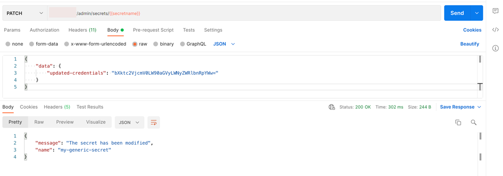

<!-- loiob5d597051e494b49a4907470f1b238af -->

# Update a Generic Secret

Generic secrets can be amended.

To update generic secret data, use the PATCH endpoint as shown below. The PATCH operation replaces the secret with the data provided. This can be used for rotating secret credentials.


<a name="loiob5d597051e494b49a4907470f1b238af__section_ehc_cyk_4rb"/>

## Using Postman

1.  Create a PATCH request and enter the URL `{{apiurl}}/v2/admin/secrets/{{secretName}}`
2.  As the request body, select the *raw* radiobutton and enter the following code:

    > ### Source Code:  
    > ```
    > {
    > 	"data": {
    > 		"updated-credentials": "bXktc2VjcmV0LW90aGVyLWNyZWRlbnRpYWw="
    > 	}
    > }
    > ```

3.  Specify the scope of the request via the header `AI-Tenant-Scope` or `AI-Resource-Group`:
    -   ***AI-Tenant-Scope*** : ***true***. The operation will be performed at the main tenant level.
    -   ***AI-Resource-Group*** : ****<resource-group-name\>****. The operation will be performed at the resource-group level.

4.  Send the request.

 


<a name="loiob5d597051e494b49a4907470f1b238af__section_wgc_2yk_4rb"/>

## Using curl

Submit a PATCH request to the endpoint `/v2/admin/secrets/"$SECRET_NAME"` and specify the scope via the `AI-Tenant-Scope` or `AI-Resource-Group` header.

```
curl --location --request PATCH "[/pandoc/div/div/horizontalrule/codeblock/span/code
     {"filepath"}) $AI_API_URL/v2/admin/secrets/$SECRET_NAME (code]" \
--header "Authorization: Bearer $TOKEN" \
--header 'Content-Type: application/json' \
--header 'AI-Resource-Group: default' \
--data-raw '{
		"data": {
			"some-credential": "bXktc2Vuc2l0aXZlLWRhdGE="
			}
}'
```

**Parent topic:** [Manage Resource Groups](manage-resource-groups-8aae6cb.md "A resource group represents a unique workspace environment, where users can create or add entities such as configurations, executions, deployments, and artifacts.")

**Related Information**  


[Create a Resource Group](create-a-resource-group-01753f4.md "You can create resource groups to isolate ML workloads.")

[Create a Generic Secret](create-a-generic-secret-1831845.md "A generic secret gives SAP AI Core authorization to utilize your resource group without exposing your credentials.")

[List All Generic Secrets](list-all-generic-secrets-05a3713.md "Locate a generic secret, without revealing sensitive information.")

[Delete a Generic Secret](delete-a-generic-secret-d5d5187.md "Manage the lifespan of your generic secrets.")

[Consume Generic Secrets in Executions or Deployments](consume-generic-secrets-in-executions-or-deployments-185a324.md "Utilize generic secrets in executions or deployments.")

