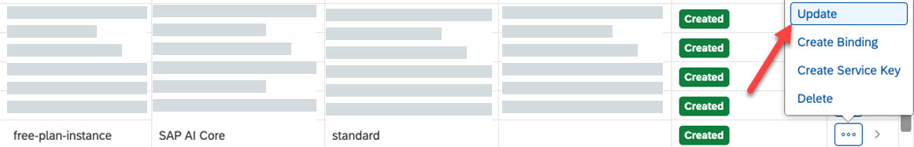

<!-- loio924f892e67b7443fbb4476b3e81959b2 -->

# Update a Service Plan

Update your SAP AI Core service instance from the standard plan to the extended plan while keeping your data and models.

<a name="loio924f892e67b7443fbb4476b3e81959b2__context_s4t_fnn_lgc"/>

## Context

During the update, all metadata and transaction data, including trained models, is retained.

> ### Restriction:  
> You cannot downgrade from the extended plan to the standard plan.
> 
> If a standard or extended instance is deleted, you cannot create a new standard plan instance.

<a name="loio924f892e67b7443fbb4476b3e81959b2__steps_qtp_xmn_15b"/>

## Procedure

1.  Open your global account in the SAP BTP cockpit.

2.  Go to your subaccount.

3.  In the navigation area, choose *Instances and Subscriptions*.

4.  Search for SAP AI Core.

5.  At the end of the subscription row, select the ellipsis \(…\) and choose *Update*.

    

6.  In the wizard that opens, select *default* and click *Update Subscription*.

<a name="loio924f892e67b7443fbb4476b3e81959b2__result_yjn_tnn_lgc"/>

## Results

All data is migrated automatically to your new plan.

User permissions remain unchanged.

