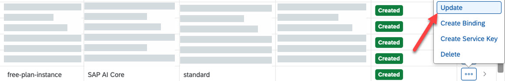

<!-- loio924f892e67b7443fbb4476b3e81959b2 -->

# Update from Free Tier to Standard Plan

Learn how to update to the SAP AI Core standard plan, after exploring the product in Free Tier.

<a name="loio924f892e67b7443fbb4476b3e81959b2__steps_qtp_xmn_15b"/>

## Procedure

1.  Open your global account in the SAP BTP cockpit.

2.  Go to your subaccount.

3.  In the navigation area, choose *Instances and Subscriptions*.

    A list of the applications to which your subaccount is subscribed in the Cloud Foundry environment is displayed.

4.  Search for SAP AI Core.

5.  Select the ellipsis at the end of the subscription row, and from the menu, select *Update*.

6.  In the wizard that opens, select *default* and click *Update Subscription*.

    > ### Note:  
    > After you have updated your service plan, free tier restrictions are no longer applied.
    > 
    > Data that you have defined in the free tier plan is automatically migrated to your standard plan.
    > 
    > Updating to a standard plan does not change user permissions.

<a name="concept_nlk_qlt_15b"/>

<!-- concept\_nlk\_qlt\_15b -->

## Changing Service Plans

If you first subscribe to the free tier option, you can migrate the same service instance to a standard service plan \(for enterprise accounts\). If you migrate from the free tier option to a standard plan, your metadata and transaction data, including trained models, are also migrated \(for enterprise accounts\). It is not possible to migrate from a standard service plan to the free tier option.

**Related Information**  

[Update from Free Tier to Standard Plan](update-from-free-tier-to-standard-plan-924f892.md "Learn how to update to the SAP AI Core standard plan, after exploring the product in Free Tier.")

