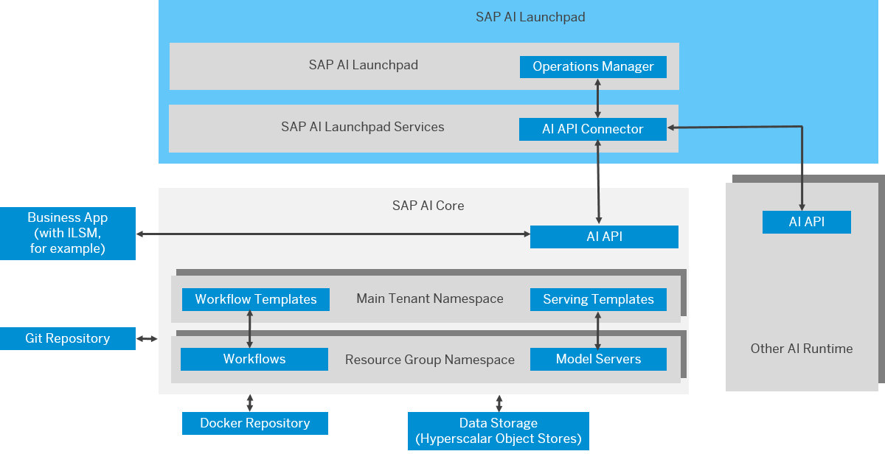

<!-- loiod029a32c22fb45fbb607e6a2c48c8a0e -->

# What Is SAP AI Core?

Learn more about the SAP AI Core service on SAP Business Technology Platform \(SAP BTP\). Build a platform for your artificial intelligence solutions.

SAP AI Core is a service within the SAP Business Technology Platform. It's designed to manage the execution and operations of AI assets in a standardized, scalable, and hyperscaler-agnostic manner. It seamlessly integrates with SAP solutions, allowing any AI function to be easily implemented using open-source frameworks. SAP AI Core supports full lifecycle management of AI scenarios. Users can access generative AI capabilities and prompt lifecycle management through the generative AI hub.

SAP AI Core lets you make data-driven decisions confidently and efficiently, tailored to address business challenges. It handles large volumes of data and offers scalable machine learning capabilities to automate tasks like triaging customer feedback or tickets and performing classification tasks. SAP AI Core includes preconfigured SAP solutions and supports open-source machine learning frameworks. It integrates with Argo Workflow and KServe, and can be embedded into other applications.

SAP AI Core allows you to experiment with and utilize natural language prompts with a variety of generative AI models in the generative AI hub.

> ### Tip:  
> The English version of this guide is open for contributions and feedback using GitHub. This allows you to get in contact with responsible authors of SAP Help Portal pages and the development team to discuss documentation-related issues. To contribute to this guide, or to provide feedback, choose the corresponding option on SAP Help Portal:
> 
> -   *Feedback* \> *Create issue*: Provide feedback about a documentation page. This option opens an issue on GitHub.
> 
> -   *Feedback* \> *Edit page*: Contribute to a documentation page. This option opens a pull request on GitHub.
> 
> 
> You need a GitHub account to use these options.
> 
> More information:
> 
> -   [Contribution Guidelines](https://help.sap.com/docs/open-documentation-initiative/contribution-guidelines/readme.html)
> 
> -   [Introduction Video](https://www.youtube.com/watch?v=WJ0oarMlVW4)
> 
> -   [Introduction Blog Post](https://blogs.sap.com/2021/11/29/sap-btp-documentation-goes-github-new-collaboration-process/)

<a name="loiod029a32c22fb45fbb607e6a2c48c8a0e__section_efb_tt3_snb"/>

## Features

<dl>
<dt><b>

Generative AI hub 

</b></dt>
<dd>

Choose from a selection of generative AI models for prompt experimentation and prompt lifecycle management.

</dd><dt><b>

Execute pipelines 

</b></dt>
<dd>

Execute pipelines as a batch job, for example, to preprocess or train your models, or perform batch inference.

</dd><dt><b>

Serve inference requests 

</b></dt>
<dd>

Deploy а trained machine learning model as a Web service to serve inference requests of trained models with high performance.

</dd><dt><b>

Manage the AI scenario lifecycle 

</b></dt>
<dd>

Manage your ML artifacts and workflows, such as model training, metrics tracking, data, models, and model deployments via a uniform API lifecycle.

</dd><dt><b>

Benefit from multitenancy support 

</b></dt>
<dd>

Use this service in tenant-aware applications. Implement multi-tenant services to segregate your AI assets and executions to isolate your tenants within SAP AI Core.

</dd><dt><b>

Integrate your cloud infrastructure 

</b></dt>
<dd>

Register your Docker registry, synchronize your AI content from your git repository, and register your object store for training data and trained models. Productize your AI content and expose it as a service to consumers in the SAP BTP marketplace.

</dd>
</dl>

<a name="loiod029a32c22fb45fbb607e6a2c48c8a0e__section_cfb_tt3_snb"/>

## Environment

This service is available in the following environments:

-   Cloud Foundry
-   Kyma
-   Kubernetes

<a name="loiod029a32c22fb45fbb607e6a2c48c8a0e__section_a51_2xm_vzb"/>

## Multitenancy

This service supports multitenancy. It can be used in tenant-aware applications. For more information, see [Multitenancy](multitenancy-ee90fe1.md).

<a name="loiod029a32c22fb45fbb607e6a2c48c8a0e__section_jq4_gpf_4rb"/>

## Architectural Overview

The SAP AI Core service works in conjunction with SAP AI Launchpad and the `AI API`. The key components are SAP AI Core, SAP AI Launchpad, and the `AI API`.

-   **SAP AI Core** provides an engine that lets you run AI workflows and model serving workloads.

-   **SAP AI Launchpad** manages a number of AI runtimes. It allows various user groups to access and manage their AI scenarios.

-   **AI API** provides a standard way of managing the AI scenario lifecycle on different runtimes, regardless of whether they're provided on SAP technology \(such as SAP S/4HANA\) or on partner technology \(such as Amazon Web Services\). When the AI API is deployed on runtimes other than SAP AI Core, the runtimes have to provide a runtime adapter.

[Figure 1](what-is-sap-ai-core-d029a32.md#loiod029a32c22fb45fbb607e6a2c48c8a0e__fig_blw_g1y_xnb) shows these three main components in an overview architecture diagram.

  
  
**Architectural Overview**

<a name="loiod029a32c22fb45fbb607e6a2c48c8a0e__section_ifb_tt3_snb"/>

## Tools

SAP AI Core connects with various internal and external tools. You interact with different repositories, systems, and objects. Some of these objects come from SAP, while others must be provided by you. This setup enables enhanced control through authorizations, and supports continuous integration and continuous deployment \(CI/CD\). The following table lists the key repositories, systems, and objects:

<table>
<tr>
<th valign="top">

What

</th>
<th valign="top">

Why

</th>
</tr>
<tr>
<td valign="top">

AI API

</td>
<td valign="top">

For managing your artifacts and workflows \(such as training scripts, data, models, and model servers\) across multiple runtimes

> ### Note:  
> The AI API can also be used to integrate other machine learning platforms, engines, or runtimes into the AI ecosystem.

</td>
</tr>
<tr>
<td valign="top">

Argo Workflows

</td>
<td valign="top">

A container native, workflow engine for Kubernetes.

</td>
</tr>
<tr>
<td valign="top">

Docker repo

</td>
<td valign="top">

For custom Docker images referenced in the templates

</td>
</tr>
<tr>
<td valign="top">

Git repo

</td>
<td valign="top">

For storing training and serving workflows and templates

</td>
</tr>
<tr>
<td valign="top">

Hyperscaler storage

</td>
<td valign="top">

For storage of input and output artifacts, such as training data and models \(for example, SAP BTP Object Store Service\)

</td>
</tr>
<tr>
<td valign="top">

KServing \(K\)

</td>
<td valign="top">

For optimized deployments of machine learning models. Deployment templates use KServe notation.

</td>
</tr>
<tr>
<td valign="top">

Kubernetes \(K8s\)

</td>
<td valign="top">

The K8s cluster orchestrates and scales the pods, which are used in AI pipelines. Resource group isolation is based on a K8s namespace.

</td>
</tr>
<tr>
<td valign="top">

SAP AI Launchpad

</td>
<td valign="top">

SAP AI Launchpad is a multitenant software as a service \(SaaS\) application on SAP Business Technology Platform \(SAP BTP\). Customers and partners can use SAP AI Launchpad to manage AI use cases \(scenarios\) across multiple instances of AI runtimes \(such as SAP AI Core\). SAP AI Launchpad also provides generative AI capabilities via the Generative AI Hub.

</td>
</tr>
</table>

-   **[Metering and Pricing for SAP AI Core](metering-and-pricing-for-sap-ai-core-1e6cbac.md "SAP AI Core
		provides a scalable infrastructure for AI model management, with usage-based pricing that
		lets you pay only for the resources you use.")**  
SAP AI Core provides a scalable infrastructure for AI model management, with usage-based pricing that lets you pay only for the resources you use.
-   **[Choose an Instance](choose-an-instance-c58d4e5.md "You can configure SAP AI Core to use different infrastructure
		instances for different tasks, based on demand. SAP AI Core provides
		several preconfigured infrastructure bundles called “resource plans” and “instance types” for this purpose.")**  
You can configure SAP AI Core to use different infrastructure instances for different tasks, based on demand. SAP AI Core provides several preconfigured infrastructure bundles called “resource plans” and “instance types” for this purpose.

**Related Information**  

[Generative AI Hub in SAP AI Core](generative-ai-hub-in-sap-ai-core-7db524e.md "The generative AI hub incorporates generative AI into your AI activities in SAP AI Core and SAP AI Launchpad.")

[AI API Overview](ai-api-overview-716d4c3.md "The AI API lets you manage your AI assets (such as training scripts, data, models, and model servers) across multiple runtimes.")

[SAP AI Launchpad](https://help.sap.com/ailaunchpad)

