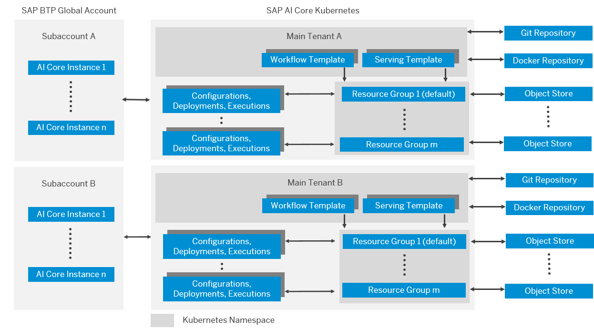

<!-- loiod029a32c22fb45fbb607e6a2c48c8a0e -->

# What Is SAP AI Core?

Hello world!

Learn more about the SAP AI Core service on SAP Business Technology Platform \(SAP BTP\).

SAP AI Core is a service in the SAP Business Technology Platform which is designed to handle the execution and operations of your AI assets in a standardized, scalable, and hyperscaler-agnostic way. It provides seamless integration with your SAP solutions. Any AI function can be easily realized using open-source frameworks. SAP AI Core supports full lifecycle management of AI scenarios.

SAP AI Core allows you to make data driven decisions confidently and efficiently, and is tailored to business problems. It handles large volumes of data and provides scalable machine learning capability, to automate tasks such as triage services for customer feedback or tickets and classification tasks. SAP AI Core comes with preconfigured SAP solutions, can be configured for open source machine learning frameworks, can be used with Argo Workflow and KServe, and can be embedded into other applications.

<a name="loiod029a32c22fb45fbb607e6a2c48c8a0e__section_cfb_tt3_snb"/>

## Environment

This service can be booked from the SAP Business Technology Platform. To subscribe to the service, you need a subaccount in Cloud Foundry.

<a name="loiod029a32c22fb45fbb607e6a2c48c8a0e__section_efb_tt3_snb"/>

## Features

  Execute pipelines 
 :   Execute pipelines as a batch job, for example, to preprocess or train your models, or perform batch inference.

   Serve inference requests 
 :   Deploy а trained machine learning model as a Web service to serve inference requests of trained models with high performance.

   Manage the AI scenario lifecycle 
 :   Manage your ML artifacts and workflows, such as model training, metrics tracking, data, models, and model deployments via a uniform API lifecycle.

   Implement multi-tenant services 
 :   Segregate your AI assets and executions to isolate your tenants within SAP AI Core.

   Integrate your cloud infrastructure 
 :   Register your Docker registry, synchronize your AI content from your git repository, and register your object store for training data and trained models. Productize your AI content amd expose it as a service to consumers in the SAP BTP marketplace.

 

<a name="loiod029a32c22fb45fbb607e6a2c48c8a0e__section_jq4_gpf_4rb"/>

## Process Flow Between SAP AI Core and SAP AI Launchpad

  

**Related Information**  

[About the AI API](about-the-ai-api-716d4c3.md "The AI API lets you manage your AI assets (such as training scripts, data, models, and model servers) across multiple runtimes.")

[SAP AI Launchpad](https://help.sap.com/viewer/product/AI_LAUNCHPAD/INTERNAL/en-US)

