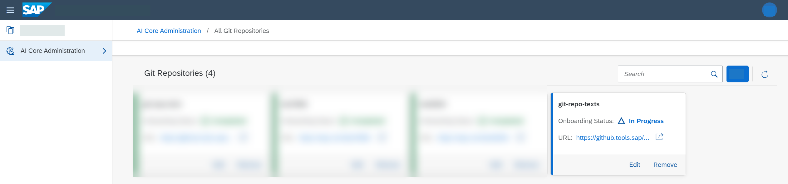

<!-- loioc8cd25115c124444a6f9a28f1cb8228d -->

# Add a Git Repository

As a system administrator, you can add Git repositories which can be used within your training and serving processes.

<a name="loioc8cd25115c124444a6f9a28f1cb8228d__prereq_lq4_g1p_kxb"/>

## Prerequisites

-   You've completed the initial setup. For more information, see [Initial Setup](https://help.sap.com/viewer/2d6c5984063c40a59eda62f4a9135bee/CLOUD/en-US/38c4599432d74c1d94e70f7c955a717d.html "Get started with SAP AI Core using the standard procedures for the SAP BTP, Cloud Foundry environment or Kyma environment.") :arrow_upper_right:.

-   You have access to a git repository over the Internet.
-   You've generated a personal access token for your git repository. For more information, see [Create a Personal Access Token](https://docs.github.com/en/authentication/keeping-your-account-and-data-secure/creating-a-personal-access-token).
-   If you want to onboard a git repository hosted on GitLab, make sure that the repository URL contains the `.git` suffix.
-   Secrets aren't permitted in your repository. If secrets are used, it isn't possible to synchronize content.

You have the `aicore_admin_repositories_editor` role or a role collection that contains it. For more information, see [Roles and Authorizations](https://help.sap.com/docs/ai-launchpad/sap-ai-launchpad/roles-and-authorizations).

> ### Note:  
> When you synchronize resources, make sure that there are no naming collisions, especially if you use multiple repositories or applications in one tenant. If you experience difficulties during synchronization, we recommend that you use only one repository or application per tenant.
> 
> For example, the following repository URLs are all considered the same repository:
> 
> -   `https://github.com/user/repo`
> -   `https://github.com/user/repo/`
> -   `https://github.com/user/REPO/`

<a name="loioc8cd25115c124444a6f9a28f1cb8228d__context_s5h_dbp_kxb"/>

## Context

Git repositories are managed by creating personal access tokens and registering them in SAP AI Core. Personal access tokens are a means of allowing and controlling connections to GitHub repositories without compromising your credentials.

You can add multiple Git repositories for a selected connection. The Git repository must already exist with valid authentication details.

> ### Note:  
> SAP AI Core supports the use of Git repositories; the use of other private or open-source repositories isn't supported.

<a name="loioc8cd25115c124444a6f9a28f1cb8228d__steps_qxg_svf_4xb"/>

## Procedure

1.  In the *Workspaces* app, choose the AI API connection.

2.  Open the *SAP AI Core Administration* app and choose *Git Repositories*.

    The *Git Repositories* screen appears with details of any existing repositories, including name, status, and URL.

3.  Choose *Add* to enter reference details for a new repository.

4.  Complete the fields in the *Add a Git Repository* dialog box as follows:

    1.  Enter a URL for the repository.

    2.  Enter a name for the repository.

        Repository names must comply with the following criteria:

        -   Contain only lowercase alphanumeric characters, hyphens \(-\), or periods \(.\)

        -   Start with an alphanumeric character

        -   End with an alphanumeric character

    3.  Enter a user name and access token.

        The combination of user name and access token enables read access to the repo.

5.  Choose *Add* to add the repo to the available repositories for the selected SAP AI Core connection.

<a name="loioc8cd25115c124444a6f9a28f1cb8228d__result_ktq_tvf_4xb"/>

## Results

The new repo appears on the *Git Repositories* screen. The onboarding status for the new repo is *In progress* until the authorization details are authenticated.

**Related Information**  

[Add Connection to SAP AI Core](add-connection-to-sap-ai-core-71dfe2c.md "As an administrator, you can add multiple connections to different instances of SAP AI Core. You can enter the service key details for a connection manually, or upload a service key file.")

[Setting Up Your Git Repository](https://help.sap.com/docs/AI_CORE/2d6c5984063c40a59eda62f4a9135bee/3269092e37d141a293f0dbd7eaafc829.html)

