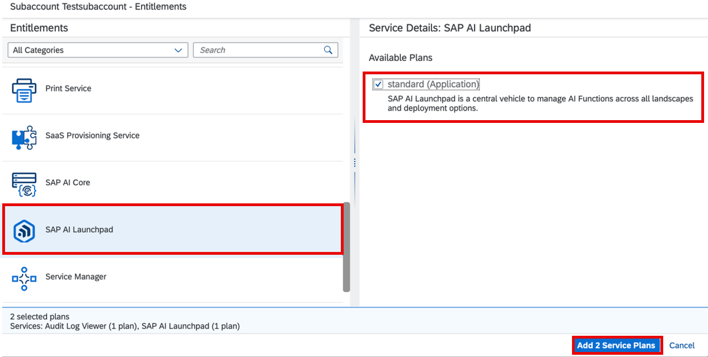

<!-- loio9a8b7f26a6dc4a69aa3179030fc0eded -->

# Add a Service Plan

Configure the required entitlements to make SAP AI Launchpad accessible in your subaccount.

<a name="loio9a8b7f26a6dc4a69aa3179030fc0eded__prereq_pzq_c14_5pb"/>

## Prerequisites

-   You are an administrator of the global account in SAP Business Technology Platform.

-   The subaccount is in the SAP Business Technology Platform, Cloud Foundry environment with enabled Cloud Foundry capabilities. For more information, see [Enable Cloud Foundry](enable-cloud-foundry-cf0d5d2.md).

-   Your SAP BTP administrator has set the entitlement to a subaccount so that you can provision SAP AI Launchpad. For more information, see [Managing Entitlements and Quotas Using the Cockpit](https://help.sap.com/docs/btp/sap-business-technology-platform/managing-entitlements-and-quotas-using-cockpit).

## Context

An entitlement is the service plan that you're entitled to use.

## Procedure

1.  In the navigation area for your global account, choose *Entitlements* \> *Entity Assignments*.

    

2.  Select your subaccount from the *Subaccounts* dropdown menu and choose *Go*.

    

3.  Choose *Configure Entitlements*.

    

4.  Choose *Add Service Plans*.

    

5.  Select the SAP AI Launchpad application, set the checkbox for the standard plan, and click *Add Service Plans*.

    

6.  Save your changes.

    

