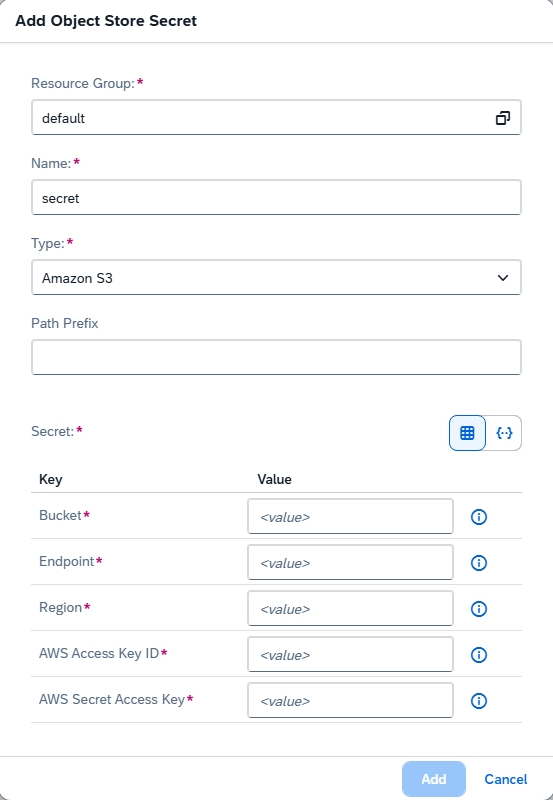

<!-- loio5b4f728c8f21403697728687f96e03c6 -->

<link rel="stylesheet" type="text/css" href="css/sap-icons.css"/>

# Add an Object Store Secret

As an administrator, you can add object store secrets for use within your AI processes.


<a name="loio5b4f728c8f21403697728687f96e03c6__prereq_t21_cgz_qxb"/>

## Prerequisites

-   You're using the SAP AI Core`extended` service plan. For more information, see [SAP AI Core Service Plans](https://help.sap.com/docs/sap-ai-core/sap-ai-core-service-guide/service-plans).
-   You have the `aicore_admin_objectstoresecret_editor` role or a role collection that contains it. For more information, see [Roles and Authorizations](https://help.sap.com/docs/ai-launchpad/sap-ai-launchpad/roles-and-authorizations).


<a name="loio5b4f728c8f21403697728687f96e03c6__context_vls_chz_qxb"/>

## Context

You can use the *SAP AI Core Administration* app to add secrets for multiple object stores. The object stores must already exist with valid credentials.

Supported cloud object stores include Amazon S3 \(S3\), Alibaba Cloud Object Storage Service \(OSS\), Azure, and SAP HANA Cloud, data lake \(WebHDFS\).


<a name="loio5b4f728c8f21403697728687f96e03c6__steps_zj5_dhz_qxb"/>

## Procedure

1.  In the *Workspaces* app, choose the AI API connection and resource group.

2.  Open the *SAP AI Core Administration* app and choose *Object Store Secrets*.

    The *Object Store Secrets* screen appears with a tile for each existing secret.

3.  Choose *Add* to enter reference details for a new secret.

4.  Complete the fields in the *Add Object Store Secret* dialog box as follows:

    1.  Confirm the resource group. To change the resource group, choose <span class="SAP-icons-V5"></span> \(Change Value\).

    2.  Enter a name for the secret.

        Secret names must comply with the following criteria:

        -   Contain only lowercase alphanumeric characters, hyphens \(-\), or periods \(.\)

        -   Start with an alphanumeric character

        -   End with an alphanumeric character


    3.  Choose the type of object store.

    4.  Enter the path prefix of the location of your documents.

    5.  Add the information for your object store.

        > ### Note:  
        > The type of object store \(for example: AWS S3, Microsoft SharePoint\) determines what fields are required for the object store secret.

        To enter your secret using dialogue boxes, use the <span class="SAP-icons-V5"></span> \(form\) icon.

        

        To enter your secret in JSON format, use the <span class="SAP-icons-V5"></span> \(code\) icon.

        > ### Note:  
        > The JSON key-value pairs correspond to the form fields shown in form mode, and may differ in format from the information provided by your object store provider.
        > 
        > Entries should not be Base-64 encoded.

        > ### Sample Code:  
        > ```
        > {
        >   "bucket": "<your S3 bucket name>",
        >   "endpoint": "<your S3 endpoint>",
        >   "region": "<your S3 region>",
        >   "AWS_ACCESS_KEY_ID": "<your S3 access key>",
        >   "AWS_SECRET_ACCESS_KEY": "<your S3 secret accces key>"
        > }
        > ```


5.  Choose *Add* to save the secret details.


<a name="loio5b4f728c8f21403697728687f96e03c6__result_ibj_2hz_qxb"/>

## Results

The new secret appears on the *Object Store Secrets* screen.

The saved secret enables read access to the nominated hyperscaler object store, enabling stored files to be used in your launchpad processes.

