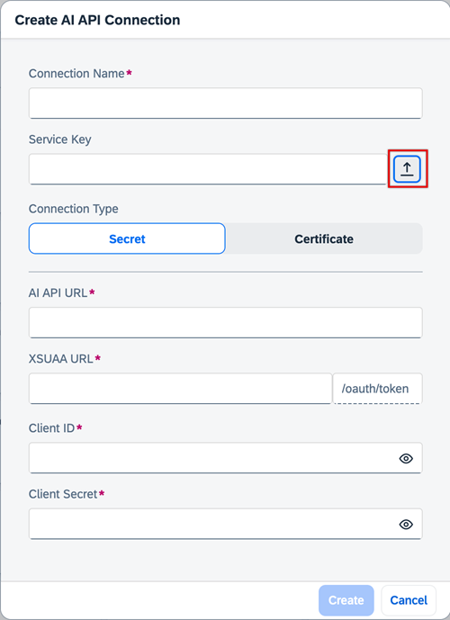

<!-- loio71dfe2cab0e94cf5bec9d707140ea0d1 -->

<link rel="stylesheet" type="text/css" href="css/sap-icons.css"/>

# Add Connection to SAP AI Core

As an administrator, you can add multiple connections to different instances of SAP AI Core. You can enter the service key details for a connection manually, or upload a service key file.

<a name="loio71dfe2cab0e94cf5bec9d707140ea0d1__prereq_knz_l1p_fyb"/>

## Prerequisites

You have the `connections_editor` role or a role collection that contains it. For more information, see [Roles and Authorizations](https://help.sap.com/docs/ai-launchpad/sap-ai-launchpad/roles-and-authorizations).

<a name="loio71dfe2cab0e94cf5bec9d707140ea0d1__steps_jvk_q1p_fyb"/>

## Procedure

1.  In SAP AI Launchpad, open the *Workspaces* app and choose *Add*. The *Create AI API Connection* dialog appears.

2.  Enter a name for your new connection.

    Connection names must comply with the following criteria:

    -   Contain only lowercase alphanumeric characters, hyphens \(-\), or periods \(.\)

    -   Start with an alphanumeric character

    -   End with an alphanumeric character

3.  Upload the service key file for your SAP AI Core instance, if available.

    To upload the service key as a `.TXT` or `JSON` file, choose  \(Upload\) . Search for and choose the local service key file.

    Service key data then defaults to the remaining fieldsincluding the connection type.

    

4.  If a service key file is not available, complete the followingbased on the service key and connection type you have:

    If you have a service key containing client secret credentials, choose *Secret* and complete the following:

    1.  Enter the `AI_API_URL` from your service key for your SAP AI Core instance.

    2.  Enter the `url` from your service key for your SAP AI Core instance.

    3.  Enter the `clientid` from your service key for your SAP AI Core instance.

    4.  Enter the `clientsecret` from your service key for your SAP AI Core instance.

    If you have a service key containing x509 certificate credentials, choose *Certificate* and complete the following:

    1.  Enter the `AI_API_URL` from your service key for your SAP AI Core instance.

    2.  Enter the `certurl` from your service key for your SAP AI Core instance.

    3.  Enter the `clientid` from your service key for your SAP AI Core instance.

    4.  Enter the `certificate` from your service key for your SAP AI Core instance.

    5.  Enter the `key` from your service key for your SAP AI Core instance.

    Sensitive fields are masked. You can unmask to show your entry if needed.

<a name="loio71dfe2cab0e94cf5bec9d707140ea0d1__result_aj3_s1p_fyb"/>

## Results

The new connection appears in the *Workspaces* app.

