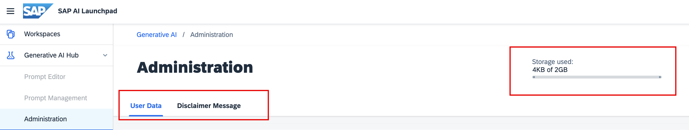

<!-- loio3d03a2ef32f7467395b813a77c8706a7 -->

# Administration

The *Administration* app provides the following capabilities:

-   Monitoring storage consumption

-   Manual user offboarding

-   Creating and managing disclaimers

Storage consumption is displayed on a progress bar as a proportion of total available storage.

Other capabilities are accessed through the corresponding tabs.

-   **[Manual User Offboarding](manual-user-offboarding-0d8d3cc.md "")**  

-   **[Create a Disclaimer](create-a-disclaimer-4ecc5ae.md "")**  

**Related Information**  

[Manual User Offboarding](manual-user-offboarding-0d8d3cc.md "")

[Create a Disclaimer](create-a-disclaimer-4ecc5ae.md "")

