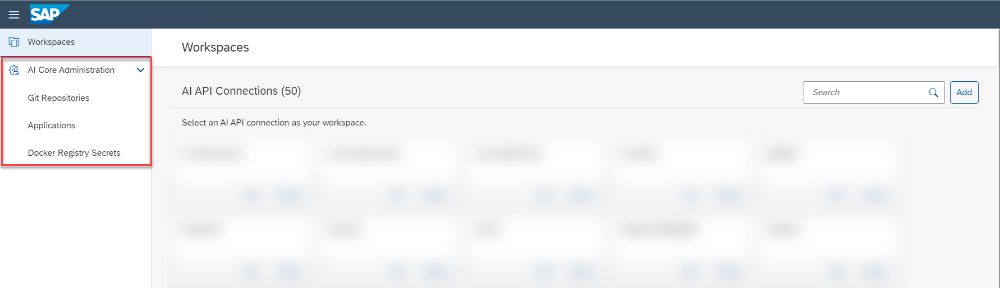

<!-- loiocb4dd1e3f63644a8b506266cec73474c -->

# Administration

You use the *SAP AI Core Administration* app in SAP AI Launchpad to manage administration activities for your SAP AI Core runtime.

For example, you can use the *SAP AI Core Administration* app to manage authentications required when processing AI workflows.

<a name="loiocb4dd1e3f63644a8b506266cec73474c__section_nbn_yfp_xsb"/>

## Accessing the App

You'll find the *SAP AI Core Administration* app in SAP AI Launchpad in the left navigation panel.

After selecting a connection in *Workspaces* app, the *SAP AI Core Administration* app is active. You can then manage Git repositories, applications, and Docker registry secrets which are connected to your underlying SAP AI Core runtime.

 

<a name="loiocb4dd1e3f63644a8b506266cec73474c__section_mzd_dgp_xsb"/>

## Key Tasks

The key tasks for the *SAP AI Core Administration* app include:

-   [Manage Repositories](manage-repositories-a63b907.md)

-   [Manage Applications](manage-applications-cf2f1d9.md)
-   [Manage Docker Registry Secrets](manage-docker-registry-secrets-6fb7cc0.md)

-   **[Manage Repositories](manage-repositories-a63b907.md "You can maintain a list of Git repositories for use within your AI processes. ")**  
You can maintain a list of Git repositories for use within your AI processes.
-   **[Manage Object Store Secrets](manage-object-store-secrets-0377ede.md "You can connect your AI processes with a cloud object store, and manage access using an object store secret.")**  
You can connect your AI processes with a cloud object store, and manage access using an object store secret.
-   **[Manage Applications](manage-applications-cf2f1d9.md "You can maintain a list of applications used within your AI processes.")**  
You can maintain a list of applications used within your AI processes.
-   **[Manage Docker Registry Secrets](manage-docker-registry-secrets-6fb7cc0.md "You can maintain a list of Docker registry secrets for use within your AI processes. ")**  
You can maintain a list of Docker registry secrets for use within your AI processes.
-   **[Manage Resource Groups](manage-resource-groups-7217afb.md "")**  

-   **[Manage Generic Secrets in SAP AI Core](manage-generic-secrets-in-sap-ai-core-678fd23.md " Main Tenant users of theSAP AI Core runtime can create, edit and
		delete generic secrets at both the main tenant and resource group levels of SAP AI Core, through the SAP AI Core
                                    Administration app.")**  
 Main Tenant users of theSAP AI Core runtime can create, edit and delete generic secrets at both the main tenant and resource group levels of SAP AI Core, through the *SAP AI Core Administration* app.

**Related Information**  

[Setting Up Your Git Repository](https://help.sap.com/docs/AI_CORE/2d6c5984063c40a59eda62f4a9135bee/3269092e37d141a293f0dbd7eaafc829.html)

