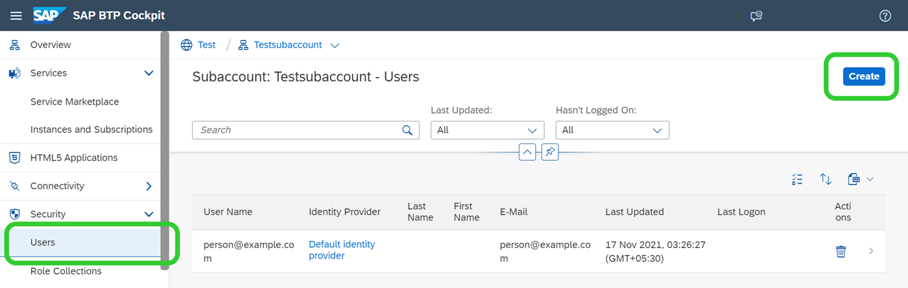
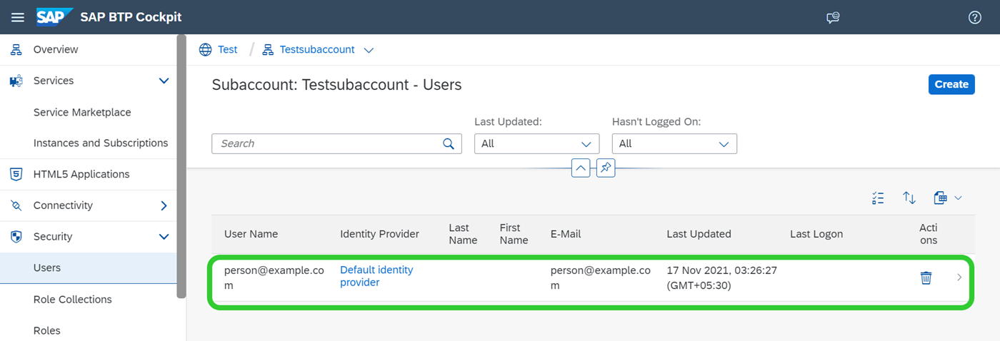
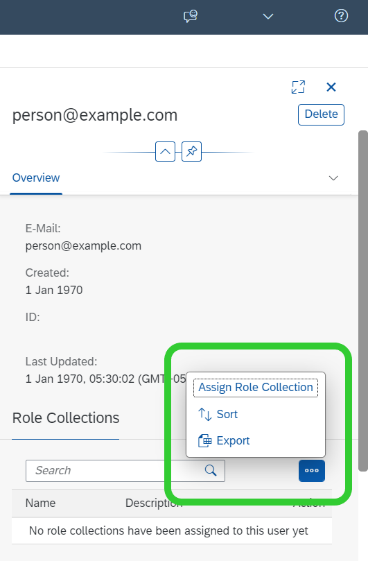

<!-- loio8c84776e330140728937e323755b45bf -->

<link rel="stylesheet" type="text/css" href="css/sap-icons.css"/>

# Allow Access to SAP AI Launchpad

You can assign role collections to specific users to allow access to SAP AI Launchpad.

<a name="loio8c84776e330140728937e323755b45bf__steps_jp1_sf3_5pb"/>

## Procedure

1.  Open the SAP BTP cockpit.

2.  Go to your global account and subaccount.

3.  Choose *Security* \> *Users* and click *Create*.

    

4.  Choose the user by clicking the corresponding row in the table.

    

5.  In the *Role Collections* section, choose *Assign Role Collection* \(you may have to click the *More* icon \(\) to see this\).

    

6.  Choose the role collections as required.

    SAP AI Launchpad provides standard or default role collections. The default role collections bundle the roles required for likely SAP AI Launchpad tasks and app functions. However, if these role collections do not suit your organizational needs, you can create your own role collections.

    **Default Role Collections**

    <table>
    <tr>
    <th valign="top">

    Relevance
    
    </th>
    <th valign="top">

    Default Role Collection
    
    </th>
    <th valign="top">

    Description
    
    </th>
    <th valign="top">

    Includes Roles
    
    </th>
    </tr>
    <tr>
    <td valign="top">
    
    SAP AI Launchpad 
    
    </td>
    <td valign="top">
    
    `ailaunchpad_connections_editor` 
    
    </td>
    <td valign="top">
    
    Provides roles to view, create, edit, and delete connections to your AI runtime \(for example, SAP AI Core\)
    
    </td>
    <td valign="top">
    
    `viewer`

    `connections_editor`
    
    </td>
    </tr>
    <tr>
    <td valign="top">
    
    SAP AI Launchpad 
    
    </td>
    <td valign="top">
    
    `ailaunchpad_allow_all_resourcegroups` 
    
    </td>
    <td valign="top">
    
    Provides access to all resource groups
    
    </td>
    <td valign="top">
    
    `allow_all_resourcegroups` 
    
    </td>
    </tr>
    <tr>
    <td valign="top">
    
    *ML Operations* 
    
    </td>
    <td valign="top">
    
    `ailaunchpad_mloperations_viewer` 
    
    </td>
    <td valign="top">
    
    Provides roles to view all contents of scenarios and resource groups
    
    </td>
    <td valign="top">
    
    `viewer`

    `mloperations_viewer`
    
    </td>
    </tr>
    <tr>
    <td valign="top">
    
    *ML Operations* 
    
    </td>
    <td valign="top">
    
    `ailaunchpad_mloperations_editor` 
    
    </td>
    <td valign="top">
    
    Provides roles to view all contents of scenarios, and to view and edit contents of resource groups
    
    </td>
    <td valign="top">
    
    `viewer`

    `mloperations_editor`

    `artifact.register`
    
    </td>
    </tr>
    <tr>
    <td valign="top">
    
    *SAP AI Core Administration*
    
    </td>
    <td valign="top">
    
    `ailaunchpad_aicore_admin_viewer`
    
    </td>
    <td valign="top">
    
    Provides roles to view authentications required for AI workflows involving SAP AI Core \(AI runtime\)
    
    </td>
    <td valign="top">
    
    `viewer`

    `aicore_admin_viewer_all`
    
    </td>
    </tr>
    <tr>
    <td valign="top">
    
    *SAP AI Core Administration*
    
    </td>
    <td valign="top">
    
    `ailaunchpad_aicore_admin_editor`
    
    </td>
    <td valign="top">
    
    Provides roles to edit authentications required for AI workflows involving SAP AI Core \(AI runtime\)
    
    </td>
    <td valign="top">
    
    `viewer`

    `aicore_admin_editor_all` 
    
    </td>
    </tr>
    <tr>
    <td valign="top">
    
    *Functions Explorer* 
    
    </td>
    <td valign="top">
    
    `ailaunchpad_functions_explorer_viewer_v2` 
    
    </td>
    <td valign="top">
    
    Provides roles to view scenarios and all ML resources of a scenario
    
    </td>
    <td valign="top">
    
    `viewer`

    `connections_viewer`

    `functions_explorer`

    `mlfunctions_viewer`

    `scenario_executable_viewer`

    `scenario_metadata_viewer`

    `scenario_configuration_viewer`

    `scenario_job_viewer`

    `scenario_artifact_viewer`

    `scenario_metric_viewer`
    
    </td>
    </tr>
    <tr>
    <td valign="top">
    
    *Functions Explorer* 
    
    </td>
    <td valign="top">
    
    `ailaunchpad_functions_explorer_editor_v2` 
    
    </td>
    <td valign="top">
    
    Edit scenarios and all ML resources of a scenario
    
    </td>
    <td valign="top">
    
    `viewer`

    `connections_viewer`

    `functions_explorer`

    `mlfunctions_editor`

    `scenario_executable_viewer`

    `scenario_metadata_viewer`

    `scenario_metric_viewer`

    `scenario_configuration_editor`

    `scenario_job_editor`

    `scenario_artifact_editor`
    
    </td>
    </tr>
    <tr>
    <td valign="top">
    
    SAP AI Launchpad
    
    </td>
    <td valign="top">
    
    `ailaunchpad_connections_editor_without_genai`
    
    </td>
    <td valign="top">
    
    Provides roles to view, create, edit, and delete connections to your AI runtime \(for example, SAP AI Core\) without Generative AI Hub
    
    </td>
    <td valign="top">
    
    `viewer_without_genai`

    `connections_editor`
    
    </td>
    </tr>
    <tr>
    <td valign="top">
    
    *ML Operations*
    
    </td>
    <td valign="top">
    
    `ailaunchpad_mloperations_viewer_without_genai` 
    
    </td>
    <td valign="top">
    
    Provides roles to view all contents of scenarios and resource groups without Generative AI Hub 
    
    </td>
    <td valign="top">
    
    `viewer_without_genai`

    `mloperations_viewer`
    
    </td>
    </tr>
    <tr>
    <td valign="top">
    
    *ML Operations*
    
    </td>
    <td valign="top">
    
    `ailaunchpad_mloperations_editor_without_genai` 
    
    </td>
    <td valign="top">
    
    Provides roles to view all contents of scenarios, and to view and edit contents of resource groups without Generative AI Hub 
    
    </td>
    <td valign="top">
    
    `viewer_without_genai`

    `mloperations_editor`

    `artifact.register`
    
    </td>
    </tr>
    <tr>
    <td valign="top">
    
    *Functions Explorer*
    
    </td>
    <td valign="top">
    
    `ailaunchpad_functions_explorer_viewer_v2_without_genai` 
    
    </td>
    <td valign="top">
    
    Provides roles to view scenarios and all ML resources of a scenario without Generative AI Hub 
    
    </td>
    <td valign="top">
    
    `viewer_without_genai`

    `connections_viewer`

    `functions_explorer`

    `mlfunctions_viewer`

    `scenario_executable_viewer`

    `scenario_metadata_viewer`

    `scenario_configuration_viewer`

    `scenario_job_viewer`

    `scenario_artifact_viewer`

    `scenario_metric_viewer`
    
    </td>
    </tr>
    <tr>
    <td valign="top">
    
    *Functions Explorer*
    
    </td>
    <td valign="top">
    
    `ailaunchpad_functions_explorer_editor_v2_without_genai` 
    
    </td>
    <td valign="top">
    
    Edit scenarios and all ML resources of a scenario without Generative AI Hub 
    
    </td>
    <td valign="top">
    
    `viewer_without_genai`

    `connections_viewer`

    `functions_explorer`

    `mlfunctions_editor`

    `scenario_executable_viewer`

    `scenario_metadata_viewer`

    `scenario_metric_viewer`

    `scenario_configuration_editor`

    `scenario_job_editor`

    `scenario_artifact_editor`
    
    </td>
    </tr>
    <tr>
    <td valign="top">
    
    *SAP AI Core Administration*
    
    </td>
    <td valign="top">
    
    `ailaunchpad_aicore_admin_viewer_without_genai`
    
    </td>
    <td valign="top">
    
    Administrator \(SAP AI Core\) viewer, without access to Generative AI Hub
    
    </td>
    <td valign="top">
    
    `viewer_without_genai``aicore_admin_viewer_all`
    
    </td>
    </tr>
    <tr>
    <td valign="top">
    
    *SAP AI Core Administration*
    
    </td>
    <td valign="top">
    
    `ailaunchpad_aicore_admin_editor_without_genai`
    
    </td>
    <td valign="top">
    
    Administrator \(SAP AI Core\) editor, without access to Generative AI Hub
    
    </td>
    <td valign="top">
    
    `viewer_without_genai``aicore_admin_editor_all`
    
    </td>
    </tr>
    <tr>
    <td valign="top">
    
    *Generative AI Hub*
    
    </td>
    <td valign="top">
    
    `ailaunchpad_genai_experimenter`
    
    </td>
    <td valign="top">
    
    Generative AI Hub experimenter
    
    </td>
    <td valign="top">
    
    `viewer_without_genai``genai_experimenter`
    
    </td>
    </tr>
    <tr>
    <td valign="top">
    
    *Generative AI Hub*
    
    </td>
    <td valign="top">
    
    `ailaunchpad_genai_manager`
    
    </td>
    <td valign="top">
    
    Generative AI Hub manager
    
    </td>
    <td valign="top">
    
    `viewer_without_genai``genai_experimenter``genai_manager`
    
    </td>
    </tr>
    <tr>
    <td valign="top">
    
    *Generative AI Hub*
    
    </td>
    <td valign="top">
    
    `ailaunchpad_genai_administrator`
    
    </td>
    <td valign="top">
    
    Generative AI Hub administrator
    
    </td>
    <td valign="top">
    
    `viewer_without_genai``genai_administrator`
    
    </td>
    </tr>
    </table>
    
7.  Choose *Assign Role Collection*.

<a name="loio8c84776e330140728937e323755b45bf__result_t34_rzg_rrb"/>

## Results

You've now assigned the role collection to the user, who has all of the authorizations provided by the role collection.

> ### Note:  
> Generative AI hub is available through the default `viewer` role.
> 
> Access to the generative AI hub can be revoked by assigning the equivalent role `without_genai`. For example, the `viewer` and `viewer_without_genai` are equiavalent roles, with and without generative AI hub capabilities respectively.

For more information, see [Roles and Authorizations](roles-and-authorizations-4ef8499.md).

**Related Information**  

[Working with Role Collections](https://help.sap.com/viewer/65de2977205c403bbc107264b8eccf4b/Cloud/en-US/393ea0b222754311884123ce564779bd.html)

[Roles and Authorizations](roles-and-authorizations-4ef8499.md "SAP AI Launchpad provides default role collections that you can assign to users. The role collections determine which actions a user is able to carry out in SAP AI Launchpad. You can also create your own role collections and assign the required roles to them.")

