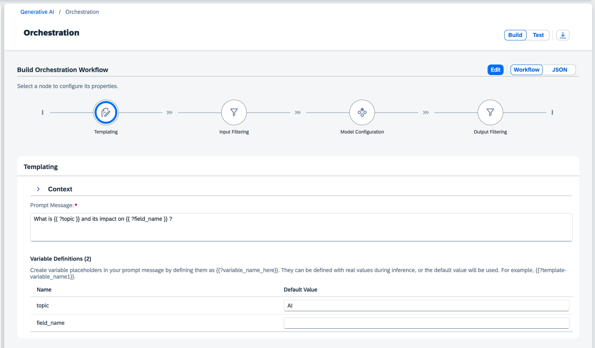

<!-- loiob7dc8b48df2b4f009e9157f5448c7935 -->

<link rel="stylesheet" type="text/css" href="css/sap-icons.css"/>

# Build Your Orchestration Workflow

You build your orchestration workflow by designing and testing a prompt that can be populated with different data during inference.


## Prerequisites

-   You have an orchestration deployment running. For more information, see [Create a Deployment for Orchestration](create-a-deployment-for-orchestration-4344c5b.md).

-   You have the role `orchestration_executor`, `genai_experimenter`, or `genai_manager`, or you are assigned a role collection that contains one of these roles. For more information, see [Roles and Authorizations](roles-and-authorizations-4ef8499.md).


<a name="loiob7dc8b48df2b4f009e9157f5448c7935__context_a51_5qc_ybc"/>

## The Orchestration Workflow

Navigate to the landing page for orchestration by choosing *Generative AI Hub* \> *Orchestration*. SAP AI Launchpad displays the following workflow, which you can use to build your orchestration.


### Templating \(Mandatory\)

In this section, you enter your prompt to be passed to the generative AI model. You can also enter a system message to specify how the model is to answer a question, and you can provide sample queries and responses for the model.

When you enter the prompt and the system message, you can define placeholders by surrounding the text with two curly brackets and preceding the placeholder name with a question mark. For example, `Create a job description for the role of {{?job_role1}}`. The names of your placeholders must meet the following criteria:

-   Start with a letter

-   End with a letter or a number

-   Do not include special characters other than an underscore \(\_\) or a hyphen \(-\). Note that consecutive underscores or hyphens are not permitted.


For each placeholder, you can enter a default value that is used to test your model. If you do not specify a default value, you will be prompted to enter a value when you test the workflow.




### Input Filtering \(Optional\)

Input filtering lets you decide the type of content that is passed to the generative AI model.

The module supports the Azure Content Safety classification service. This service recognizes four distinct content categories: `Hate`, `Violence`, `Sexual`, and `SelfHarm`. For more information, see [Harm categories in Azure AI Content Safety](https://learn.microsoft.com/en-us/azure/ai-services/content-safety/concepts/harm-categories?tabs=warning). Text can have more than one label \(for example, a text sample can be classified as both `Hate` and `Violence`\). The returned content categories include a severity level rating of 0, 2, 4, or 6. The value increases with the severity of the content.

> ### Note:  
> Some generative AI models have content filters incorporated into their standard offering. This means that content may be filtered irrespective of the settings that you configure here.

If you edit the workflow, you can hide the filter section.


### Model Configuration \(Mandatory\)

In this section, you select the model that you want to use in your workflow. If you don't select a model, the default model will be used. You can also include further parameters in JSON format. For information about the supported parameters, see the documentation of the model provider.

When you run the workflow, you will receive one response from the model. If you want to receive multiple responses, you can set a value for the `n` parameter in the model configuration.

> ### Example:  
> If you enter `n=3` in the model configuration, the model will generate three different responses based on your prompt template.


### Output Filtering \(Optional\)

Output filtering lets you decide the type of content that is received from the generative AI model.

The module supports the Azure Content Safety classification service. This service recognizes four distinct content categories: `Hate`, `Violence`, `Sexual`, and `SelfHarm`. For more information, see [Harm categories in Azure AI Content Safety](https://learn.microsoft.com/en-us/azure/ai-services/content-safety/concepts/harm-categories?tabs=warning). Text can have more than one label \(for example, a text sample can be classified as both `Hate` and `Violence`\). The returned content categories include a severity level rating of 0, 2, 4, or 6. The value increases with the severity of the content.

> ### Note:  
> Some generative AI models have content filters incorporated into their standard offering. This means that content may be filtered irrespective of the settings that you configure here.

If you edit the workflow, you can hide the filter section.


<a name="loiob7dc8b48df2b4f009e9157f5448c7935__section_xjc_nzr_dcc"/>

## Editing the Orchestration Workflow

You can change the orchestration workflow by showing or hiding modules. To do so, click the *Edit* button and toggle the switch to show or hide the modules as required. Note that you can only hide optional modules.

> ### Restriction:  
> Templating and Model Configuration modules are mandatory and therefore can't be hidden.


<a name="loiob7dc8b48df2b4f009e9157f5448c7935__section_rkz_zmx_dcc"/>

## Uploading an Orchestration Workflow

You can upload your own orchestration workflow in JSON format. The workflow structure must match the following example:

```json
{
    "module_configurations": {
        "llm_module_config": {
            "model_name": "gpt-35-turbo",
            "model_params": {},
            "model_version": "0613"
        },
        "templating_module_config": {
            "template": [
			{
                    "role": "user",
                    "content": "what is {{?context}} ?"
               }
		],
            "defaults": {
                "context": "artificial intelligence"
            }
        },
        "filtering_module_config": {
            "input": {
                "filters": [
                    {
                        "type": "azure_content_safety",
                        "config": {
                            "Hate": "2",
                            "SelfHarm": "2",
                            "Sexual": "2",
                            "Violence": "2"
                        }
                    }
                ]
            },
            "output": {
                "filters": [
                    {
                        "type": "azure_content_safety",
                        "config": {
                            "Hate": "2",
                            "SelfHarm": "2",
                            "Sexual": "2",
                            "Violence": "2"
                        }
                    }
                ]
            }
        }
    }
}
```

1.  Click *JSON* to show the JSON file for your orchestration workflow.

2.  Click *Upload* to upload your edited JSON file.

    The size of your file cannot exceed 200 KB.

3.  If necessary, you can download the JSON file again by clicking <span class="SAP-icons-V5"></span>.


> ### Note:  
> If the parameters in your uploaded json are invalid to the selected model they will be ignored.

