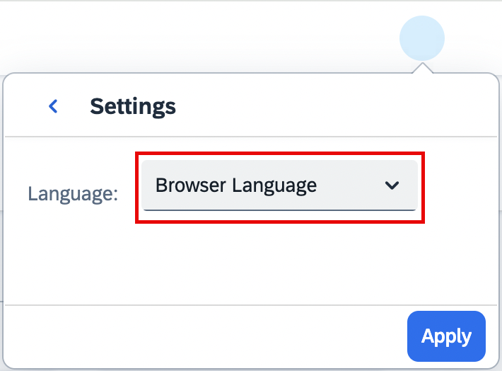

<!-- loio85a79eb4f2014177a28a55ae50980cef -->

<link rel="stylesheet" type="text/css" href="css/sap-icons.css"/>

# Change Language Setting

## Context

You can choose the language in which you work with SAP AI Launchpad apps. SAP AI Launchpad apps initially default to your browser language, however, you can change this to any of the currently supported languages.

You can change your preferred language setting at any time and from within any SAP AI Launchpad app.

## Procedure

1.  Open SAP AI Launchpad. The *Workspaces* app appears.

2.  Choose your profile icon in the header.

3.  Choose :gear: to show available languages.

    

4.  Select your preferred language from the list, and then choose *Apply*.

<a name="loio85a79eb4f2014177a28a55ae50980cef__result_tds_nzf_k5b"/>

## Results

The screen refreshes and your preferred language appears throughout SAP AI Launchpad apps.

