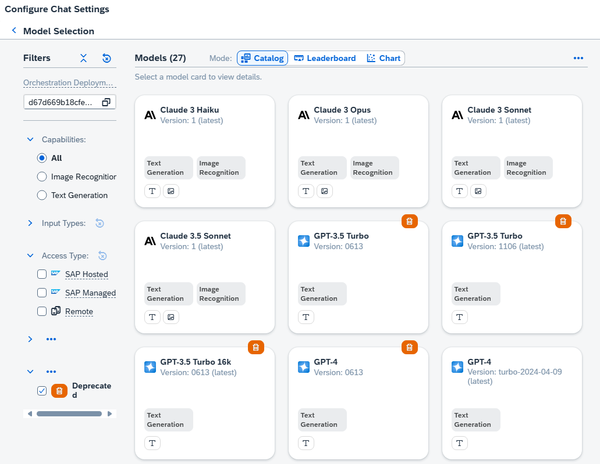
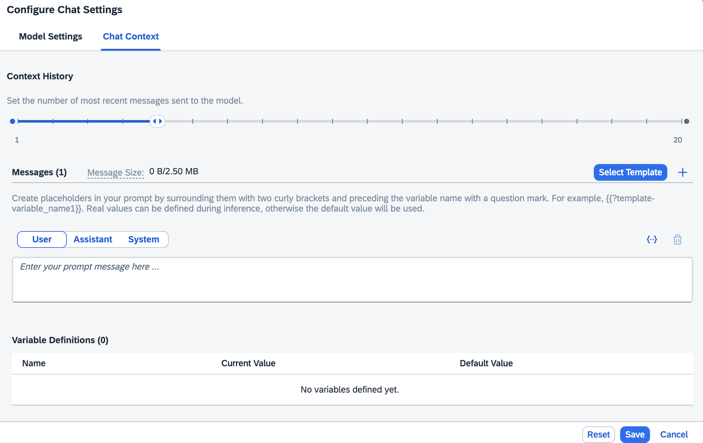
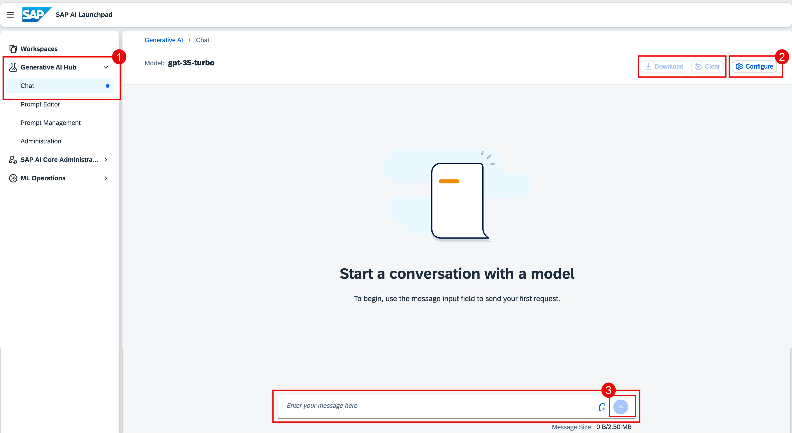

<!-- loiod84b5a1a2973440fb1af992ccaa2ac87 -->

<link rel="stylesheet" type="text/css" href="css/sap-icons.css"/>

# Chat

<a name="loiod84b5a1a2973440fb1af992ccaa2ac87__prereq_gd3_lrc_bzb"/>

## Prerequisites

-   You have an orchestration deployment running. For more information, see [Create a Deployment for Orchestration](create-a-deployment-for-orchestration-4344c5b.md)

-   You’ve selected the AI API connection and resource group that you used in the activation steps.

-   For image upload only: you have the `prompt_media_executor` role, or you are assigned a role collection that contains it. For more information, see [Roles and Authorizations](security-e4cf710.md#loio4ef8499d7a4945ec854e3b4590830bcc).

-   You have the `genai_manager`, `prompt_manager`, `genai_experimenter` or `prompt_experimenter` role, or you are assigned a role collection that contains one of these roles. For more information, see [Roles and Authorizations](security-e4cf710.md#loio4ef8499d7a4945ec854e3b4590830bcc).

<a name="loiod84b5a1a2973440fb1af992ccaa2ac87__context_qdl_xnp_rzb"/>

## Context

> ### Caution:  
> SAP does not take any responsibility for quality of the content in the input to or output of the underlying generative AI models. This includes but is not limited to bias, hallucinations, or inaccuracies. The user is responsible for verifying the content.

## Procedure

1.  Select the connection to your SAP AI Core runtime in the *Workspaces* app and choose the resource group that was used for your generative AI hub deployment.

2.  In the side navigation, expand the *Generative AI Hub* and choose *Chat*.

    1.  **Optional:** Adjust the model settings by choosing *Configure*, then the *Model Settings* tab.

        Settings include:

        -   **Model:** If you do not choose a model, the default model will be used.

            When choosing a model, you can filter by input type.

            

        -   **Parameters:** Different models support different parameters and values. For more information, see the documentation from the model provider. Also see [Models and Scenarios in the Generative AI Hub](models-and-scenarios-in-the-generative-ai-hub-fef463b.md).
        -   **Streaming Response:** Where supported, chat responses are output in real time, as they are generated.

        

    2.  **Optional:** Adjust the chat context by choosing *Configure*, then the *Chat Context* tab.

        Settings include:

        -   **Select Template:** Users with an orchestration deployment and exisiting templates can select a template using the *Select Template* button.
        -   **Context History:** The number of previous interactions that form the context for the chat. A single interaction consists of a user input and model response.

        -   **System Message:** Instructions or context to guide the behavior of the model. Available for selected models.

        -   **Examples:** Example of prompts and desired responses, to set a precedent for the model. Available for selected models.

            Examples can be removed using the *Decline* icon.

        

        > ### Tip:  
        > Chat contexts are passed to the model with each chat message, and are included in the token count. Smaller contexts consume fewer tokens.
        > 
        > If you get an exceeded token count error, reduce the context history.

3.  Enter your chat input and press the *Send* icon.

    For selected models, image inputs are supported, and can be added using the  \(add image\)icon or copy and paste.

    Prompt messages are limited to 2.50 MB across all inputs, including the context history and system message.

    If you change your model configuration from a model that supports images to one that doesn't, you will start a new chat.

    

<a name="loiod84b5a1a2973440fb1af992ccaa2ac87__result_xss_135_jzb"/>

## Results

The response to your chat input will be generated.

You can clear the current chat, including the context history, by clicking the *Clear* button.

You can download your chat using the *Download* icon. Text data will be automatically downloaded in JSON format, and can be saved locally. Images will not be downloaded.

You can copy text data from an individual chat message or response using the *copy* icon. Images will not be copied.

<a name="loiod84b5a1a2973440fb1af992ccaa2ac87__postreq_fsm_k35_jzb"/>

## Next Steps

-   You can continue your chat by sending more messages.
-   You can repeat your chat with changes to the messages, model, and parameters to change the outcome.

