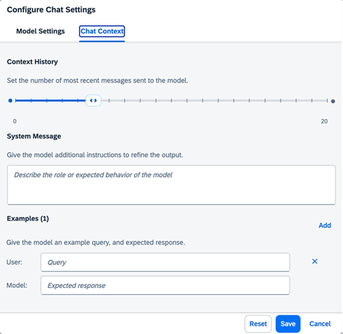

<!-- loiod84b5a1a2973440fb1af992ccaa2ac87 -->

# Chat

<a name="loiod84b5a1a2973440fb1af992ccaa2ac87__prereq_gd3_lrc_bzb"/>

## Prerequisites

-   You have at least one deployment for a generative AI model running. For more information, see [Create a Deployment for a Generative AI Model](create-a-deployment-for-a-generative-ai-model-96b65bb.md).

-   You’ve selected the AI API connection and resource group that you used in the activation steps.

-   You have the `genai_manager`, `prompt_manager`, `genai_experimenter` or `prompt_experimenter` role, or you are assigned a role collection that contains one of these roles. For more information, see [Roles and Authorizations](roles-and-authorizations-4ef8499.md).

<a name="loiod84b5a1a2973440fb1af992ccaa2ac87__context_qdl_xnp_rzb"/>

## Context

> ### Caution:  
> SAP does not take any responsibility for quality of the content in the input to or output of the underlying generative AI models, including but not limited to, bias, hallucinations, or inaccuracies. The user is responsible for verifying the content.

## Procedure

1.  Select the connection to your SAP AI Core runtime in the *Workspaces* app and choose the resource group that was used for your generative AI hub deployment.

2.  In the side navigation, expand the *Generative AI Hub* and choose *Chat*.

    1.  **Optional:** Adjust the model settings by choosing *Configure*, then the *Model Settings* tab.

        Settings include:

        -   **Model:**If you do not choose a model, the default model will be used.

        -   **Parameters:**Different models support different parameters and values. For more information, see the documentation from the model provider. Also see [Models and Scenarios in the Generative AI Hub](models-and-scenarios-in-the-generative-ai-hub-fef463b.md).
        -   **Streaming Response:**Chat responses are output in real time, as they are generated.

        

    2.  **Optional:** Adjust the chat context by choosing *Configure*, then the *Chat Context* tab.

        Settings include:

        -   **Chat Memory:**The number of previous messages that form the context for the chat.

        -   **System Message:**Instructions or context to guide the behavior of the model. Available for selected models.

        -   **Examples:**Example of prompts and desired responses, to set a precedent for the model. Available for selected models.

            Examples can be removed using the *Decline* icon.

        

        > ### Tip:  
        > Chat contexts are passed to the model with each chat message, and are included in the token count. Smaller contexts consume fewer tokens.
        > 
        > If you get an exceeded token count error, reduce the context history.

3.  Enter your chat input and press the *Send* icon.

    

<a name="loiod84b5a1a2973440fb1af992ccaa2ac87__result_xss_135_jzb"/>

## Results

The response to your chat input will be generated.

You can clear the current chat, including the context history, by clicking the *Clear* button.

You can download your entire chat using the *Download* icon. Your chat will be automatically downloaded in JSON format, and can be saved locally.

You can copy an individual chat message or response using the *copy* icon.

<a name="loiod84b5a1a2973440fb1af992ccaa2ac87__postreq_fsm_k35_jzb"/>

## Next Steps

-   You can continue your chat by sending more messages.
-   You can repeat your chat with changes to the messages, model, and parameters to change the outcome.

