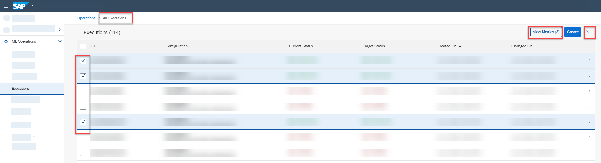
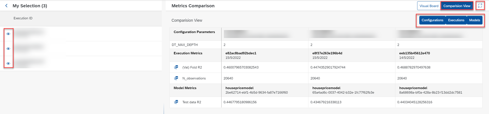

<!-- loio0050ba2804cc4b6c8325e9672f083e79 -->

<link rel="stylesheet" type="text/css" href="css/sap-icons.css"/>

# Compare Metric Resources

You compare metrics resources for executions to determine which configuration parameters result in optimum results.

<a name="loio0050ba2804cc4b6c8325e9672f083e79__context_hdb_n2b_xsb"/>

## Context

Metrics provide data about the quality \(confidence\) of a model. Model quality is affected by the dataset used in the execution \(training process\).

When you compare metrics, multiple model/ execution metrics are compared against configuration parameters. You compare metric data to determine whether further adjustments are required, or to identify a configuration which is producing optimum results.

> ### Note:  
> You can compare metrics for up to five executions.

<a name="loio0050ba2804cc4b6c8325e9672f083e79__steps_idb_n2b_xsb"/>

## Procedure

1.  In the *ML Operations* app, choose *Executions*.

2.  Select the executions for comparison and choose *View Metrics*.

    

    The *Metrics Overview* appears for the selected executions. The execution IDs and descriptions are listed in the *My Selection* pane. The *Metrics Comparison* pane defaults to the chart view.

3.  Choose *Comparison View* to compare metrics for your selected executions.

4.  Investigate the metric details.

    -   To show detailed comparison results, choose  \(Expand\).

    -   To show or hide metrics for an execution, choose :eye: or  \(Hide\).

    -   To show or hide different comparison criteria, choose *Configurations*, *Executions*, or *Models*.

    

