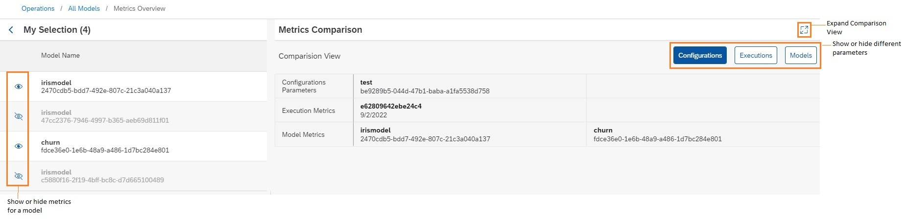

<!-- loio4b4415eabfb0431aba77d005e6e586dd -->

<link rel="stylesheet" type="text/css" href="css/sap-icons.css"/>

# Compare Model Metrics

You can compare metrics for models to determine which configuration parameters result in optimum results.

## Context

Metrics provide data about the quality \(confidence\) of a model. Model quality is affected by the dataset used in the model \(training process\).

When you compare metrics, multiple model/ execution metrics are compared against configuration parameters. You compare metric data to determine whether further adjustments are required, or to identify a configuration which is producing optimum results.

> ### Note:  
> You can compare metrics for up to five models.

## Procedure

1.  In the *ML Operations* app, choose *Models*.

2.  Select the models for comparison and choose *View Metrics*.

    The *Metrics Comparison View* appears for the selected models.

3.  Investigate the metric details.

    -   To show detailed comparison results, choose  \(Expand\).

    -   To show or hide metrics for a model, choose :eye: or  \(Hide\).

    -   To show or hide different comparison data, choose *Configurations*, *Executions*, or *Models*.

    

