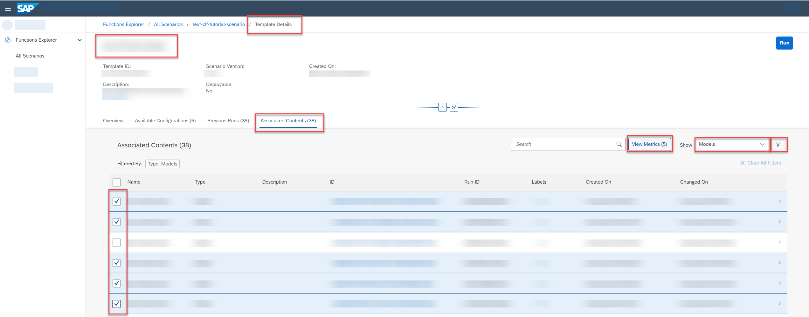
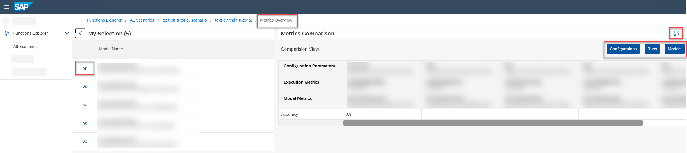

<!-- loioe357639514de45b0b409078de163a3aa -->

<link rel="stylesheet" type="text/css" href="css/sap-icons.css"/>

# Compare Model Metrics

You can compare metrics for models to determine which configuration parameters result in optimum results.

## Context

> ### Note:  
> You can compare metrics for up to five models.

<a name="loioe357639514de45b0b409078de163a3aa__steps_jqb_skb_xsb"/>

## Procedure

1.  In the *Functions Explorer* app, find the run template. For more information, see [Investigate a Run Template](investigate-a-run-template-b753dc0.md).

2.  On the *Run Details* screen, select the *Associated Contents* tab.

    Objects associated with a run template are filtered by type, such as models or datasets.

3.  Select ***Models*** in the *Show* field to display all the models generated by the run template.

4.  **Optional:** Filter the list by entering the model name, model ID, or run ID in the  \(Filter\) .

5.  Select the models for comparison and choose *View Metrics*.

    

    The *Metrics Overview* screen appears for the selected models. The model IDs and descriptions you selected are listed in the *My Selection* pane. The *Metrics Comparison* pane defaults to the chart view.

6.  Choose *Comparison View* to compare metric data.

7.  Investigate the metric data for the selected models.

    -   To show the comparison results in full screen mode, choose  \(Fullscreen\).

    -   To show or hide the models selected for comparison, choose :eye: or  \(Hide\).

    -   To show or hide different comparison data, choose *Configurations*, *Executions*, or *Models*.

    

**Related Information**  

[Create Chart to Compare Models](create-chart-to-compare-models-377db35.md "You can create charts for models to visually compare quality criteria and values.")

