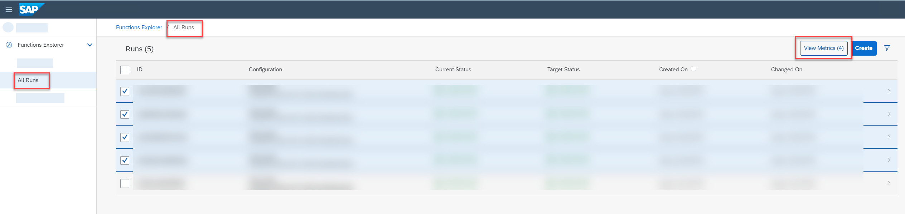

<!-- loio02556558a4464cd1a14237838c9f4dbb -->

<link rel="stylesheet" type="text/css" href="css/sap-icons.css"/>

# Compare Run Metrics

You compare metrics for runs to determine which configuration parameters result in optimum results.

## Context

> ### Note:  
> You can compare metrics for up to five runs.

## Procedure

1.  In the *Functions Explorer* app, choose *All Runs*.

2.  **Optional:** If you have a large list of runs, you can filter the list by choosing  \(Filter\). The *Filter* dialog appears.

    1.  Enter the run ID or select a status.

    2.  Choose *Apply* to apply the filter to the list.

3.  Select the runs for comparison and choose *View Metrics*.

    

    The *Metrics Overview* appears for the selected runs. The run IDs and descriptions are listed in the *My Selection* pane. The *Metrics Comparison* pane defaults to the chart view.

    

4.  Choose *Comparison View* to compare metric data.

5.  Investigate the metric data for the selected runs.

    -   To show the data comparison in full-screen mode, choose  \(Fullscreen\).

    -   To show or hide the runs selected for comparison, choose :eye: or  \(Hide\).

    -   To show or hide different criteria and comparison data, choose *Configurations*, *Runs*, or *Models*.

**Related Information**  

[Create Chart to Compare Runs](create-chart-to-compare-runs-e963d2f.md "You can create charts for runs to visually compare quality criteria and values.")

