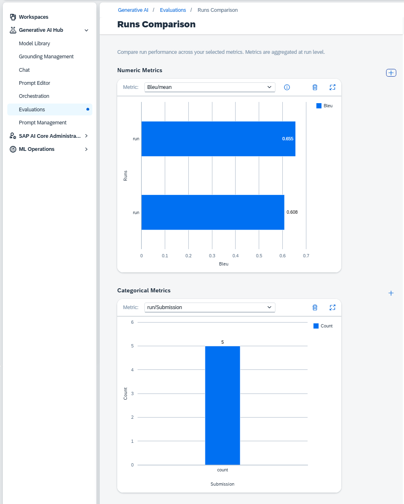

<!-- loio6dc7cb8c950b479c8b5900ef76e61bb1 -->

<link rel="stylesheet" type="text/css" href="css/sap-icons.css"/>

# Compare Runs

<a name="loio6dc7cb8c950b479c8b5900ef76e61bb1__prereq_vp3_r2g_s2c"/>

## Prerequisites

-   You have the `custom_evaluation`, `genai_manager` or `genai_experimenter` role, or you are assigned a role collection that contains one of these roles.
-   You have deployed an evaluation run. For more information, see [Create an Evaluation](create-an-evaluation-c15182a.md).
-   You're using the `extended` service plan. For more information, see [Service Plans](https://help.sap.com/viewer/2d6c5984063c40a59eda62f4a9135bee/CLOUD/en-US/c7244c6a7e3b4ffc928a2564c216e7c7.html "The SAP AI Core service plan you choose determines pricing, conditions of use, resources, available services, and hosts.") :arrow_upper_right:.

## Context

You can compare the metrics of up to five runs.

## Procedure

1.  Select the connection to your SAP AI Core runtime in the *Workspaces* app and choose the resource group that was used for your generative AI hub deployment.

2.  In the side navigation, expand *Generative AI Hub* and choose *Optimizations*.

3.  Choose the *Runs* tab.

    You can filter by name or by using tags by using the  \(Filter\) icon. Your input must be an exact match.

    Alternatively, you can see runs associated with an evaluation job by choosing *Jobs* \> *choose your job* \> *Associated Runs*.

4.  Select the runs to compare and choose *Compare*.

    The *Runs Comparison* screen appears, showing comparisons of your selected metrics.

    

<a name="loio6dc7cb8c950b479c8b5900ef76e61bb1__postreq_nnz_tjg_s2c"/>

## Next Steps

You can add more comparisons to your view using the :heavy_plus_sign: icon.

You can choose a different metric using the drop down menu.

You can remove a comparison using the :wastebasket: icon.

You can enlarge a comparison using the  \(Full Screen\) icon.

