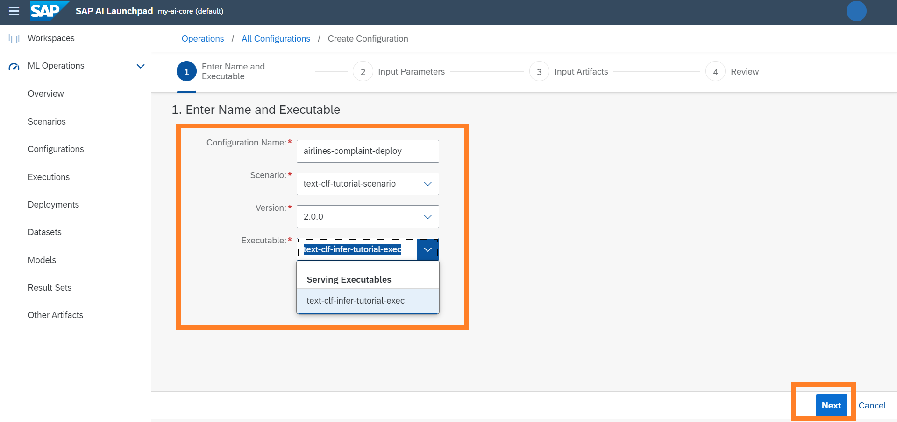
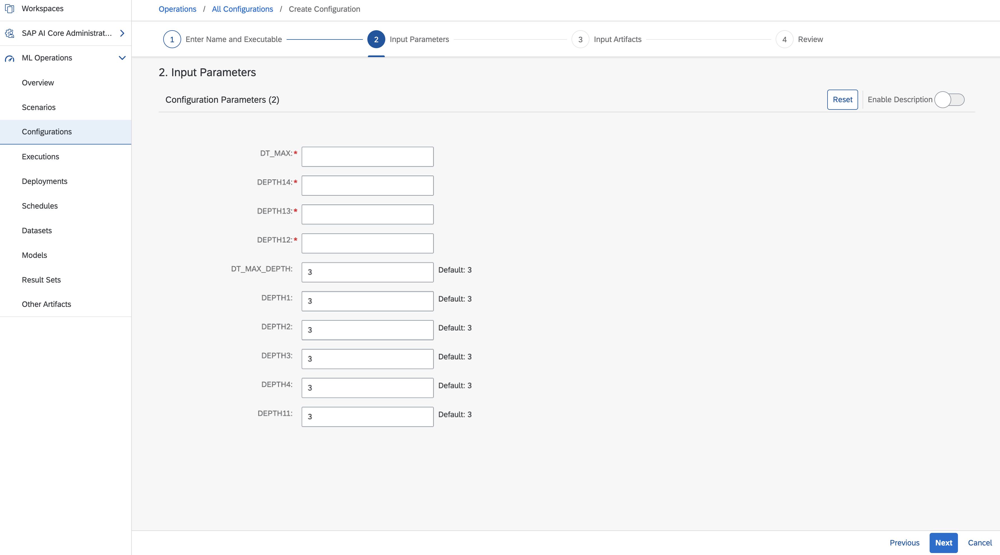
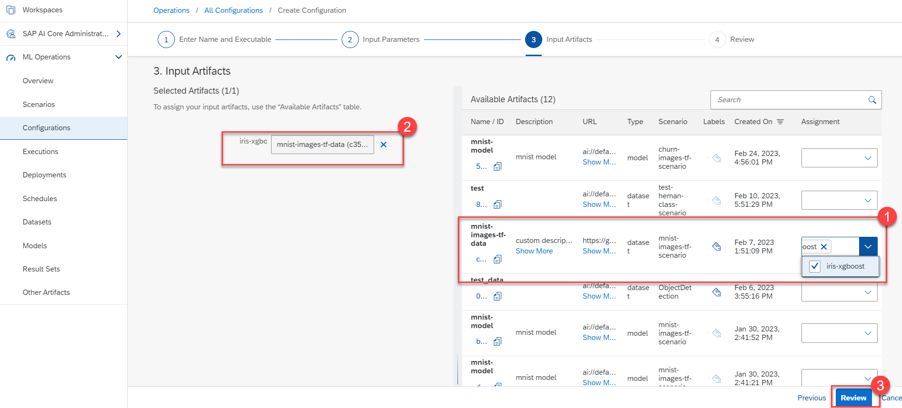

<!-- loio03bdcc7fbb0b4e67a7d946692f0fd857 -->

<link rel="stylesheet" type="text/css" href="css/sap-icons.css"/>

# Create a Configuration

A configuration combines parameters, artifacts \(for example, a dataset or model\), and executables, that are used in training or deploying a model.

<a name="loio03bdcc7fbb0b4e67a7d946692f0fd857__prereq_b54_nld_jpb"/>

## Prerequisites

You have either the `mloperations_editor` or `scenario_configuration_editor` role, or you are assigned a role collection that contains one of these roles. For more information, see [Roles and Authorizations](roles-and-authorizations-4ef8499.md).

## Procedure

1.  In the *ML Operations* app, choose *Configurations*.

2.  On the *Configurations* screen, choose *Create*.

    The create wizard appears. This wizard has two main areas; a navigation area at the top showing the step sequence, and a content area below it.

3.  Enter the configuration details.

    Required details include the following:

    -   *Configuration Name*: enter a name for the new configuration
    -   *Scenario*: enter a name which represents the AI use case
    -   *Version*: choose a scenario version
    -   *Executable*: select either a workflow or serving executable from the list displayed. Selection options are subject to availability and the selected version.
        -   *Workflow Executable* for a training template
        -   *Serving Executable* for a serving \(deploying\) template

    

4.  Choose *Next* to display the *Input Parameters* step.

5.  Enter an alphanumeric value for the *Input Parameter*, as required by placeholder \(*<Parameter\>*\) of the selected executable. Where default values have been set, these will be prefilled, but can be changed manually.

    > ### Restriction:  
    > A configuration can contain up to 1000 input parameters. An input parameter value can't exceed 5000 characters.

    

    > ### Tip:  
    > The *Reset* button clears the mandatory fields and enters default values, where they are asigned. The *Enable Description* swtich show descriptions and types, where available.

6.  Choose *Next* to display the *Input Artifacts* step.

7.  Select the required artifacts from the list of available artifacts. Where possible, the artifacts available have been prefiltered by type. The artifact is required as an input artifact for the selected executable.

    > ### Tip:  
    > Use the *Enable Description* switch to view artifact description as popovers..

    

8.  Choose *Review* to check the details you've entered for the configuration. Check the details then choose *Create*.

    You'll be redirected to the details screen for the newly created configuration.

9.  **Optional:** Choose  \(Copy\) for the configuration ID to copy the unique ID for future use.

<a name="loio03bdcc7fbb0b4e67a7d946692f0fd857__result_g55_whz_hvb"/>

## Results

The newly created configuration is now available on the *All Configurations* screen.

**Related Information**  

[Create a Deployment](create-a-deployment-33b34e9.md "You create a deployment to run a model for serving purposes.")

[Create an Execution](create-an-execution-6c90fc7.md "")

