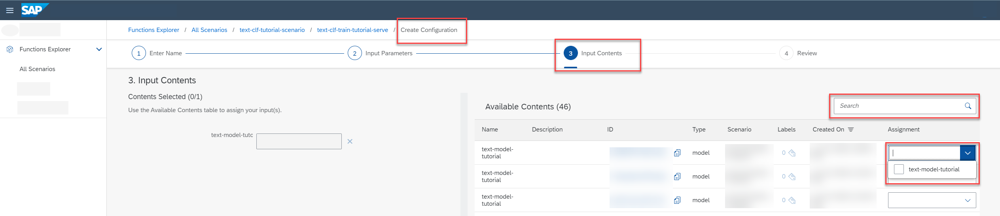

<!-- loio03fa29fbfad74511ad0efbbf38a8d910 -->

<link rel="stylesheet" type="text/css" href="css/sap-icons.css"/>

# Create a Configuration

A configuration contains parameters and dataset references, and is combined with a deployment template to create a deployment.

<a name="loio03fa29fbfad74511ad0efbbf38a8d910__prereq_b54_nld_zac"/>

## Prerequisites

You have the `mlfunctions_editor` role, or you have been assigned a role collection that contains this role.

For more information, see [Roles and Authorizations](roles-and-authorizations-4ef8499.md).

<a name="loio03fa29fbfad74511ad0efbbf38a8d910__steps_n4q_yrq_vsb"/>

## Procedure

1.  Find the deployment template. See [Investigate a Deployment Template](investigate-a-deployment-template-0f68ee0.md).

2.  Select the *Available Configurations* tab.

    The list shows all configurations by name and ID, and with creation date details.

3.  Choose *Create* to create a new configuration.

    The *Create Configuration* wizard appears. This wizard has four steps.

4.  Enter the required data for the new configuration.

    1.  In the *Enter Name* step, enter a configuration name and choose *Next*.

    2.  In the *Input Parameters* step, enter the input parameter values \(alphanumeric\) for the selected template, then choose *Next*.

        > ### Restriction:  
        > A configuration can contain up to 1000 input parameters. An input parameter value can't exceed 5000 characters.

    3.  In the *Input Contents* step, find the name of the model in the list of *Available Contents* list \(right pane\).

        To search for a model, enter a value or partial value in the :mag:field.

        For the selected model, choose the dropdown for the *Assignment* field and select the input.

        

    4.  Choose *Review* to display a summary of the configuration details. Choose *Create* to create the configuration.

    The newly created configuration and its details are displayed.

**Related Information**  

[Find a Configuration](find-a-configuration-642037f.md "You can view all the configurations associated with a deployment template, and investigate a configuration in detail.")

