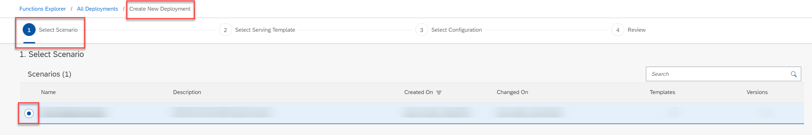
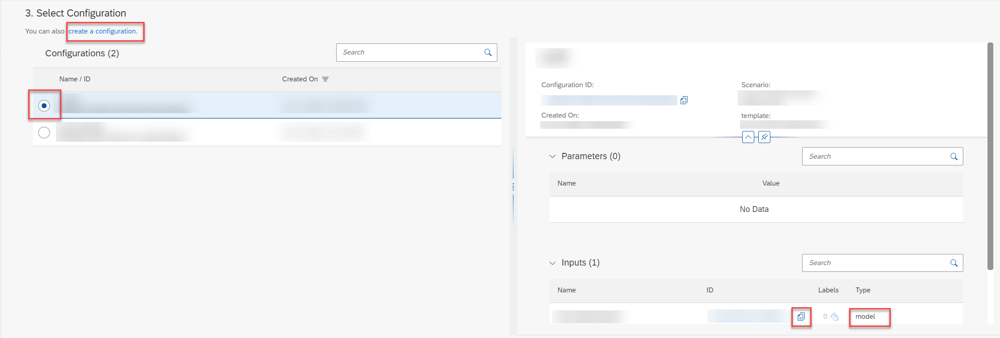

<!-- loio3bc6477b52f54234b6040891a3b77106 -->

# Create a Deployment

A deployment uses a model and data to make a prediction.

<a name="loio3bc6477b52f54234b6040891a3b77106__prereq_b54_nld_jib"/>

## Prerequisites

You have the `mlfunctions_editor` role, or you have been assigned a role collection that contains this role.

For more information, see [Roles and Authorizations](roles-and-authorizations-4ef8499.md).

## Context

Deployments are used to make online predictions.

## Procedure

1.  In the *Functions Explorer* app, choose *All Deployments*.

    The *All Deployments* screen appears listing all existing deployments. Deployments are listed by ID, and with additional details such as configuration name and ID, current and target status, created on timestamp, and changed on timestamp.

2.  Choose *Create* to create a new deployment.

    The *Create New Deployment* wizard appears. This wizard has four steps.

3.  Select the required data for the new deployment.

    1.  In the *Select Scenario* step, select the scenario from the list and choose *Next*.

        

    2.  In the *Select Deployment Template* step, select the deployment template from the list and choose *Next*.
    3.  In the *Select Configuration* step, select the required configuration. The details for the selected configuration are displayed in the right pane.

         

        > ### Tip:  
        > If there is no configuration which matches your data requirements, you can choose *create a configuration*. You will be redirected to create a configuration, and the deployment you have started will be lost. When you have saved the new configuration, you can re-create the deployment with the new configuration.

        Confirm the selection and choose *Review*.

    4.  In the *Review* step, review the data that you've selected for the new deployment. Choose *Create* to create the deployment.

    The new deployment is created and is now displayed in the *All Deployments* screen.

