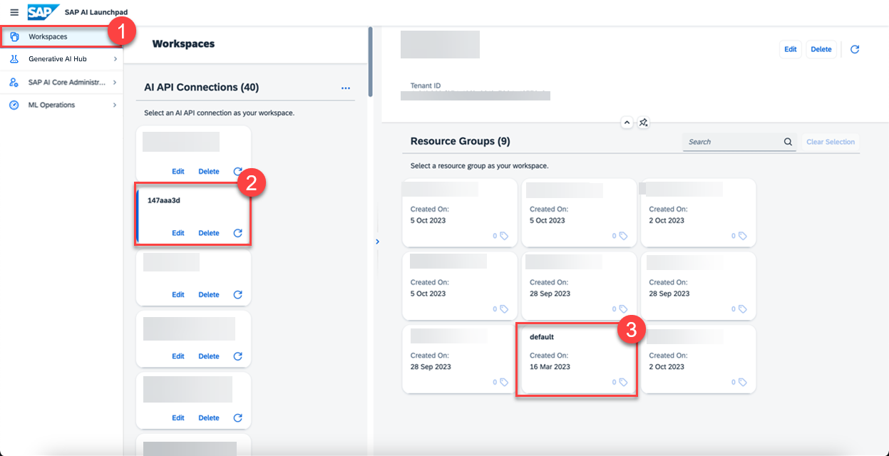
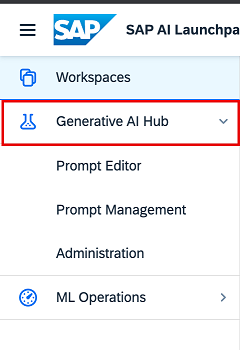
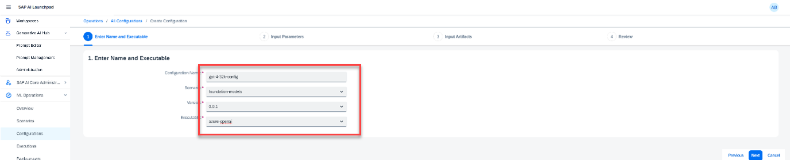

<!-- loio96b65bbe3d8a4681830f575a146b5071 -->

# Create a Deployment for a Generative AI Model

You make a model available for use by creating a deployment. You can do so one time for each model and model version, and for each resource group that you want to use with generative AI hub.

<a name="loio96b65bbe3d8a4681830f575a146b5071__prereq_nzn_mdw_tyb"/>

## Prerequisites

-   You have an SAP AI Core service instance and service key. For more information, see [SAP AI Core Initial Setup Documentation](https://help.sap.com/docs/AI_CORE/2d6c5984063c40a59eda62f4a9135bee/38c4599432d74c1d94e70f7c955a717d.htm).
-   You’re using the SAP AI Core `extended` service plan.
-   You have either the `mloperations_editor` or `scenario_deployment_editor` role, or you are assigned a role collection that contains one of these roles. For more information, see [Roles and Authorizations](https://help.sap.com/docs/ai-launchpad/sap-ai-launchpad/roles-and-authorizations).

-   You have completed the client authorization for your preferred user interface. For more information, see [Use a Service Key in SAP AI Core](https://help.sap.com/docs/AI_CORE/2d6c5984063c40a59eda62f4a9135bee/3a97465bf6164400a4b5c1641007e3d6.html?locale=en-US&state=DRAFT&version=CLOUD).

<a name="loio96b65bbe3d8a4681830f575a146b5071__steps_gbx_g2d_bzb"/>

## Procedure

1.  Select the connection to your SAP AI Core runtime in the *Workspaces* app and choose a resource group.

    

    The *Generative AI Hub* app is now clickable in your side navigation panel and resource groups are listed. 

    

2.  In the *ML Ops* app, choose *Scenarios* and check that a scenario called *foundation-models* scenario exists.

    

    If the *foundation-models* scenario is not available, check your SAP AI Core tenant service plan.

3.  In the *ML Ops* app, choose *Configurations* and click *Create*.

    

4.  Enter a name for your configuration, choose the *foundation-models* scenario, enter a version number, and select the executable for your chosen model provider.

    

5.  Enter the name and version \(if applicable\) of the model that you want to use.

    The following models are available:

    ****

    <table>
    <tr>
    <th valign="top">

    Executable ID
    
    </th>
    <th valign="top">

    Model Name
    
    </th>
    <th valign="top">

    Model Version
    
    </th>
    <th valign="top">

    More Information
    
    </th>
    </tr>
    <tr>
    <td valign="top">
    
    `azure-openai`
    
    </td>
    <td valign="top">
    
    `gpt-35-turbo`
    
    </td>
    <td valign="top">
    
    0613

    1106
    
    </td>
    <td valign="top">
    
    [Azure Chat Completions](https://learn.microsoft.com/en-us/azure/ai-services/openai/reference#chat-completions)
    
    </td>
    </tr>
    <tr>
    <td valign="top">
    
    `azure-openai`
    
    </td>
    <td valign="top">
    
    `gpt-35-turbo-16k`
    
    </td>
    <td valign="top">
    
    0613
    
    </td>
    <td valign="top">
    
    [Azure Chat Completions](https://learn.microsoft.com/en-us/azure/ai-services/openai/reference#chat-completions)
    
    </td>
    </tr>
    <tr>
    <td valign="top">
    
    `azure-openai`
    
    </td>
    <td valign="top">
    
    `gpt-4`
    
    </td>
    <td valign="top">
    
    0613
    
    </td>
    <td valign="top">
    
    [Azure Chat Completions](https://learn.microsoft.com/en-us/azure/ai-services/openai/reference#chat-completions)
    
    </td>
    </tr>
    <tr>
    <td valign="top">
    
    `azure-openai`
    
    </td>
    <td valign="top">
    
    `gpt-4-32k`
    
    </td>
    <td valign="top">
    
    0613
    
    </td>
    <td valign="top">
    
    [Azure Chat Completions](https://learn.microsoft.com/en-us/azure/ai-services/openai/reference#chat-completions)
    
    </td>
    </tr>
    <tr>
    <td valign="top">
    
    `azure-openai`
    
    </td>
    <td valign="top">
    
    `text-embedding-ada-002`
    
    </td>
    <td valign="top">
    
    2
    
    </td>
    <td valign="top">
    
    [Embeddings](https://learn.microsoft.com/en-us/azure/ai-services/openai/reference#embeddings)
    
    </td>
    </tr>
    <tr>
    <td valign="top">
    
    `azure-openai`
    
    </td>
    <td valign="top">
    
    `text-embedding-3-small`
    
    </td>
    <td valign="top">
    
    N/A
    
    </td>
    <td valign="top">
    
    [Embeddings](https://learn.microsoft.com/en-us/azure/ai-services/openai/reference#embeddings)
    
    </td>
    </tr>
    <tr>
    <td valign="top">
    
    `azure-openai`
    
    </td>
    <td valign="top">
    
    `text-embedding-3-large`
    
    </td>
    <td valign="top">
    
    N/A
    
    </td>
    <td valign="top">
    
    [Embeddings](https://learn.microsoft.com/en-us/azure/ai-services/openai/reference#embeddings)
    
    </td>
    </tr>
    <tr>
    <td valign="top">
    
    `azure-openai`
    
    </td>
    <td valign="top">
    
    `gpt-4o`
    
    </td>
    <td valign="top">
    
    2024-05-13
    
    </td>
    <td valign="top">
    
    [Azure Chat Completions](https://learn.microsoft.com/en-us/azure/ai-services/openai/reference#chat-completions)
    
    </td>
    </tr>
    <tr>
    <td valign="top">
    
    `azure-openai`
    
    </td>
    <td valign="top">
    
    `gpt-4`
    
    </td>
    <td valign="top">
    
    turbo-2024-04-09
    
    </td>
    <td valign="top">
    
    [Azure Chat Completions](https://learn.microsoft.com/en-us/azure/ai-services/openai/reference#chat-completions)
    
    </td>
    </tr>
    <tr>
    <td valign="top">
    
    `aicore-opensource`
    
    </td>
    <td valign="top">
    
    `tiiuae--falcon-40b-instruct`
    
    </td>
    <td valign="top">
    
    N/A
    
    </td>
    <td valign="top">
    
    [Tiiuae Falcon 40b Instruct](https://huggingface.co/tiiuae/falcon-40b-instruct)
    
    </td>
    </tr>
    <tr>
    <td valign="top">
    
    `aicore-opensource`
    
    </td>
    <td valign="top">
    
    `mistralai--mixtral-8x7b-instruct-v01`
    
    </td>
    <td valign="top">
    
    N/A
    
    </td>
    <td valign="top">
    
    [Mistral AI](https://huggingface.co/mistralai/Mixtral-8x7B-Instruct-v0.1)
    
    </td>
    </tr>
    <tr>
    <td valign="top">
    
    `aicore-opensource`
    
    </td>
    <td valign="top">
    
    `meta--llama3-70b-instruct`
    
    </td>
    <td valign="top">
    
    N/A
    
    </td>
    <td valign="top">
    
    [Meta](https://huggingface.co/meta-llama/Meta-Llama-3-70B-Instruct)
    
    </td>
    </tr>
    <tr>
    <td valign="top">
    
    `gcp-vertexai`
    
    </td>
    <td valign="top">
    
    `text-bison`
    
    </td>
    <td valign="top">
    
    002
    
    </td>
    <td valign="top">
    
    [GCP Vertex AI](https://cloud.google.com/vertex-ai/generative-ai/docs/model-reference/text)
    
    </td>
    </tr>
    <tr>
    <td valign="top">
    
    `gcp-vertexai`
    
    </td>
    <td valign="top">
    
    `chat-bison`
    
    </td>
    <td valign="top">
    
    002
    
    </td>
    <td valign="top">
    
    [GCP Vertex AI](https://cloud.google.com/vertex-ai/generative-ai/docs/model-reference/text-chat)
    
    </td>
    </tr>
    <tr>
    <td valign="top">
    
    `gcp-vertexai`
    
    </td>
    <td valign="top">
    
    `textembedding-gecko`
    
    </td>
    <td valign="top">
    
    003
    
    </td>
    <td valign="top">
    
    [GCP Vertex AI](https://cloud.google.com/vertex-ai/generative-ai/docs/model-reference/text-embeddings)
    
    </td>
    </tr>
    <tr>
    <td valign="top">
    
    `gcp-vertexai`
    
    </td>
    <td valign="top">
    
    `textembedding-gecko-multilingual`
    
    </td>
    <td valign="top">
    
    001
    
    </td>
    <td valign="top">
    
    [GCP Vertex AI](https://cloud.google.com/vertex-ai/generative-ai/docs/model-reference/text-embeddings)
    
    </td>
    </tr>
    <tr>
    <td valign="top">
    
    `gcp-vertexai`
    
    </td>
    <td valign="top">
    
    `gemini-1.0-pro`
    
    </td>
    <td valign="top">
    
    001
    
    </td>
    <td valign="top">
    
    [GCP Vertex AI](https://cloud.google.com/vertex-ai/generative-ai/docs/model-reference/gemini)
    
    </td>
    </tr>
    <tr>
    <td valign="top">
    
    `aws-bedrock`
    
    </td>
    <td valign="top">
    
    `anthropic--claude-3-sonnet`
    
    </td>
    <td valign="top">
    
    v1
    
    </td>
    <td valign="top">
    
    [AWS Bedrock](https://docs.aws.amazon.com/bedrock/latest/userguide/model-parameters-anthropic-claude-messages.html)
    
    </td>
    </tr>
    <tr>
    <td valign="top">
    
    `aws-bedrock`
    
    </td>
    <td valign="top">
    
    `anthropic--claude-3-haiku`
    
    </td>
    <td valign="top">
    
    v1
    
    </td>
    <td valign="top">
    
    [AWS Bedrock](https://docs.aws.amazon.com/bedrock/latest/userguide/model-parameters-anthropic-claude-messages.html)
    
    </td>
    </tr>
    <tr>
    <td valign="top">
    
    `aws-bedrock`
    
    </td>
    <td valign="top">
    
    `anthropic--claude-3-opus`
    
    </td>
    <td valign="top">
    
    v1
    
    </td>
    <td valign="top">
    
    [AWS Bedrock](https://docs.aws.amazon.com/bedrock/latest/userguide/model-parameters-anthropic-claude-messages.html)
    
    </td>
    </tr>
    <tr>
    <td valign="top">
    
    `aws-bedrock`
    
    </td>
    <td valign="top">
    
    `amazon--titan-embed-text`
    
    </td>
    <td valign="top">
    
    1.2
    
    </td>
    <td valign="top">
    
    [AWS Bedrock](https://docs.aws.amazon.com/bedrock/latest/userguide/titan-embedding-models.html)
    
    </td>
    </tr>
    <tr>
    <td valign="top">
    
    `aws-bedrock`
    
    </td>
    <td valign="top">
    
    `amazon--titan-text-lite`
    
    </td>
    <td valign="top">
    
    1
    
    </td>
    <td valign="top">
    
    [AWS Bedrock](https://docs.aws.amazon.com/bedrock/latest/userguide/titan-text-models.html)
    
    </td>
    </tr>
    <tr>
    <td valign="top">
    
    `aws-bedrock`
    
    </td>
    <td valign="top">
    
    `amazon--titan-text-express`
    
    </td>
    <td valign="top">
    
    1
    
    </td>
    <td valign="top">
    
    [AWS Bedrock](https://docs.aws.amazon.com/bedrock/latest/userguide/titan-text-models.html)
    
    </td>
    </tr>
    </table>
    
    > ### Note:  
    > -   Instead of specifying a model version, using “latest” will use the latest version of the model available in SAP AI Core.
    > 
    > -   Where model version is not listed, it is not applicable.

    

6.  After you’ve created your configuration, select *Create Deployment*.

    

    > ### Note:  
    > You must use the same resource group for all of your generative AI activities. To use a different resource group, these steps must be repeated for each resource group.

<a name="loio96b65bbe3d8a4681830f575a146b5071__postreq_nsw_sqd_bzb"/>

## Next Steps

When the deployment is running, the model can be accessed using the *Generative AI Hub* app. For more information, see [Prompt Experimentation](prompt-experimentation-384cc0c.md).

If you want to remove a model, delete its deployment. For more information, see [Delete a Deployment](delete-a-deployment-6c07132.md).

<a name="concept_fn1_2qy_szb"/>

<!-- concept\_fn1\_2qy\_szb -->

## Model Lifecycle

Model versions have deprecation dates. Where a model version is specified in a deployment, the deployment will stop working on the deprecation date of that model version.

Implement one of the following model upgrade options:

-   **Auto Upgrade:** Create a new generative AI configuration and deployment or patch a deployment with a new configuration, specifying `modelVersion` `latest`. When a new `modelVersion` is supported by SAP AI Core, existing generative AI deployments will automatically use the latest version of the given model.

-   **Manual Upgrade:** Create a new generative AI configuration with your chosen replacement `modelVersion` and use it to patch your deployment. This model version will be used in generative AI deployments irrespective of updates to the models supported by SAP AI Core.

    > ### Note:  
    > If `modelVersion` isn’t specified, it will be `latest` by default. To upgrade manually, you **must** specify a `modelVersion`.

