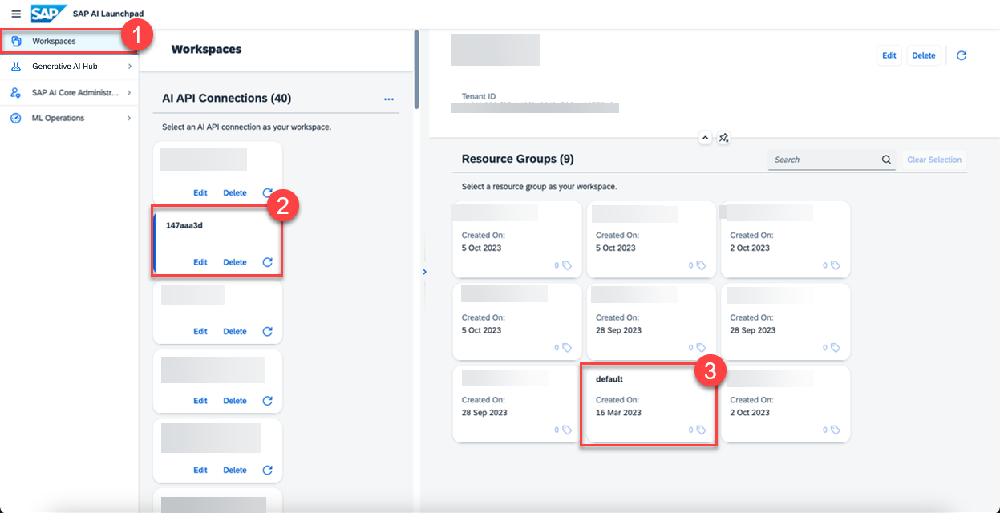
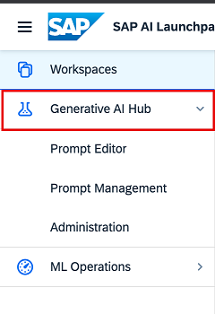
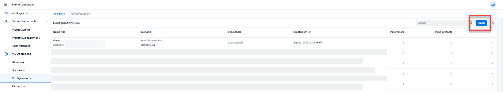
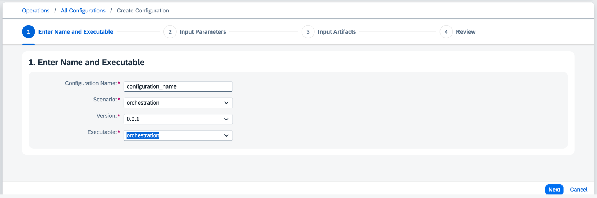
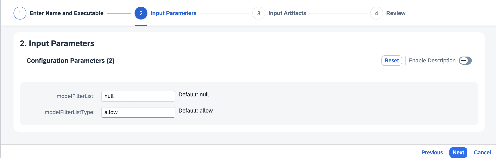

<!-- loio4344c5b67f604a8ea313baf5a2d41047 -->

# Create a Deployment for Orchestration


<a name="loio4344c5b67f604a8ea313baf5a2d41047__prereq_nzn_mdw_tyb"/>

## Prerequisites

-   You have an SAP AI Launchpad service instance and service key. For more information, see [Initial Setup](https://help.sap.com/viewer/2d6c5984063c40a59eda62f4a9135bee/CLOUD/en-US/38c4599432d74c1d94e70f7c955a717d.html "You provision SAP AI Core from the SAP BTP cockpit in SAP Business Technology Platform. After provisioning, you will have your service key, which provides URLs and credentials for accessing the SAP AI Core instance") :arrow_upper_right:.
-   You’re using the `extended` service plan.
-   You have either the `mloperations_editor` or `scenario_deployment_editor` role, or you are assigned a role collection that contains one of these roles. For more information, see [Roles and Authorizations](https://help.sap.com/docs/ai-launchpad/sap-ai-launchpad/roles-and-authorizations).

-   You have completed the client authorization for your preferred user interface.For more information, see [Use a Service Key in SAP AI Core](https://help.sap.com/docs/AI_CORE/2d6c5984063c40a59eda62f4a9135bee/3a97465bf6164400a4b5c1641007e3d6.html?locale=en-US&state=DRAFT&version=CLOUD).

-   You have at least one orchestration compatible deployment for a generative AI model running. For more information, see [Models and Scenarios in the Generative AI Hub](models-and-scenarios-in-the-generative-ai-hub-fef463b.md) and [Create a Deployment for a Generative AI Model](create-a-deployment-for-a-generative-ai-model-96b65bb.md).


<a name="loio4344c5b67f604a8ea313baf5a2d41047__context_oqk_24g_c2c"/>

## Context

You create a deployment to make orchestration capabilities available for use. After the deployment is complete, you get a `deploymentUrl`. You can use this URL across your organization to access orchestration in the generative AI hub.


## Procedure

1.  Select the connection to your SAP AI Core runtime in the *Workspaces* app and choose a resource group.

    

    The *Generative AI Hub* app is now clickable in your side navigation panel and resource groups are listed. 

    

2.  In the *ML Ops* app, choose *Scenarios* and check that a scenario called *orchestration* exists.

    If the *orchestration* scenario is not available, check your SAP AI Core tenant service plan.

3.  In the *ML Ops* app, choose *Configurations* and click *Create*.

    

4.  Enter a name for your configuration, choose the *orchestration* scenario, enter a version number, and select the *orchestration* executable.

    

5.  **Optional:** Add your model to a *modelFilterList*.

    The following example uses Claude Sonnet version 1:

    > ### Sample Code:  
    > ```
    > [{"modelName": "anthropic--claude-3-sonnet","modelVersion":"1"}]
    > ```

    When creating a deployment for orchestration, you can restrict the choice of models using an allow or deny list. You can use this to implement internal standards, for example where only certain LLMs are approved for use.

    *modelFilterListType* has the following options:

    -   `deny`: only denies the models and defined versions in the modelFilterList to be used within orchestration.

    -   `allow`: only allows the models and defined versions in the modelFilterList to be used within orchestration.


    

6.  After you’ve created your configuration, select *Create Deployment*.

    > ### Note:  
    > You must use the same resource group for all of your generative AI activities. If you want to use a different resource group, repeat these steps for each resource group.


<a name="loio4344c5b67f604a8ea313baf5a2d41047__postreq_nsw_sqd_bzb"/>

## Next Steps

When the orchestration deployment is running, orchestration can be accessed using the *Generative AI Hub* app.

**Related Information**  


[Delete a Deployment](delete-a-deployment-6c07132.md "You delete a deployment to remove it from your instance.")

