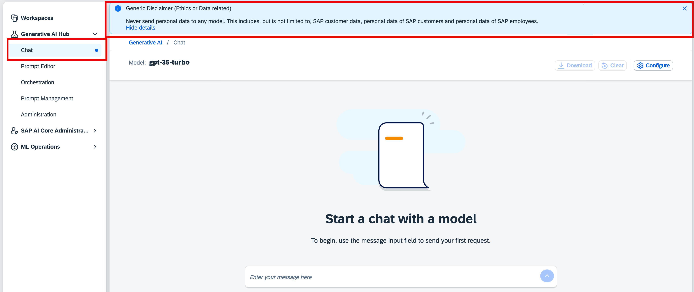

<!-- loio4ecc5ae6efcb46c984284c29a5bafc4c -->

# Create a Disclaimer

<a name="loio4ecc5ae6efcb46c984284c29a5bafc4c__prereq_rs5_3fp_11c"/>

## Prerequisites

-   You have either the `genai_administrator` or `prompt_administrator` role, or you are assigned a role collection that contains one of these roles. For more information, see [Roles and Authorizations](security-e4cf710.md#loio4ef8499d7a4945ec854e3b4590830bcc).

## Context

You can create a custom disclaimer message which will be shown to every user of the *Prompt Editor*and *Chat* applications, within your tenant. You can use this to implement internal standards, for example to inform users of AI ethics, or data guidelines.

## Procedure

1.  Select the connection to your SAP AI Core runtime in the *Workspaces* app.

2.  In the side navigation, expand the *Generative AI Hub* and choose *Administration*.

3.  In the *Disclaimer Message* tab bar, enter a title for your disclaimer. Optionally, you can add more detail in the *Details* field. You can save your progress using the *Save* button.

    

    You will see a preview of your disclaimer message in the *Preview* field.

4.  Publish your disclaimer message using the *Activate Disclaimer* toggle button.

    

    If you want to remove your disclaimer message in the future, you do so by deactivating the *Activate Disclaimer* toggle button.

    After publishing, your disclaimer message will show on the *Prompt Editor*and *Chat* applications.

    

    

