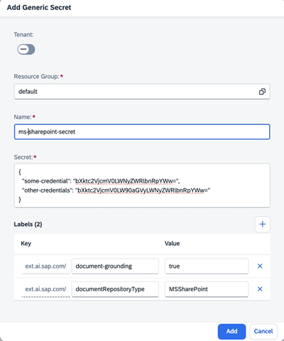

<!-- loioda05d4a4b0114fb9bdf3aa294155443d -->

<link rel="stylesheet" type="text/css" href="css/sap-icons.css"/>

# Create a Generic Secret for AI Data Management


<a name="loioda05d4a4b0114fb9bdf3aa294155443d__prereq_udx_nph_fdc"/>

## Prerequisites

-   You have the role `aicore_admin_genericsecret_editor` or a role collection that contains it. For more information, see [Roles and Authorizations](https://help.sap.com/docs/ai-launchpad/sap-ai-launchpad/roles-and-authorizations).
-   You're using the SAP AI Core runtime.
-   You've prepared your SharePoint integration. For more information, see [Prepare SharePoint Integration with Joule](https://help.sap.com/docs/joule/integrating-joule-with-sap/prepare-sharepoint-integration).


<a name="loioda05d4a4b0114fb9bdf3aa294155443d__context_GenericSecret"/>

## Context

You use the *SAP AI Core Administration* app to add generic secrets at the level of the main tenant or resource group. For tenant-wide generic secrets, use the SAP AI Core API.

To allow the rotation of tenant-wide secrets for long-running deployments without requiring a restart, the deployment must mount the tenant-wide secret. It must also monitor the mounted secret for changes instead of relying on an in-memory copy. When a tenant-wide secret is updated, the tenant must observe the `resourceGroupSecretReplicationStatus` field in the `Get Secret` endpoint to confirm that the secret has been successfully replicated across the required resource groups. For more information, see [Consume Generic Secrets in Executions or Deployments](https://help.sap.com/docs/AI_CORE/2d6c5984063c40a59eda62f4a9135bee/185a3245692542a78bfeff87220410c6.html).


<a name="loioda05d4a4b0114fb9bdf3aa294155443d__steps_z3r_1lx_rxb"/>

## Procedure

1.  In the *Workspaces* app, choose the AI API connection.

2.  If you want to add your secret at the resource group level, choose the resource group. Alternatively, use the toggles in the header or dialog box, where the system prompts you to specify a resource group.

3.  Open the *SAP AI Core Administration* app and choose *Generic Secrets*.

    The *Generic Secrets* screen appears with a tile for each existing secret.

4.  Choose *Add* to enter reference details for a new secret.

5.  Complete the fields in the *Add Generic Secret* dialog box as follows:

    1.  Switch between tenant-level secrets and resource-group-level secrets.

    2.  If your secret is at the resource-group level, confirm the resource group. To change the resource group, choose <span class="SAP-icons-V5"></span> \(Change Value\).

    3.  Enter a name for the secret, making sure that the name meets the following criteria.

        -   It contains only lowercase alphanumeric characters, hyphens \(-\), and numbers.

        -   It doesn't start or end with a hyphen \(-\).


    4.  Enter the secret in `JSON` format. For example:


    ```
    {
      "some-credential": "bXktc2VjcmV0LWNyZWRlbnRpYWw=",
      "other-credentials": "bXktc2VjcmV0LW90aGVyLWNyZWRlbnRpYWw=",
    }
    ```

    > ### Note:  
    > The API expects sensitive data to be Base64-encoded. You can easily encode your data in Base64 format using the following command on Linux or MacOS: `echo -n 'my-sensitive-data' | base64`

6.  In the *Labels* field, enter *Key* `document-grounding` and choose *Value* `true`, and enter *Key* `documentRepositoryType` and choose your repository type from the dropdown list.

7.  Choose *Add* to save the secret details.

    


**Related Information**  


[Edit a Secret](edit-a-secret-2a858ae.md "")

[Remove a Secret](remove-a-secret-ea8eecf.md "")

[Generic Secrets for Grounding](https://help.sap.com/docs/AI_CORE/2d6c5984063c40a59eda62f4a9135bee/fbf4daea78e9409eb13c4b413345a2c9.html)

