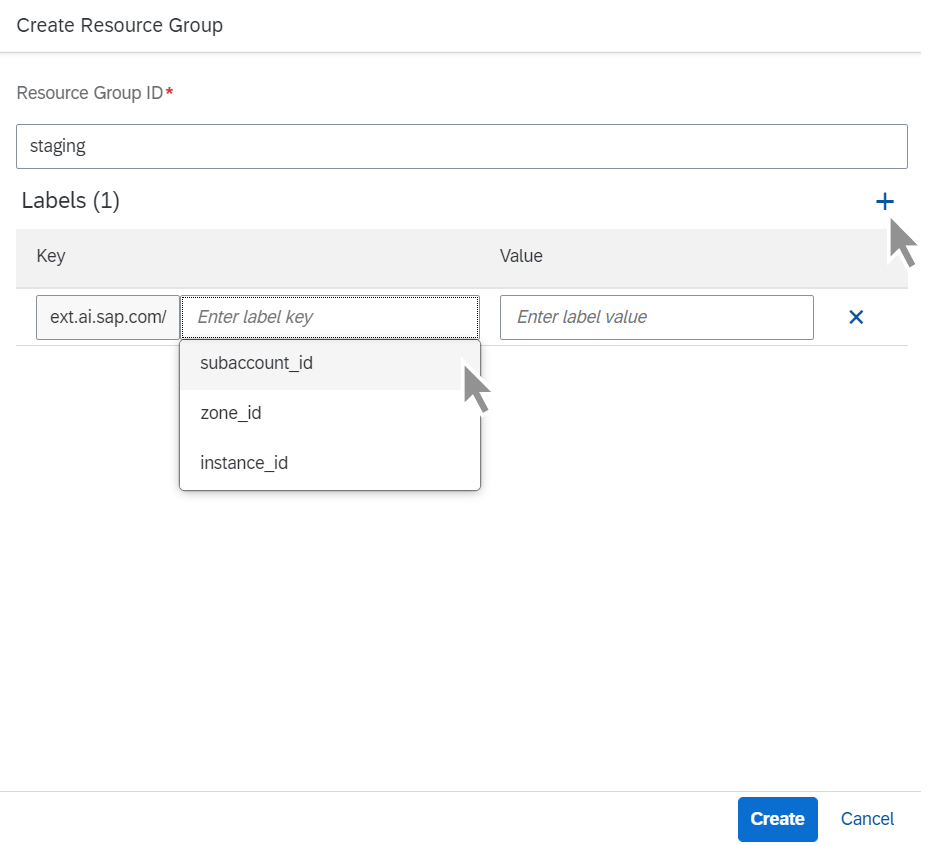

<!-- loio060d9beb42394e33b5f68b9c0458a755 -->

# Create a Resource Group

As an administrator, you create resource groups to isolate your ML workloads and processes.

<a name="loio060d9beb42394e33b5f68b9c0458a755__prereq_jab_bpc_rob"/>

## Prerequisites

You have the `aicore_admin_resourcegroup_editor` role or a role collection that contains it. For more information, see [Roles and Authorizations](roles-and-authorizations-4ef8499.md).

Your tenant has been onboarded and a default resource group automatically created.

## Context

When creating a resource group, subaccount ID, instance ID, and zone ID are standard labels available for use.

<a name="loio060d9beb42394e33b5f68b9c0458a755__steps_hey_kwk_hvb"/>

## Procedure

1.  In the *Workspaces* app, choose the AI API connection.

2.  Open the *SAP AI Core Administration* app and choose *Resource Groups*.

    The *Resource Groups* screen appears with a tile for each existing resource group.

3.  Choose *Create* to create reference details for a new resource group.

4.  Complete the fields in the *Create Resource Group* dialog box.

    

    1.  Enter a resource group ID.

        > ### Note:  
        > Ensure that the resource group ID is unique. If the ID is not unique and is currently in use, then the new resource group and its details will overwrite the existing resource group.

    2.  Choose the ***subaccount\_id*** label key and enter a value.

    3.  Choose the ***zone\_id*** label key and enter a value.

    4.  Choose the ***instance\_id*** label key and enter a value.

    5.  If additional labels are required, enter their keys and corresponding values.

5.  Choose *Create* to create the resource group.

    The *All Resource Groups* screen appears listing the new resource group.

6.  **Optional:** Now that the resource group is created, you can link it to an object store secret. To do so, find the resource group and display its details. Choose *Add* to add an object store secret to the resource group. See [Add an Object Store Secret](add-an-object-store-secret-5b4f728.md).

<a name="loio060d9beb42394e33b5f68b9c0458a755__result_tin_hbr_1tb"/>

## Results

The new resource group is created. Executions, deployments, configurations, and artifacts that are created using the resource group are uniquely associated with the resource group.

**Related Information**  

[Create a Resource Group](https://help.sap.com/viewer/2d6c5984063c40a59eda62f4a9135bee/CLOUD/en-US/01753f4dcb454401b539ecc4def641be.html "") :arrow_upper_right:

