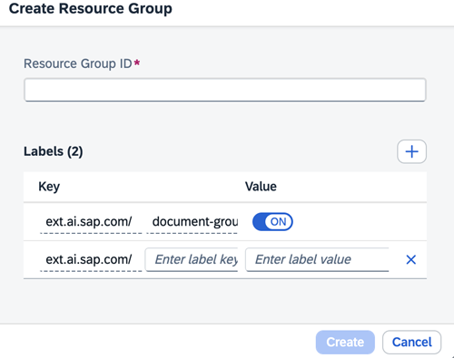

<!-- loio36ddabf56bf9402e980f0a7d4fe225fe -->

# Create a Resource Group for AI Data Management

<a name="loio36ddabf56bf9402e980f0a7d4fe225fe__prereq_vsn_vrt_qxb"/>

## Prerequisites

You have the `aicore_admin_resourcegroup_editor` role or a role collection that contains it. For more information, see [Roles and Authorizations](https://help.sap.com/docs/ai-launchpad/sap-ai-launchpad/roles-and-authorizations).

Your tenant has been onboarded and a default resource group automatically created.

<a name="loio36ddabf56bf9402e980f0a7d4fe225fe__context_mqx_wzw_kxb"/>

## Context

> ### Note:  
> Resource group Ids must be of length minimum: 3, maximum: 253. The first and last characters must be either a lowercase letter, an uppercase letter, or a number. Character entries from the second to penultimate can include a lower case letter, an upper case letter, a number, a period \(.\), or a hyphen \(-\). No other special characters are permitted.

<a name="loio36ddabf56bf9402e980f0a7d4fe225fe__steps_hey_kwk_hvb"/>

## Procedure

1.  In the *Workspaces* app, choose the AI API connection.

2.  Open the *SAP AI Core Administration* app and choose *Resource Groups*.

    The *Resource Groups* screen appears with a tile for each existing resource group.

3.  Choose *Create* to create reference details for a new resource group.

4.  Complete the fields in the *Create Resource Group* dialog box.

    

    1.  Enter a resource group ID.

        > ### Note:  
        > Ensure that the resource group ID is unique. If the ID is not unique and is currently in use, then the new resource group and its details will overwrite the existing resource group.

    2.  Choose the `subaccount_id` label key and enter a value.

    3.  Choose the `zone_id` label key and enter a value.

    4.  Choose the `instance_id` label key and enter a value.

    5.  Enter the `document-grounding` label key and switch the value *On*.

    6.  If additional labels are required, enter their keys and corresponding values.

5.  Choose *Create* to create the resource group.

    The *All Resource Groups* screen appears and shows the new resource group.

<a name="loio36ddabf56bf9402e980f0a7d4fe225fe__result_llz_dst_qxb"/>

## Results

The new resource group is created. Executions, deployments, configurations, and artifacts that are created using the resource group are uniquely associated with the resource group.

<a name="loio36ddabf56bf9402e980f0a7d4fe225fe__postreq_q3k_pfk_ddc"/>

## Next Steps

To edit a resource group, see [Edit a Resource Group](https://help.sap.com/docs/AI_LAUNCHPAD/92d77f26188e4582897b9106b9cb72e0/7c554d20eac145e18b57e8fd9003b350.html).

To delete a resource group, see [Delete a Resource Group](https://help.sap.com/docs/AI_LAUNCHPAD/92d77f26188e4582897b9106b9cb72e0/dc5373a8566a47f29ed121f798bd036d.html).

