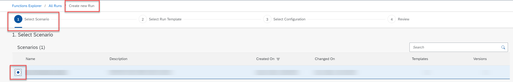
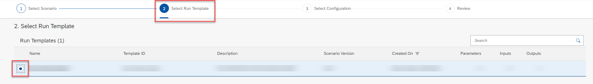
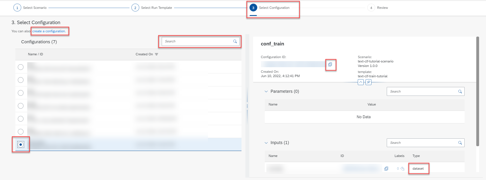

<!-- loioebc7a629b2c24745969fefd840ecece9 -->

# Create a Run

A run is a training process which generates a model.

<a name="loioebc7a629b2c24745969fefd840ecece9__prereq_b54_nld_jib"/>

## Prerequisites

You have the `mlfunctions_editor` role, or you have been assigned a role collection that contains this role.

For more information, see [Roles and Authorizations](security-e4cf710.md#loio4ef8499d7a4945ec854e3b4590830bcc).

## Context

Runs are used to train a model.

## Procedure

1.  In the *Functions Explorer* app, choose *All Runs*.

    The *All Runs* screen appears listing all existing runs. Runs are listed by ID, and with additional details such as configuration name and ID, current and target status, created on timestamp, and changed on timestamp.

2.  Choose *Create* to create a new run.

    The *Create New Run* wizard appears. This wizard has four steps.

3.  Select the required data for the new run.

    1.  In the *Select Scenario* step, select the scenario from the list and choose *Next*.

        

    2.  In the *Select Run Template* step, select the run template from the list and choose *Next*.

        

    3.  In the *Select Configuration* step, select the required configuration. The details for the selected configuration are displayed in the right pane.

        

        > ### Tip:  
        > If there is no configuration which matches your data requirements, you can choose *create a configuration*. You will be redirected to create a configuration, and the run you have started will be lost. When you have saved the new configuration, you can re-create the run with the new configuration.

        Confirm the selection and choose *Review*.

    4.  In the *Review* step, review the data that you've selected for the new run. Choose *Create* to create the run.

    The new run is created and is now displayed in the *All Runs* screen.

