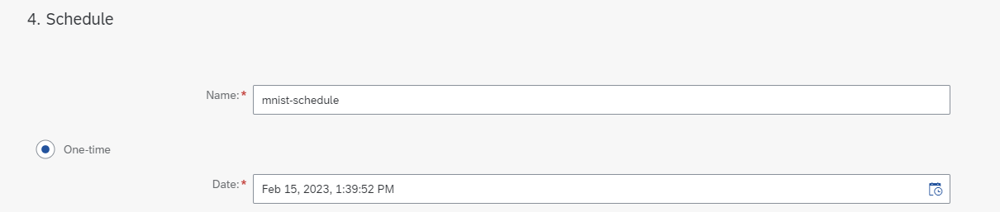
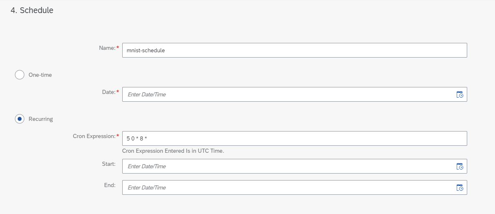

<!-- loio986339df34cc448c8bc8c048b29b6f03 -->

<link rel="stylesheet" type="text/css" href="css/sap-icons.css"/>

# Create a Schedule

<a name="loio986339df34cc448c8bc8c048b29b6f03__prereq_nv2_wwp_kwb"/>

## Prerequisites

You have the `mloperations_editor` or `execution_schedules_editor role`, or you have been assigned a role collection that contains one of these roles. For more information, see [Roles and Authorizations](roles-and-authorizations-4ef8499.md).

## Procedure

1.  Choose a resource group. For more information, see [Set Resource Group](set-resource-group-0c07728.md#loio0c077289f29d4147921fb07ab0f68b7f).

2.  In the *ML Operations* app, choose *Schedules*.

    The **All Schedules** screen appears listing all of the schedules for the selected resource group.

3.  Choose *Create* to create a new schedule.

    The *Create Schedule* wizard appears. This wizard has five steps.

4.  Select the required data for the new deployment.

    1.  In the *Select Scenario* step, select the scenario from the list and choose *Next*.
    2.  In the *Select Executable* step, select the workflow executable from the list and choose *Next*.
    3.  In the *Select Configuration* step, select the required configuration. The details for the selected configuration are displayed in the right pane. You can search the list by entering a configuration name or part of the name in the :mag: field.

        > ### Tip:  
        > If there is no configuration which matches your data requirements, you can choose *create a configuration*. You'll be redirected to create a configuration, and the schedule you've started will be lost. When you have saved the new configuration, you can re-create the schedule using the new configuration. For more information, see [Create a Configuration](create-a-configuration-03bdcc7.md).

5.  In the *Schedule* step, choose from:

    -   To create a *One-Time* schedule, choose *One-Time* schedule and selecting the end date and time. 
    -   To create a *Recurring* schedule choose *Recurring*. Optionally, you can enter a cron expression to provide a start and end time. 

        > ### Note:  
        > Your AI runtime can specify a minimum frequency expected for the cron expression. For more information, see [About the AI API](https://help.sap.com/docs/sap-ai-core/sap-ai-core-service-guide/about-ai-api).

        > ### Note:  
        > The cron expression entered is in UTC time. For more information, see [Cron Formatting](https://pubs.opengroup.org/onlinepubs/9699919799/utilities/crontab.html).

6.  Choose *Review* to continue.

