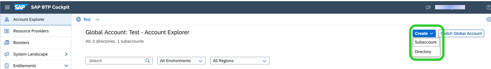
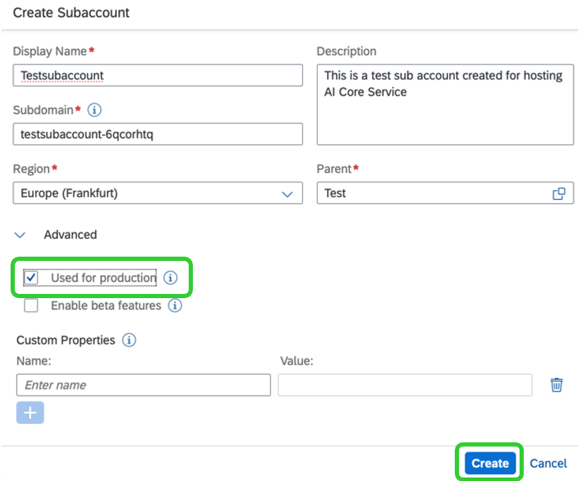

<!-- loiofdab88e50ce54dec9da202dcd825e0e9 -->

# Create a Subaccount

Create a subaccount in your global account using the SAP BTP cockpit.

<a name="loiofdab88e50ce54dec9da202dcd825e0e9__prereq_y5p_45h_5pb"/>

## Prerequisites

You are an administrator of the global account in SAP Business Technology Platform.

## Context

You create a subaccount within your global account. The subaccount is added as a tile to the global account view, and you are automatically assigned to it as an administrator.

<a name="loiofdab88e50ce54dec9da202dcd825e0e9__steps_gwl_w4c_bcb"/>

## Procedure

1.  In the SAP BTP cockpit, choose *Account Explorer* and then choose *Create* \> *Subaccount*.

    

2.  Enter the details for your subaccount as follows:

    1.  Enter a meaningful name and description for your subaccount.

    2.  Enter a subdomain.

        This will become part of the URL for accessing the applications that you subscribe to from this subaccount.

        > ### Note:  
        > The subdomain can contain only letters \(uppercase and lowercase\), digits, and hyphens \(-\). Hyphens are not permitted at the start or end of the name. The subdomain must be unique across all subaccounts in the same region. You cannot differentiate subdomains by uppercase and lowercase characters alone. For example, ***SUBDOMAIN*** and ***subdomain*** are considered to be the same.

    3.  Enter the desired region for your subaccount.

    4.  Select the *Used for production* checkbox unless your account is used for non-production purposes such as development or testing.

        This setting does not change the configuration of your subaccount. The checkbox helps you to operate your production subaccounts and systems more efficiently. Your cloud operator may also use this checkbox to take appropriate action when handling incidents related to mission-critical accounts in production systems. You can change your selection at any time by editing the subaccount properties.

    5.  **Optional:** Click *Enable beta features* if you want to use beta services and applications in your subaccount.

        You cannot change this setting after you have enabled it.

        > ### Caution:  
        > You shouldn't use SAP BTP beta features in subaccounts that belong to productive enterprise accounts. For more information, see [Important Disclaimers and Legal Information](https://help.sap.com/viewer/disclaimer).

    6.  Click *Create*.

    

3.  Save your changes.

